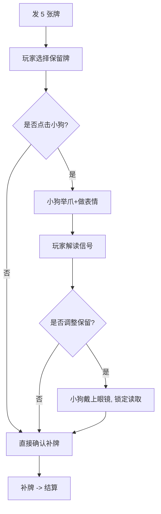

# Lucky Dog Pub — 游戏策划案

> 版本：v0.1
> 状态：企划草案

## 游戏概述

### 一句话
**玩家和他的幸运柴犬，在每局扑克里赌上一切。**

### 平台目标
以 itch.io 免费发布为主。Steam 的 $100 上架费与免费游戏的模式不匹配，暂不列入首发计划。待游戏完成后再评估是否通过 1.99 美金的限时免费策略来覆盖成本。

### 核心理念
这是一个人+狗组合的电视扑克游戏。玩家不是一个人坐在这台机器前——他带着一只柴犬，它很聪明，它能预知牌库里的结果。它想告诉玩家，但它只能通过眼睛、耳朵和帽子来传递信号。玩家学会读懂它，他们配合着从牌桌上赢下一个又一个筹码。

从地下室野局开始，一路赢到 WSOP 冠军桌，玩家的手臂会随着地位变化——从赤裸到衬衫，从夹克到西装，最后戴上金手链。

## 核心玩法

### 基底规则：Jacks or Better 电视扑克

标准流程：
1. 下注（固定注额）
2. 发 5 张牌
3. 玩家选择要保留的牌（其余弃掉）
4. 补牌
5. 按最终牌型赔率结算

牌型赔率（标准）：

- **皇家同花顺** — 1 筹码回报 250
- **同花顺** — 1 筹码回报 50
- **四条** — 1 筹码回报 25
- **葫芦** — 1 筹码回报 9
- **同花** — 1 筹码回报 6
- **顺子** — 1 筹码回报 4
- **三条** — 1 筹码回报 3
- **两对** — 1 筹码回报 2
- **J 对或更高** — 1 筹码回报 1
- **其他** — 0

下注规则：**固定每局 5 筹码**，游戏初始给玩家 **100 筹码**，输光即游戏结束。

设计说明：**玩家相对容易赢。** 伪随机算法会让"差一点"的牌型更频繁出现——不是让玩家一直输，而是让玩家一直处在"差一点就赢了"的兴奋中。这是电视扑克成瘾性的来源，也是设计上有意保留的部分。

### 核心交互

- **点击卡牌** — 切换保留/弃牌状态
- **点击小狗** — **每局限一次**——小狗给出当前保留策略的模糊反馈
- **点击手臂（敲桌子）** — 确认补牌，进入结算
- **点击筹码/酒杯** — 第一个版本暂不实现氛围交互，聚焦核心玩法

### 小狗反馈系统（核心特色）

**玩家操作流程：**



**小狗的信号等级（约 4 档）：**

- **无聊/打哈欠/耷拉耳** — 这把不好，求稳也难有回报
- **普通高兴/眯眼吐舌** — 不错，有基本的回报（一对/两对级别）
- **眼睛亮了（Lucky Eye）** — 大牌，同花及以上级别
- **亮眼+竖耳+帽子扬起** — 顶级的——同花顺/皇家同花顺级别

**重要设计原则：这不是一个精确的系统。**

小狗的表情只有这 4 档，但牌型回报的可能性远多于 4 种。所以大多数时候，玩家只能从它那里得到"有回报"还是"没回报"的模糊信号。偶尔才能捕捉到"它眼睛亮了"——那才是真正的大牌信号。

**这就产生了一个微妙的心理游戏：**
- "它刚才是不是眼睛亮了一下？还是我看错了？"
- "它这次高兴的程度好像比上次大，是有戏吗？"
- 玩家永远在试探和解读，永远不完全确定。

这也呼应了 NFT 项目最初的理念——**玩家知道自己是"幸运儿"才坐在这张桌上，但他真的读懂自己的幸运吗？**

**表现层：**
小狗一开始不戴眼镜。玩家点它→它举起爪子+做一个表情。如果玩家调整保留策略再想点第二次→小狗把眼镜戴上，表示"不给你看了"。
（表现层可以随时迭代替换，逻辑不变）

## 成长系统：段位进化

**核心机制：不设经验/等级，只记录"历史最高筹码"。**

电视扑克的玩家心理是水平循环（再来一局），不适合垂直推进的成长线（关卡/等级）。所以设计选择是：**把玩家的身份感融入主画面，不进任何二级界面。**

### 段位列表

- **初始** — 赤裸手臂（有毛） → 地下室野局玩家
- **1,000 筹码** — 衬衫 → 进赌场了，像样了
- **10,000 筹码** — 棒球夹克 → 锦标赛选手
- **100,000 筹码** — 西装 → 高额桌常客
- **1,000,000 筹码** — WSOP 金手链 → 冠军

**段位进化的体验：**
数值达到阈值时，当前局结算后触发晋升演出：屏幕渐黑，画面中央浮现白色文字（例如"有些人花一辈子才走到这张桌子。你花了____局。"或"衬衫的第一颗扣子，总是最难扣上的。"），玩家点击任意键继续，屏幕渐亮恢复——手臂已经换上了新的装扮。不需要进任何菜单，也不打开二级界面。这是一次短暂的仪式，然后游戏继续。

同时小狗的帽子和眼镜也有对应里程碑解锁，每局随机穿戴已解锁的外观。

**筹码堆的视觉延伸：**
筹码不绑定具体面额，而是作为段位的视觉表现随阶段变化。玩家筹码总数始终在 UI 上以数字显示，桌上的筹码堆只反映身份层级——从杂乱的小堆杂色筹码，逐渐变为整齐的高堆深色筹码，最终以金色筹码为主。这样筹码金额可以更大更刺激，而不受视觉表现的限制。

### Game Over

筹码归零时，屏幕渐黑，画面中央逐行显示白色字幕——**小狗视角的谚语**，风格是借用人类谚语或俗语的句式，但从小狗的视角重新解读，最后用"但我是狗"或类似的狗视角包袱收尾。

示例：

> 牌局就像一盒巧克力，你永远不知道下一块会是什么味道……但我是狗，吃了巧克力会死。

> 俗话说，哪有小孩天天哭，哪有赌狗天天输？嘿，我说我上辈子其实是个人你信吗？

小狗是玩家的队友，它在给玩家打气，用的是一种只有柴犬才能说出来的方式。

字幕播放完毕后回到主菜单，玩家可以重新开始，一切重置。

## 美术资产使用说明

### 已确定使用的素材

- **卡牌（5 位 × 4 花色 × 13 点数）** — 牌桌展示，来源：PSD 扑克组
- **赌桌（各色）** — 主画面背景，来源：PSD 桌子组
- **柴犬（1 种颜色，多种表情）** — 吉祥物角色，来源：PSD 装饰物组
- **小狗眼镜（6 款）** — 外观收集 + 功能提示，来源：PSD 装饰物组
- **玩家手臂（裸→衬衫→夹克→西装→金手链）** — 段位进化表现，来源：PSD 玩家组
- **筹码（各色模板）** — 段位视觉延伸，来源：PSD 筹码组

### 暂不使用的素材

- 酒杯/酒水（第一个版本不做氛围交互）
- 其他 3 种毛色的柴犬（保留给未来版本或换色功能）
- 部分扑克赛事背景（看后期是否需要多样化背景）

## UI 布局概念

因为美术资源为 1:1 方形，桌面游戏需要在左右两侧补充 UI。

```
┌──────────────────────────────────────┐
│                                      │
│  [筹码数]          [段位徽章]        │
│                                      │
│  ┌────────── 牌桌 ──────────┐       │
│  │                          │       │
│  │    Flop1 Flop2 Flop3      │       │
│  │    Turn  River            │       │
│  │                          │       │
│  │      柴犬（中央偏右）      │       │
│  │                          │       │
│  │  玩家手牌（左下）          │       │
│  │  筹码堆（右下）            │       │
│  └──────────────────────────┘       │
│                                      │
│  [小狗反馈区]                         │
│  [操作提示]                           │
│                                      │
└──────────────────────────────────────┘
```

左/右侧保留给：筹码总数显示、段位标识、历史最高纪录等 UI 元素。

## 音效与音乐

第一个版本开发期间，所有音效和背景音乐均使用 **控制台打印字符串** 来标记触发时机，例如：

```
[音效] 发牌 - 卡牌滑动声
[音效] 补牌 - 卡牌翻面声
[音效] 点击小狗 - 小狗哼声
[音效] 结算 - 筹码碰撞声
[BGM] 牌桌背景音乐 - 轻爵士循环
[BGM] 段位升级 - 短暂的高潮音效
```

游戏开发完成后，将整理一份**音效素材需求清单**发给主人，主人通过淘宝外包渠道采购/定制实录音效后替换。

## 设计与体验原则

1. **主角是小狗，不是扑克。** 扑克只是载体，小狗才是玩家打开游戏的理由。
2. **小狗不是玩具，是队友。** 它会给出信号，不是被玩家摆弄的装饰品。
3. **解码的模糊性是刻意的。** 如果小狗 100% 准确，游戏就变成了扫雷。它是模糊的，玩家才需要学习和判断。
4. **不进二级界面。** 所有核心体验都在主画面完成。没有图鉴、没有商店、没有装备栏。
5. **干净免费。** 无广告、无内购、无每日签到。让游戏本身说话。
6. **不做不必要的功能。** 第一个版本聚焦核心玩法，氛围交互（筹码/酒杯）和音效素材采购均排到核心功能之后。

## 已决策事项汇总

- 最终使用者称呼：**玩家**
- 首发平台：**itch.io**
- 下注方式：**固定每局 5 筹码**
- 初始筹码：**100**
- 筹码功能：**不设面额，作为段位视觉延伸**
- Game Over 表现：**黑屏 + 小狗谚语白字**
- 音效/BGM：**先用 print 占位，完工后出素材清单由主人外包采购**
- 筹码/酒杯氛围交互：**第一个版本不实现**
