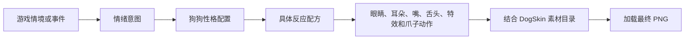

# 狗狗表情、性格与美术部件架构构想

## 文档定位

本文记录 Lucky Dog Rise 对狗狗美术部件、有限情绪集合、性格差异和表情资源寻址方式的远期构想。

当前内容用于帮助主人规划 Photoshop、Illustrator、DogSkin 表和 DogReaction 表未来的演进方向，尚未形成正式数据结构或开发需求。现有狗狗素材、表结构和运行时逻辑不应仅依据本文立即重构。

本文首先以元气型、腼腆型和高冷型三种示例性格打样。示例名称和表现方式均可调整，重点是验证“同一游戏情绪由不同性格表现为不同具体表情”的设计方法。

## 背景与痛点

当前四种柴犬具有相同的 Photoshop 图层结构，主要区别是毛发配色、线条颜色和局部细节。狗头、眼睛、耳朵、舌头和爪子通过智能对象分别导出为 PNG。

增加一种表情时，当前流程通常需要：

1. 在赤柴图层组中完成表情。
2. 将表情复制到其他柴犬图层组。
3. 分别修改毛色、线条色和局部细节。
4. 为每个版本命名并填写数据表。
5. 导出素材并调整运行时表现。

当狗狗数量和表情数量增加后，工作量会接近以下乘积：

```text
狗狗数量 × 头型数量 × 表情数量 × 配色数量 × 专属细节数量
```

问题的核心不是单个表情难画，而是同一结构被复制到多个狗狗目录后，修改、命名、检查和导出的成本持续增长。

## 设计目标

- 把游戏语义上的情绪与具体美术表情分开。
- 让狗狗性格决定同一种情绪如何表现。
- 控制通用情绪数量，不因发现新的表情画法而无限增加系统状态。
- 让颜色相近的狗狗仍能通过招牌表情和反应方式形成角色差异。
- 共享可以共享的表情结构，同时允许每只狗覆盖颜色、几何形状和专属细节。
- 保持运行时读取摊平 PNG 的简单方式，不要求游戏实时修改矢量颜色。
- 避免在 DogSkin 表中为每个新表情不断增加横向字段。

## 核心概念分层

未来需要区分以下概念：

- 游戏情境：玩家正在做什么，或游戏刚刚发生了什么，例如挂机、选牌、中奖和拒绝饮品。
- 情绪意图：游戏希望狗狗表达什么，例如无聊、开心、狂喜、沉默和拒绝。
- 性格配置：某类狗狗如何理解并表现这些情绪，例如元气、腼腆或高冷。
- 具体反应：最终使用哪些眼睛、耳朵、嘴、舌头、特效和爪子动作。
- 皮肤资源：这些逻辑资源名在某只狗的素材目录中对应哪张 PNG。

数据寻址关系如下：



游戏逻辑只负责提出情绪意图，不应直接要求某只狗“眯眼、吐舌并脸红”。具体表现由性格配置和反应配方决定。

## 第一版有限情绪集合

第一版建议先控制在八类情绪意图。后续只有在游戏中出现明确使用场景时，才增加新的情绪意图。

### 日常 Default

用于普通待机、正常操作和没有更高优先级状态时的基础表现。该表情也是玩家识别狗狗性格的主要入口。

### 专注 Focused

用于玩家持续输入、选牌、等待决策或狗狗认真观察牌局时。

### 无聊 Bored

用于长时间挂机、坏牌或长时间没有值得关注的事件时。

### 开心 Happy

用于小胜、普通正面反馈和轻度愉悦。该情绪不应与大奖反应共用完全相同的强度。

### 狂喜 Jackpot

用于大牌、稀有奖励和重大正面事件。现有四条、同花顺和皇家同花顺可以继续归入这一档。

### 沉默 Silent

用于狗狗不回答、无话可说或以沉默代替回复的场景。省略号气泡属于该表现可能使用的 ExpressionFX，而不是眼镜功能。

### 拒绝 Reject

用于拒绝再次回答、阻止玩家继续饮用 Refreshment 或其他明确否定行为。该状态通常伴随短暂动作，不适合作为长期待机状态。

### 招呼 Hello

用于欢迎、主动提醒和提示玩家注意。该状态通常伴随单爪挥手。

@主人 [请确认第一版是否以这八类情绪意图作为讨论基础；如需增加新的情绪，应同时注明对应的实际游戏场景。]

## 性格表现样稿

以下内容用于展示性格系统的差异幅度，不表示所有狗狗必须归入这三类。

### 元气型

- 日常：睁眼微笑并吐舌，主动注视玩家。
- 专注：眼睛睁大，耳朵竖起，认真观察。
- 无聊：耳朵耷拉，使用死鱼眼或明显泄气的表情。
- 开心：眯眼吐舌笑，反应直接而明显。
- 狂喜：星星眼、哈气，并通过爪子动作增强兴奋感。
- 沉默：半睁眼、一字嘴，配合省略号气泡。
- 拒绝：摇头并用双爪摆手。
- 招呼：右爪热情挥手。

### 腼腆型

- 日常：小幅微笑，视线略微向下或避开玩家。
- 专注：抿嘴认真观察，但动作幅度较小。
- 无聊：低头或眼神游离，不明显抱怨。
- 开心：脸红并轻轻微笑。
- 狂喜：眼睛发亮、脸红并短暂回避视线。
- 沉默：低头回避，配合脸红和省略号气泡。
- 拒绝：露出为难和冒汗的表情，小幅摆手。
- 招呼：小幅挥手并害羞微笑。

### 高冷型

- 日常：半睁眼，嘴角保持平直。
- 专注：微微眯眼审视牌局。
- 无聊：明显嫌弃或把视线移向一旁。
- 开心：只轻微扬起嘴角。
- 狂喜：短暂露出惊讶，随后恢复克制。
- 沉默：侧眼看向玩家，完全不张嘴。
- 拒绝：皱眉并冷眼拒绝，不使用夸张摆手。
- 招呼：只抬一下爪子示意。

通过默认表情、开心方式、大奖反应、拒绝方式和招呼动作的差异，颜色相近的狗狗也可以被玩家理解为不同角色，而不是同一只狗的简单换色版本。

@主人 [请确认示例性格是否继续使用“元气型、腼腆型、高冷型”作为工作名称，或改为更符合游戏世界观的称呼。]

## 部件拆分原则

一个视觉区域只有满足以下至少一项时，才值得成为独立部件：

- 会在不影响其他区域的情况下独立切换。
- 会独立播放动画。
- 需要独立控制层级、遮罩或显隐。
- 不同 DogSkin 可能只覆盖该区域。
- 可以被大量反应稳定复用。

如果一个区域总是与另一区域同步变化，将其拆分只会增加素材和数据维护成本。

## 第一版部件样稿

### HeadBase

保存固定脸型、毛发轮廓、口鼻底色和鼻子。日常情绪不应更换整个 HeadBase。

如果未来某类特殊狗狗会在表情变化时改变头部外形，应优先把它视为专属覆盖，而不是要求所有狗狗都准备多套 HeadBase。

### SkinDetail

保存不属于通用表情的狗狗专属细节，例如胡麻杂毛、缝合线、伤口、脱皮、骨头和金属接缝。

SkinDetail 默认固定跟随 DogSkin；极少数会随反应变化的细节可以通过专属反应覆盖。

### Eyes

保存左右眼睛和眉毛，初期继续作为一个整体图片。眨眼、斜眼、对眼和左右不对称均可直接画在同一张 Eyes 图片中。

### Ears

保存左右耳朵姿态，初期继续作为一个整体图片。即使出现一边竖起、一边耷拉，也不代表必须拆成两个运行时部件。

只有出现左右耳独立动画、分别遮挡或运行时自由组合需求时，才考虑拆分 LeftEar 和 RightEar。

### Mouth

保存鼻子下方竖线、嘴型和口腔。Mouth 建议从当前 Head 图片中独立，因为日常、专注、无聊、开心、狂喜、沉默和拒绝都可能改变嘴型。

鼻子本身初步保留在 HeadBase 中；鼻子下方连接嘴部的线属于 Mouth，以便不同嘴型完整替换。

### Tongue

保存舌头图片和舌头动画。现有独立结构可以继续保留。

### ExpressionFX

保存腮红、眼泪、汗滴、怒气、省略号和其他不适合画进眼睛或嘴里的附加表现。该槽位允许为空。

是否将省略号实现为跟随狗狗的画面部件，还是继续使用独立 Emoji 气泡，需要在表现设计阶段单独确定。

### ClawLeft 与 ClawRight

左右爪继续独立。当前已经存在右爪单独挥手、双爪拒绝动作和不同前后层级，因此符合独立部件条件。

### FixedEyewear

保存与狗狗身份绑定的固定眼镜。固定眼镜属于 DogSkin 外观，不属于通用情绪。

## 表情对部件的影响样稿

以下列表用于验证部件边界，不表示每种性格都必须修改列出的所有部件：

- 日常：主要使用 Eyes、Ears、Mouth，可选 Tongue。
- 专注：主要修改 Eyes 和 Mouth，可选 Ears。
- 无聊：主要修改 Eyes、Ears 和 Mouth。
- 开心：主要修改 Eyes、Ears 和 Mouth，可选 Tongue 与 ExpressionFX。
- 狂喜：可能同时修改 Eyes、Ears、Mouth、Tongue、ExpressionFX 和爪子动作。
- 沉默：主要修改 Eyes 和 Mouth，可选 Ears 与 ExpressionFX。
- 拒绝：主要修改 Eyes、Ears、Mouth 和爪子动作，可选 ExpressionFX。
- 招呼：主要修改 Eyes、Ears、Mouth 和右爪动作，可选 Tongue。

由此得到的当前结论是：Mouth 值得独立，左右爪必须独立；Eyes 和 Ears 暂时不需要继续拆成左右两张图片。

## DogSkin 如何找到高兴时的眼睛

DogSkin 不再保存 `Eyes_Happy` 字段，并不代表具体图片不再配置。资源选择被拆成“性格映射”和“反应配方”两步。

以下名称只是说明职责，最终表名和字段名仍需结合 Luban 表结构确定。

### 第一步：DogSkin 指定性格

示例：

```text
DogSkin 1001 赤柴
FolderPath = v1\Shiba\Red
PersonalityProfileId = Shy
```

### 第二步：性格把 Happy 映射到具体反应

示例：

```text
PersonalityReactionMap
PersonalityProfileId = Shy
EmotionIntent = Happy
ReactionId = ShyHappy
```

### 第三步：反应配方指定逻辑素材名

示例：

```text
DogReaction ShyHappy
EyeAsset = Eyes_ShySmile
EarAsset = Ears_Soft
MouthAsset = Mouth_SmallSmile
ExpressionFXAsset = FX_Blush
```

### 第四步：运行时结合 DogSkin 目录得到完整路径

赤柴最终加载：

```text
v1\Shiba\Red\Eyes_ShySmile.png
```

黑柴如果也是腼腆型，则最终加载：

```text
v1\Shiba\Black\Eyes_ShySmile.png
```

两只狗使用相同的逻辑素材名，但 PNG 位于各自素材目录中，因此可以拥有不同毛色、线条色和局部细节。

如果高冷型狗狗高兴时需要另一种眼睛，则性格映射选择另一条反应：

```text
Aloof + Happy = AloofHappy
AloofHappy.EyeAsset = Eyes_SubtleSmile
```

因此，具体狗狗高兴时使用哪张 PNG 仍然是确定、可追踪的数据配置，只是不再通过 DogSkin 表中无限增加字段表达。

## 建议的数据职责

### DogSkin

DogSkin 只保存稳定跟随狗狗身份的内容：

- Id 和 Alias。
- FolderPath。
- HeadBase。
- SkinDetail。
- 默认 Eyes、Ears、Mouth 和 Tongue。
- 左右爪素材。
- FixedEyewear。
- PersonalityProfileId。
- IconReactionId，用于背包图标和盲盒展示的招牌表情。

### PersonalityReactionMap

该映射负责回答“某种性格遇到某个情绪意图时，应使用哪条具体反应”。

建议采用长表结构，每行只表达一个性格与一个情绪意图的映射，避免为每个新情绪增加新列。

### DogReaction

DogReaction 保存最终表现配方：

- Eyes 逻辑素材名。
- Ears 逻辑素材名。
- Mouth 逻辑素材名。
- Tongue 逻辑素材名或动画。
- ExpressionFX 逻辑素材名。
- 左右爪姿态与动画。
- 临时头饰覆盖等特殊表现。
- AssetRef 或等价的继承字段。

现有 DogReaction 的 `AssetRef` 已经具备复用反应参数的基础，可以继续保留这一思路。

## 对当前 DogSkin 宽表的影响

当前 DogSkin 中存在 `Eyes_Bored`、`Eyes_Cute`、`Eyes_Happy`、`Eyes_Lucky`、`Eyes_Neutral` 和 `Eyes_Wink` 等字段。

如果沿用这种结构，每增加一个表情都需要：

- 在 DogSkin 表中增加一列。
- 为所有已有 DogSkin 补填该列。
- 重新生成 Luban C# 和 JSON。
- 修改 DogSkin 编辑器表单和验证逻辑。

未来重构时，建议不再为新表情继续增加 DogSkin 字段。DogReaction 直接保存 `Eyes_Silent` 等逻辑素材名，运行时结合当前 DogSkin 的 FolderPath 寻址。

尚未支持某个反应的狗狗，不要求生成完整表情全集。DogSkin 编辑器只需根据该狗绑定的 PersonalityProfile，检查其实际需要的素材是否齐全。

## 性格与收集辨识度

如果颜色相近的狗狗拥有不同性格，它们的默认展示也应体现这种差异。

DogSkin 建议增加或等价表达 `IconReactionId`：

- 元气型狗狗的图标可以使用吐舌笑或主动注视。
- 腼腆型狗狗的图标可以使用脸红微笑。
- 高冷型狗狗的图标可以使用半睁眼或轻微嫌弃。

这样玩家在背包、盲盒和交易界面中就能直接看到角色差异，而不必装备后等待特定事件触发表情。

## 美术生产方向

不建议立即把现有四种柴犬全部从 Photoshop 迁移到 Illustrator。

可以先采用混合方式：

- Illustrator 负责可复用的表情结构、轮廓和配色母版。
- 配置记录不同 DogSkin 的毛色、口鼻色、线条色和可选 SkinDetail。
- 自动化工具根据性格所需反应生成各狗狗目录中的 PNG。
- Photoshop 或 DogSkin 可视化工具继续承担1200×1200画布中的整体对齐和最终检查。
- 游戏运行时继续读取普通 PNG，不承担实时换色。

共享是默认能力，不是强制限制。某只狗的几何结构、线条或细节确实不同，可以为该部件提供专属覆盖。

## 第一轮验证范围

第一轮只制作以下三种情绪意图：

- 沉默。
- 开心。
- 拒绝。

每种情绪分别为元气型、腼腆型和高冷型提供文字表现方案，共形成九个反应样稿。

这一轮用于验证：

- 三种性格是否能被清晰感知。
- Mouth 是否应从 Head 中独立。
- ExpressionFX 的职责是否清晰。
- Ears 是否有必要拆分左右。
- 同一表情结构能否通过换色服务于多种柴犬。
- 性格映射能否准确找到每只狗需要的 PNG。

在该验证完成前，不批量迁移旧表情，也不确定 Illustrator 自动导出工具的最终结构。

## 待确认事项

- 第一版情绪意图是否保持八类。
- 三种示例性格的名称与行为是否符合游戏气质。
- 鼻子是否固定属于 HeadBase，鼻子下方竖线是否属于 Mouth。
- 省略号应属于 ExpressionFX，还是继续使用独立 Emoji 气泡系统。
- DogSkin 的招牌表情是否需要独立的 IconReactionId。
- 性格到反应的映射采用独立长表，还是合并到未来的 ReactionProfile 数据结构中。

