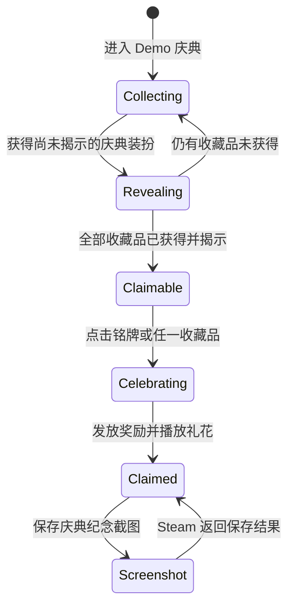

# Demo 庆典收集活动说明

## 功能定位

Demo 庆典收集活动是 Demo 渠道的阶段性收集目标，用于把盲盒奖励、装扮收集、庆祝反馈、Steam 愿望单入口和纪念截图串成完整流程。

程序结构继续使用通用的 `CollectionEvent` 与 `WishlistCallToAction` 命名，避免把可复用逻辑绑定为单次活动专用代码。当前活动参数为：

- 活动 ID：`demo-next-fest-2026`
- 普通收藏盲盒：`2002`
- 大奖盲盒：`2003`
- 展示结构：3 个大奖和由盲盒权重表动态生成的普通收藏品
- 完成奖励：`Item 9004 / Chardonnay ×7`
- 生效渠道：正式 Demo 包及 Dev 中的 Demo 调试玩法渠道

正式 Demo 的 `user://` 根目录独立位于 `LuckyDogRise/Demo`。庆典进度继续随 V16 账号存档按 SteamID 隔离，不与 Playtest 或 Release 共用。

## 玩家流程

当盲盒奖励入账且本次首次获得使活动收藏集变为完整时，系统自动展开系统功能面板、切换至 Demo 庆典页并定位到页面顶部。最后一件物品随后继续使用既有的一秒揭示动画；动画完成后，胜利铭牌进入可领取状态。

页面重新进入时按当前进度选择初始滚动位置：

1. 存在待揭示奖励时，从收藏区域开始。
2. 已全部揭示但尚未领取完成奖励时，从胜利铭牌开始。
3. 已领取完成奖励时，从愿望单模块开始。
4. 其他情况从页面顶部开始。

路线图末尾提供“回到顶部”按钮，使用 `SecondaryButton` 样式，并以 `0.35s Cubic Out` 平滑滚动到页面顶部。

## 收藏品视觉

收藏格有三种视觉状态：

- `Covered`
  - 只显示完整银色覆盖层，不提前泄露奖品图标或名称。
- `Revealed`
  - 显示奖品、品质视觉与对应的残留银色覆盖层。
- `Shining`
  - 移除银色覆盖层，并以三组错峰星光进行交叉淡入淡出。

新获得的收藏品会在庆典页面中播放一秒揭示动画。动画结束后才写入已揭示记录，避免中断时把未展示的奖励误记为已展示。

道具名称 Tooltip 保持关闭。该设计用于保留揭示前的神秘感，同时避免 Demo 阶段暴露尚未完成本地化的道具名称。

## 胜利铭牌

铭牌使用三套独立背景和月桂资源，对应以下状态：

- 收集中
  - 铭牌不可点击。
  - 标题显示庆典名称，小字鼓励玩家继续收集。
- 已集齐、可领取
  - 铭牌与所有收藏品均可点击，并进入同一领取入口。
  - 月桂摆动和提示文字下划线用于表达可点击状态。
- 已领取
  - 铭牌标题优先显示当前 Steam 昵称。
  - 无法取得昵称时显示本地化的完成庆典兜底标题。
  - 小字显示首次完成的本地日期。
  - 愿望单按钮下方显示“保存庆典截图到 Steam”按钮。

已领取状态不再使用 Debug 临时昵称。Debug 铭牌状态预览与正式流程共用当前平台昵称提供器。

昵称排版保持固定铭牌高度，按以下顺序适配：

1. 默认字号可以单行显示时保持单行。
2. 单行超宽时优先尝试两行。
3. 两行仍无法容纳时逐级缩小字号。
4. 达到最小字号仍无法容纳时使用两行省略。

## 完成与庆祝

玩家集齐并揭示全部收藏品后，可以点击铭牌或任一收藏品开始庆祝：

1. 立即禁用铭牌和收藏品点击状态，防止重复请求。
2. 页面以 `0.35s Cubic Out` 滚动到庆祝展示位置。
3. 发放 `Chardonnay ×7`。
4. 写入活动奖励已领取状态和首次完成时间。
5. 全部收藏品切换为 `Shining`。
6. 从页面两侧喷出礼花并播放 `Collection_ConfettiBurst` 音效。

领取入口最终汇合到 `GameData.TryClaimCollectionEventVictoryReward()`。活动 ID 已领取校验用于防止重复发奖。

## 首次获得小狗提示

触发条件保持为：玩家第一次获得当前活动收藏范围内的小狗。

桌宠模式：

- 自动展开系统功能面板并切换到 Demo 庆典页。
- 不显示额外对话框。
- 对应小狗完成揭示后，记录本活动的首次小狗提示已经处理。

扑克模式：

- 在扑克面板内显示“Demo 庆典进行中”进度对话框。
- 对话框只说明庆典活动、刚获得的小狗和收集进展，不承担愿望单号召。
- 玩家确认后展开系统功能面板并切换到庆典页。
- 对话框位于 CanvasLayer 20，高于 CanvasLayer 18 的扑克操作教学；关闭对话框后，原教学继续显示。

该提示每个活动只处理一次。待处理的小狗 Item ID 会写入账号存档，用于处理中断恢复。

## 愿望单入口与退出提示

庆典页面始终显示害羞小狗、气泡和绿色愿望单按钮。按钮本身只负责打开商店页面，不表示已经替玩家加入愿望单。

商店打开顺序为：

1. 优先调用 `steam://store/2583700`，交给 Steam 客户端打开。
2. Steam URI 打开失败时，回退到 `GameDevelopConfig.WishlistCallToActionUrl` 的网页地址。

主动愿望单覆盖层有两个触发点：

- 玩家退出游戏。
- 玩家已经领取庆典完成奖励，并在之后再次进入庆典页面。

退出场景提供：

- “退出并前往 Steam 添加愿望单”主按钮。
- “直接退出”次按钮。
- “以后退出时不再提醒”开关。
- 返回游戏的关闭按钮。

主按钮与直接退出按钮最终都进入既有安全退出流程，继续执行存档、Steam Cloud flush 和平台清理。关闭按钮只返回游戏。

`WishlistCallToActionPageOpened` 表示游戏已经成功发起过商店页面打开请求，不表示 Steam 已经确认玩家添加愿望单。该字段为 true 后不再显示主动号召，但页面上的常驻愿望单入口仍然可用。

主动号召共享配置中的冷却秒数。冷却仅在本次进程内生效，重新启动游戏后从零开始；退出提醒永久关闭状态和商店页已打开状态随账号存档保存。

## Steam 庆典截图

截图按钮只在铭牌进入已领取状态后显示。

截图内容包括：

- 三个大奖。
- 普通收藏品网格。
- 已领取铭牌。
- 害羞小狗和愿望单气泡。

实际按钮不会被复制进截图。系统使用独立 `SubViewport` 以两倍分辨率渲染，不移动、缩放或重新挂载玩家正在观看的页面。

截图通过 `SteamScreenshots.WriteScreenshot()` 保存到玩家本地 Steam 截图库，并等待 `ScreenshotReady_t` 确认。该功能不会自动发布截图，也不会自动分享到外部社交平台。

若 Steam 不可用、平台会话在渲染期间发生替换或二十秒内没有收到成功回调，按钮会显示“未确认保存，请检查 Steam”。

## 本地化

庆典页面、三种铭牌状态、首次小狗进度对话框、退出愿望单覆盖层、Steam 截图结果与“回到顶部”按钮均通过 `Data/Localization/LocalizationText.csv` 提供 20 种语言文本。

简体中文和繁体中文在日常文案中统一使用“小狗”。固定尺寸气泡继续使用按语言调整的字号规则，长正文使用自动换行或滚动容器。

## 存档字段

以下状态保存在账号隔离的 V16 `SaveProfile` 中：

- 各活动已揭示物品 ID。
- 各活动胜利奖励领取状态。
- 各活动首次完成时间。
- 各活动首次小狗提示已处理状态。
- 各活动待处理小狗 Item ID。
- 退出愿望单提醒永久关闭状态。
- 商店页已打开状态。

`WishlistCallToActionLastShownAtUnixSeconds` 作为兼容字段保留，但加载时重置为 `0`，不恢复上次进程的冷却。

## Debug 与发布边界

Dev 构建保留以下验收工具：

- 三种铭牌状态循环预览。
- 礼花重复播放测试。
- Demo 试玩流程重置。
- 商店页已打开状态开关。

这些入口不修改正式活动配置；铭牌预览不会发放奖励。正式导出不显示 Debug 页和庆典 Debug 工具区域。

Demo 导出包启用 `CollectionEvents=True`，并关闭 LinkTree、Steam Inventory 写入、玩家统计和成就。庆典截图和 Steam 商店 URI 仍通过当前平台会话工作。

Godot 反射绑定使用的庆典控制器已经加入 `Build/godot-obfuscation-preserve.txt`，防止混淆后场景无法按类名加载。

## 主要文件

- `lucky-dog-rise/Scenes/Prefabs/CollectionEventPage.tscn`
- `lucky-dog-rise/Scripts/Desktop/CollectionEventPageController.cs`
- `lucky-dog-rise/Scenes/Prefabs/CollectionEventRewardCell.tscn`
- `lucky-dog-rise/Scripts/Desktop/CollectionEventRewardCellController.cs`
- `lucky-dog-rise/Scenes/Prefabs/CollectionCelebrationConfetti.tscn`
- `lucky-dog-rise/Scripts/Desktop/CollectionCelebrationConfettiController.cs`
- `lucky-dog-rise/Scripts/Desktop/CollectionCelebrationScreenshot.cs`
- `lucky-dog-rise/Scenes/Prefabs/PokerCollectionProgressDialog.tscn`
- `lucky-dog-rise/Scripts/PokerCollectionProgressDialogController.cs`
- `lucky-dog-rise/Scenes/Prefabs/WishlistCallToActionOverlay.tscn`
- `lucky-dog-rise/Scripts/Desktop/WishlistCallToActionOverlayController.cs`
- `lucky-dog-rise/Scripts/Desktop/WishlistCallToAction.cs`
- `lucky-dog-rise/Scripts/Desktop/SystemPanelController.cs`
- `lucky-dog-rise/Scripts/Desktop/GameData.cs`
- `lucky-dog-rise/Data/Localization/LocalizationText.csv`

## 验收边界

功能开发已经完成。后续发布工作只需按候选包流程执行回归，不再扩大功能范围：

1. 使用普通玩家 Steam 账号验证首次小狗的桌宠与扑克两条路径。
2. 验证集齐、领取、礼花、真实 Steam 昵称和日期持久化。
3. 验证 Steam 客户端优先打开及网页托底。
4. 验证退出覆盖层的关闭、直接退出、不再提醒和安全退出流程。
5. 验证庆典截图进入本地 Steam 截图库，并确认不会自动发布。
6. 验证 Demo、Playtest 与 Release 的 `user://` 目录互不污染。
