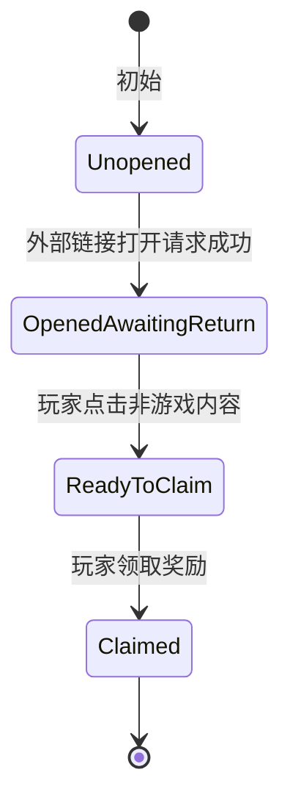

# LinkTree 奖励入口设计

## 功能定位

LinkTree 页用于在系统功能面板中展示外部链接入口，并承接轻量活动奖励。玩家可以通过点击 Banner 打开外部页面，并在客户端确认外部页面打开成功后领取一次奖励。

本功能使用 Steam Inventory 领取 Bundle 发放平台奖励，并以 Bundle 中永久保留的回执判断是否已经领取。Dev 构建提供独立的 LinkTree UI 模拟开关，用于反复测试角标、外部操作等待、领奖状态和反馈动画；模拟流程不访问 Steam Inventory，也不发放本地奖励。

## 当前入口

当前配置来源为 `LinkTree` 表。首批正式入口类型包括：

1. Twitter 关注页。
2. Steam 社区页。
3. Steam 商店页。
4. 小红书主页。

游戏前期 LinkTree 入口数量较少，默认全部开放展示，不使用本地开始时间或结束时间字段控制可见性。

LinkTree 页面按照 `GameDevelopConfig.LinkTreeVisibleBannerCount` 控制最佳展示数量。玩家每次进入页面时重新选择展示条目，置顶条目优先，其次是尚未领取的普通条目；已领取的普通条目只用于补足空位。玩家在当前页面完成领奖后，展示列表不立即变化，下次进入页面时才可能由其他条目顶替。

当有效条目总数少于最佳展示数量时，所有条目都会显示。当置顶条目数量超过最佳展示数量时，所有置顶条目仍然显示，同时输出配置警告。

## 交互流程

LinkTree 奖励入口采用四段状态：

各状态表现如下：

1. `Unopened`
   - Banner 显示礼物角标。
   - 礼物角标使用未激活颜色。
   - 点击 Banner 打开 `PreClaimUrl`。

2. `OpenedAwaitingReturn`
   - 外部链接打开请求通过 `OpenCheckType` 校验后进入该状态。
   - 显示效果与 `Unopened` 相同，不提前提示奖励可领。
   - 玩家需要在真实游戏内容之外点击一次，才会进入 `ReadyToClaim`。
   - 非游戏内容命中复用宿主窗口的真实交互区域判断；透明缓冲区不属于游戏内容。

3. `ReadyToClaim`
   - 礼物角标变为可领取颜色。
   - 点击 Banner 或角标领取奖励。

4. `Claimed`
   - 礼物角标隐藏。
   - 玩家在当前记录来源下不能再次领取该入口奖励。
   - 再次点击 Banner 打开 `PostClaimUrl`。

外部行为校验仍属于客户端可信流程。系统只确认 `OS.ShellOpen` 请求成功，并等待一次非游戏内容点击，不验证玩家是否真的完成关注、浏览或其它网页操作。该限制的作用是避免奖励过早变为可领，不承担反作弊职责。

## 奖励类型

`ELinkTreeRewardType` 描述玩家领取后获得什么奖励。

当前计划支持：

1. `None`
   - 无实际奖励。
   - 只记录访问和领取状态。

2. `FixedItem`
   - 固定道具奖励。
   - `RewardItemId` 填本地 `Item.Id`，用于展示和映射。
   - 实际物品由 Steam 领取 Bundle 直接发放，其 ItemDef 来自 `Item.SteamItemDefId`；客户端不在本地凭空添加该道具。

3. `FixedChips`
   - 固定筹码奖励。
   - 所有玩家领取相同数量的 `RewardChips` 筹码。
   - Steam Bundle 只发永久回执，回执确认后由客户端增加筹码。筹码属于本地可信度较低的单机资源，不要求进入 Steam Inventory。

4. `SequentialPack`
   - 顺序礼包奖励。
   - 例如签到格子：玩家按个人领取进度依次获得第 1、2、3、4、5 格奖励。
   - 如果玩家仍有领取资格但已经超过最后一格，则之后每次领取最后一格奖励。
   - 当前版本只预留表字段，不实现该功能。

5. `BlindBox`
   - 奖励一张指定盲盒的 Steam 开箱成本券，并在领奖后自动进入开盒表演。
   - `RewardBlindBoxId` 填本地 `BlindBox.Id`；领取 Bundle 的实际内容必须包含该盲盒的 `SteamOpenCostItemDefId`。
   - 当前已完成表字段、枚举和转换器配方校验；客户端自动兑换并进入开盒表演尚未实现。

当前客户端已实现 `None`、`FixedItem` 和 `FixedChips`。`SequentialPack` 与 `BlindBox` 仍属于后续工作。

## 领取记录

领取记录来源不放入 `LinkTree` 表。它属于运行环境策略，而不是单个入口的策划数据。

当前策略如下：

1. Dev 构建可以显式开启 LinkTree UI 模拟。
   - 开启后，所有有效入口从未领取状态开始，仅在内存中推进表现状态。
   - 模拟领奖不创建 Steam 回执，不修改本地存档，也不发放筹码或道具。
   - 关闭后重新同步 Steam Inventory，并恢复真实领取状态。
   - 已有真实 Steam 领奖事务在途时，不允许进入模拟模式。

2. 正常模式使用 Steam Inventory。
   - Steam Inventory 负责判断玩家是否已经领取过正式奖励。
   - 客户端对 `SteamClaimBundleItemDefId` 调用 `AddPromoItem`；Bundle 展开后不会作为库存实例保留。
   - `SteamReceiptItemDefId` 对应的永久回执必须包含在 Bundle 中，启动同步时以该回执恢复 `Claimed`。
   - 固定物品由同一 Bundle 直接写入 Steam 库存，再通过完整库存同步映射到本地背包。
   - 固定筹码只在永久回执得到确认后由客户端本地发放。
   - 玩家修改本地时间或本地数据不应绕过 Steam 的最终领取判断。

LinkTree 永久回执不得被消费。`AddPromoItem` 请求成功不等于领取 Bundle 已经展开，客户端只有在返回结果或后续完整库存中确认永久回执后，才完成领奖状态并发放本地筹码。`ConsumeItem` 删除回执实例后不会重置一次性 Promo 资格，因此不能用于重复测试首次领奖流程；完整规则与测试方式见 [SteamItemDef 表说明](SteamItemDef表说明.md#回执生命周期与测试限制)。

领奖前先保存一笔本地待处理事务，其中同时记录 LinkTree ID、领取 Bundle ItemDef ID 和永久回执 ItemDef ID。回调丢失、断线或进程中断后，客户端先同步完整库存并查找永久回执，再决定完成事务或允许重试。旧版只保存一个 Steam ItemDef ID 的待处理事务在迁移时直接清除，不猜测其新含义。

Steam Inventory 不可用时，LinkTree 显示平台服务不可用，不根据 Dev 渠道或 Steam 登录状态隐式切换为内存领奖。调试行为只由显式 UI 模拟开关控制。

## 数据表

`LinkTree` 表描述入口展示、链接和奖励内容。

字段说明：

1. `Id`
   - 入口唯一 ID。

2. `Key`
   - 稳定机器名。
   - 可用于代码、Steam 记录或未来本地记录。

3. `SortOrder`
   - 显示顺序。
   - 数字越小越靠前。

4. `IsPinned`
   - 是否为长期保留的置顶入口。
   - 置顶条目不会因奖励已经领取而被其他条目替换，并优先占用展示名额。
   - 该字段不绕过 `IsEnabled` 等基础有效性条件。

5. `IsEnabled`
   - 是否显示入口。

6. `TooltipKey`
   - 提示文本 Key。
   - 当前也可直接填简短显示名。

7. `BannerTexturePath`
   - Banner 图片路径。

8. `BadgeTexturePath`
   - 礼物角标图片路径。
   - 当前使用 `UI/LinkTree/Icon_Gift.svg`。

9. `PreClaimUrl`
   - 领奖前点击 Banner 打开的 URL。
   - 可用于关注页、活动页、带 pre-claim UTM 的商店页。

10. `PostClaimUrl`
   - 领奖后再次点击 Banner 打开的 URL。
   - 可用于普通主页、社区页、带 post-claim UTM 的商店页。

11. `OpenCheckType`
    - 外部链接打开校验方式。
    - 当前使用 `ShellOpenOk`。

12. `RewardType`
    - 奖励类型。

13. `RewardItemId`
    - `RewardType=FixedItem` 时使用。
    - 填本地 `Item.Id`，用于奖励图标和 Steam 物品映射，不填写 Steam ItemDef ID。

14. `RewardChips`
    - `RewardType=FixedChips` 时使用。

15. `SequentialPackId`
    - `RewardType=SequentialPack` 时使用。
    - 当前预留。

16. `RewardBlindBoxId`
    - `RewardType=BlindBox` 时使用，填写本地 `BlindBox.Id`。

17. `SteamReceiptItemDefId`
    - Steam Inventory 中用于标记该入口已经领取的一次性永久回执 ItemDef ID。
    - LinkTree 奖励固定为一次性领取，不再额外配置领取次数。

18. `SteamClaimBundleItemDefId`
    - 客户端调用 `AddPromoItem` 时提交的领取 Bundle ItemDef ID。
    - Bundle 必须包含 `SteamReceiptItemDefId`，并根据奖励类型包含固定物品或盲盒开箱成本券。
    - 旧版或停用条目允许暂时填 `0`，但不能执行真实领奖。

## 枚举

`ELinkTreeOpenCheckType`：

1. `None`
   - 不做打开校验。

2. `ShellOpenOk`
   - `OS.ShellOpen` 返回成功后允许进入可领取状态。

3. `SteamClientOk`
   - 预留：确认 Steam 客户端或 Steam overlay 成功打开后允许领取。

4. `BrowserProcessOk`
   - 预留：确认浏览器启动成功后允许领取。

`ELinkTreeRewardType`：

1. `None`
2. `FixedItem`
3. `FixedChips`
4. `SequentialPack`
5. `BlindBox`

## 暂不实现内容

以下内容不阻塞当前版本：

1. LinkTree 数据热更新。
2. 顺序礼包奖励。
3. LinkTree 盲盒奖励的自动兑换与开盒表演。
4. 本地可见开始时间和结束时间。
5. 自建服务器校验。
