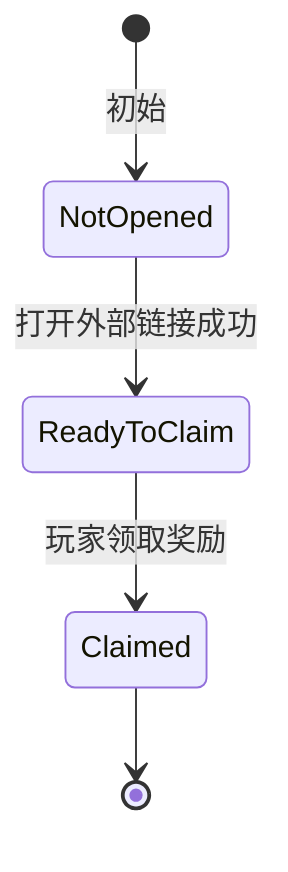

# LinkTree 奖励入口设计

## 功能定位

LinkTree 页用于在系统功能面板中展示外部链接入口，并承接轻量活动奖励。玩家可以通过点击 Banner 打开外部页面，并在客户端确认外部页面打开成功后领取一次奖励。

本功能当前优先服务早期版本的推广入口和领取反馈，不阻塞 Steam Inventory 的正式接入。正式发售前，领取去重应切换到 Steam Inventory；开发阶段可以继续使用内存态记录，方便重启游戏后反复测试。

## 当前入口

当前配置来源为 `LinkTreeReward` 表。首批入口包括：

1. Twitter 关注页。
2. Steam 社区页。
3. Steam 商店页。
4. 小红书主页。

游戏前期 LinkTree 入口数量较少，默认全部开放展示，不使用本地开始时间或结束时间字段控制可见性。

## 交互流程

LinkTree 奖励入口采用三段状态：

各状态表现如下：

1. `NotOpened`
   - Banner 显示礼物角标。
   - 礼物角标使用未激活颜色。
   - 点击 Banner 打开 `PreClaimUrl`。

2. `ReadyToClaim`
   - 仅当外部链接打开校验成功后进入该状态。
   - 礼物角标变为可领取颜色。
   - 点击 Banner 或角标领取奖励。

3. `Claimed`
   - 礼物角标隐藏。
   - 玩家在当前记录来源下不能再次领取该入口奖励。
   - 再次点击 Banner 打开 `PostClaimUrl`。

当前客户端可信度要求较低。只要 `OS.ShellOpen` 返回成功，即可认为玩家已经完成访问动作。即使玩家刻意作弊，也不作为本阶段重点防护对象。

## 奖励类型

`ELinkTreeRewardType` 描述玩家领取后获得什么奖励。

当前计划支持：

1. `None`
   - 无实际奖励。
   - 只记录访问和领取状态。

2. `FixedItem`
   - 固定道具奖励。
   - 所有玩家领取相同的 `RewardItemId` 道具。

3. `FixedChips`
   - 固定筹码奖励。
   - 所有玩家领取相同数量的 `RewardChips` 筹码。

4. `SequentialPack`
   - 顺序礼包奖励。
   - 例如签到格子：玩家按个人领取进度依次获得第 1、2、3、4、5 格奖励。
   - 如果玩家仍有领取资格但已经超过最后一格，则之后每次领取最后一格奖励。
   - 当前版本只预留表字段，不实现该功能。

当前开发重点只实现 `FixedItem` 和 `FixedChips`。

## 领取记录

领取记录来源不放入 `LinkTreeReward` 表。它属于运行环境策略，而不是单个入口的策划数据。

建议策略如下：

1. 开发调试阶段使用内存记录。
   - 重启游戏即可重置领取状态。
   - 适合反复测试角标、打开链接、领取流程和奖励发放。

2. 正式 Steam 版本使用 Steam Inventory。
   - Steam Inventory 负责判断玩家是否已经领取过正式奖励。
   - 本地客户端只负责展示状态和发起领取请求。
   - 玩家修改本地时间或本地数据不应绕过 Steam 的最终领取判断。

后续接入 Steam Inventory 后，Debug 页可以增加临时覆盖项，在 `Auto`、`MemoryOnly` 和 `SteamInventory` 之间切换。`Auto` 根据构建渠道和平台选择默认策略。

## 数据表

`LinkTreeReward` 表描述入口展示、链接和奖励内容。

字段说明：

1. `Id`
   - 入口唯一 ID。

2. `Key`
   - 稳定机器名。
   - 可用于代码、Steam 记录或未来本地记录。

3. `SortOrder`
   - 显示顺序。
   - 数字越小越靠前。

4. `IsEnabled`
   - 是否显示入口。

5. `TooltipKey`
   - 提示文本 Key。
   - 当前也可直接填简短显示名。

6. `BannerTexturePath`
   - Banner 图片路径。

7. `BadgeTexturePath`
   - 礼物角标图片路径。
   - 当前使用 `UI/LinkTree/Icon_Gift.svg`。

8. `PreClaimUrl`
   - 领奖前点击 Banner 打开的 URL。
   - 可用于关注页、活动页、带 pre-claim UTM 的商店页。

9. `PostClaimUrl`
   - 领奖后再次点击 Banner 打开的 URL。
   - 可用于普通主页、社区页、带 post-claim UTM 的商店页。

10. `OpenCheckType`
    - 外部链接打开校验方式。
    - 当前使用 `ShellOpenOk`。

11. `RewardType`
    - 奖励类型。

12. `RewardItemId`
    - `RewardType=FixedItem` 时使用。

13. `RewardChips`
    - `RewardType=FixedChips` 时使用。

14. `SequentialPackId`
    - `RewardType=SequentialPack` 时使用。
    - 当前预留。

15. `SteamPromoItemDefId`
    - 未来 Steam 库存发奖或领取标记用的 itemdef ID。
    - 当前可填 `0`。

16. `ClaimLimit`
    - 每个玩家最多领取次数。
    - 常规入口填 `1`。

## 枚举

`ELinkTreeOpenCheckType`：

1. `None`
   - 不做打开校验。

2. `ShellOpenOk`
   - `OS.ShellOpen` 返回成功后允许进入可领取状态。

3. `SteamClientOk`
   - 预留：确认 Steam 客户端或 Steam overlay 成功打开后允许领取。

4. `BrowserProcessOk`
   - 预留：确认浏览器启动成功后允许领取。

`ELinkTreeRewardType`：

1. `None`
2. `FixedItem`
3. `FixedChips`
4. `SequentialPack`

## 暂不实现内容

以下内容不阻塞当前版本：

1. Steam Inventory 正式领取去重。
2. LinkTree 数据热更新。
3. 顺序礼包奖励。
4. 本地可见开始时间和结束时间。
5. 自建服务器校验。

