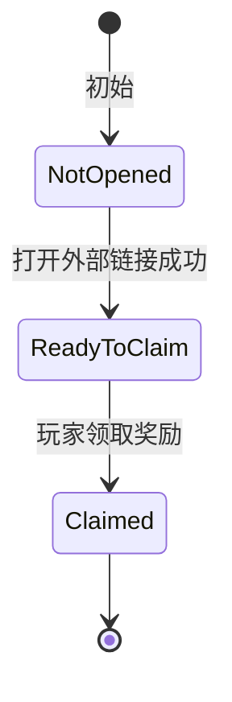

# LinkTree 奖励入口设计

## 功能定位

LinkTree 页用于在系统功能面板中展示外部链接入口，并承接轻量活动奖励。玩家可以通过点击 Banner 打开外部页面，并在客户端确认外部页面打开成功后领取一次奖励。

本功能当前使用 Steam Inventory 永久回执完成领取去重。Dev 构建提供独立的 LinkTree UI 模拟开关，用于反复测试角标、外部操作等待、领奖状态和反馈动画；模拟流程不访问 Steam Inventory，也不发放本地奖励。

## 当前入口

当前配置来源为 `LinkTreeReward` 表。首批入口包括：

1. Twitter 关注页。
2. Steam 社区页。
3. Steam 商店页。
4. 小红书主页。

游戏前期 LinkTree 入口数量较少，默认全部开放展示，不使用本地开始时间或结束时间字段控制可见性。

LinkTree 页面按照 `GameDevelopConfig.LinkTreeVisibleBannerCount` 控制最佳展示数量。玩家每次进入页面时重新选择展示条目，置顶条目优先，其次是尚未领取的普通条目；已领取的普通条目只用于补足空位。玩家在当前页面完成领奖后，展示列表不立即变化，下次进入页面时才可能由其他条目顶替。

当有效条目总数少于最佳展示数量时，所有条目都会显示。当置顶条目数量超过最佳展示数量时，所有置顶条目仍然显示，同时输出配置警告。

## 交互流程

LinkTree 奖励入口采用三段状态：

各状态表现如下：

1. `NotOpened`
   - Banner 显示礼物角标。
   - 礼物角标使用未激活颜色。
   - 点击 Banner 打开 `PreClaimUrl`。

2. `ReadyToClaim`
   - 仅当外部链接打开校验成功后进入该状态。
   - 礼物角标变为可领取颜色。
   - 点击 Banner 或角标领取奖励。

3. `Claimed`
   - 礼物角标隐藏。
   - 玩家在当前记录来源下不能再次领取该入口奖励。
   - 再次点击 Banner 打开 `PostClaimUrl`。

当前客户端可信度要求较低。只要 `OS.ShellOpen` 返回成功，即可认为玩家已经完成访问动作。即使玩家刻意作弊，也不作为本阶段重点防护对象。

## 奖励类型

`ELinkTreeRewardType` 描述玩家领取后获得什么奖励。

当前计划支持：

1. `None`
   - 无实际奖励。
   - 只记录访问和领取状态。

2. `FixedItem`
   - 固定道具奖励。
   - 所有玩家领取相同的 `RewardItemId` 道具。

3. `FixedChips`
   - 固定筹码奖励。
   - 所有玩家领取相同数量的 `RewardChips` 筹码。

4. `SequentialPack`
   - 顺序礼包奖励。
   - 例如签到格子：玩家按个人领取进度依次获得第 1、2、3、4、5 格奖励。
   - 如果玩家仍有领取资格但已经超过最后一格，则之后每次领取最后一格奖励。
   - 当前版本只预留表字段，不实现该功能。

当前开发重点只实现 `FixedItem` 和 `FixedChips`。

## 领取记录

领取记录来源不放入 `LinkTreeReward` 表。它属于运行环境策略，而不是单个入口的策划数据。

当前策略如下：

1. Dev 构建可以显式开启 LinkTree UI 模拟。
   - 开启后，所有有效入口从未领取状态开始，仅在内存中推进表现状态。
   - 模拟领奖不创建 Steam 回执，不修改本地存档，也不发放筹码或道具。
   - 关闭后重新同步 Steam Inventory，并恢复真实领取状态。
   - 已有真实 Steam 领奖事务在途时，不允许进入模拟模式。

2. 正常模式使用 Steam Inventory。
   - Steam Inventory 负责判断玩家是否已经领取过正式奖励。
   - 本地客户端只负责展示状态和发起领取请求。
   - 玩家修改本地时间或本地数据不应绕过 Steam 的最终领取判断。

Steam Inventory 不可用时，LinkTree 显示平台服务不可用，不根据 Dev 渠道或 Steam 登录状态隐式切换为内存领奖。调试行为只由显式 UI 模拟开关控制。

## 数据表

`LinkTreeReward` 表描述入口展示、链接和奖励内容。

字段说明：

1. `Id`
   - 入口唯一 ID。

2. `Key`
   - 稳定机器名。
   - 可用于代码、Steam 记录或未来本地记录。

3. `SortOrder`
   - 显示顺序。
   - 数字越小越靠前。

4. `IsPinned`
   - 是否为长期保留的置顶入口。
   - 置顶条目不会因奖励已经领取而被其他条目替换，并优先占用展示名额。
   - 该字段不绕过 `IsEnabled` 等基础有效性条件。

5. `IsEnabled`
   - 是否显示入口。

6. `TooltipKey`
   - 提示文本 Key。
   - 当前也可直接填简短显示名。

7. `BannerTexturePath`
   - Banner 图片路径。

8. `BadgeTexturePath`
   - 礼物角标图片路径。
   - 当前使用 `UI/LinkTree/Icon_Gift.svg`。

9. `PreClaimUrl`
   - 领奖前点击 Banner 打开的 URL。
   - 可用于关注页、活动页、带 pre-claim UTM 的商店页。

10. `PostClaimUrl`
   - 领奖后再次点击 Banner 打开的 URL。
   - 可用于普通主页、社区页、带 post-claim UTM 的商店页。

11. `OpenCheckType`
    - 外部链接打开校验方式。
    - 当前使用 `ShellOpenOk`。

12. `RewardType`
    - 奖励类型。

13. `RewardItemId`
    - `RewardType=FixedItem` 时使用。

14. `RewardChips`
    - `RewardType=FixedChips` 时使用。

15. `SequentialPackId`
    - `RewardType=SequentialPack` 时使用。
    - 当前预留。

16. `SteamPromoItemDefId`
    - Steam Inventory 中用于标记该入口已经领取的一次性永久回执 ItemDef ID。
    - LinkTree 奖励固定为一次性领取，不再额外配置领取次数。

## 枚举

`ELinkTreeOpenCheckType`：

1. `None`
   - 不做打开校验。

2. `ShellOpenOk`
   - `OS.ShellOpen` 返回成功后允许进入可领取状态。

3. `SteamClientOk`
   - 预留：确认 Steam 客户端或 Steam overlay 成功打开后允许领取。

4. `BrowserProcessOk`
   - 预留：确认浏览器启动成功后允许领取。

`ELinkTreeRewardType`：

1. `None`
2. `FixedItem`
3. `FixedChips`
4. `SequentialPack`

## 暂不实现内容

以下内容不阻塞当前版本：

1. LinkTree 数据热更新。
2. 顺序礼包奖励。
3. 本地可见开始时间和结束时间。
4. 自建服务器校验。
