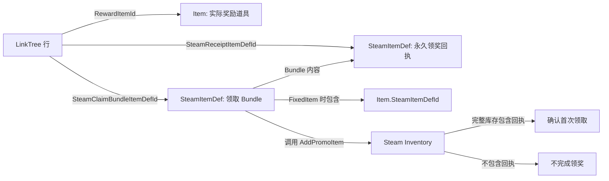

# SteamItemDef 表说明

本文记录已经导出到项目目录的直接奖励 ItemDef 数据和转换器规则。常规标准券、新手券和盲盒招待券已退出客户端运行时；旧定义因 Steam ItemDef 不可复用而继续保留，旧 PlaytimeGenerator 通过 `use_drop_limit=true`、`drop_limit=0` 停止发放。新版 schema 文件已经由转换器生成，新手阶段配置、直接奖励客户端、进度回执和 Mock 回归已经完成；正式上传与真实 Steam 帐号回归尚未执行。目标行为以 [盲盒系统设计](盲盒系统设计.md) 为准。

非循环 Schedule 的 Steam 资格提前量统一读取 `SteamPlaytimeEligibilityLeadSeconds`，当前导出配置为 `180` 秒。转换器和客户端使用同一公式与分钟向上取整结果；旧字段 `SteamPlaytimeDropLeadSeconds`、`SteamPlaytimeRequestLeadSeconds` 已移除，不新增独立的 25 秒参数。请求失败、超时或结果未知时遵守 65 秒公共节流继续复查或重试；展示点没有可信奖励则直接进入 Fallback。循环 Schedule 继续使用独立心跳。

完整库存同步不再把所有服务器新增数量标记为 New。客户端在请求前保存实例级库存基线，优先读取本次回调实例，并在结果未知时通过可信完整库存差量定位合法候选；只有能够归因到当前盲盒准备事务的实例才进入待揭晓状态。首次同步和无法归因的普通对账只静默修正拥有数量，不批量添加 New、不自动装备，也不触发获得型反馈。

`BlindBox` 保留默认支付规则，`BlindBoxSchedule.CostChipsOverride` 只覆盖特殊展示机会：正数覆盖成本，`0` 继承，负数表示免费并以绝对值作为删除线参考价格。Schedule 1001 配置为 `-1000`，其正常装扮和本地 Refreshment Fallback 均免费显示删除线 1000；迟到装扮使用 BlindBox 默认价格。

## 功能定位

`SteamItemDef` 表是 Lucky Dog Rise 的 Steam Inventory 平台规则源。它主要描述没有对应本地 `Item` 行的回执、Bundle、Generator、PlaytimeGenerator，以及必须保留的历史定义。

本表不是玩家实际库存，也不直接描述游戏本地背包。Steam 为每一位玩家实际生成的物品称为库存实例；本表中的每一行只是生成该类实例时使用的定义。

实际装扮、饮品和卡背等游戏物品仍由 `Item` 表统一管理。转换器合并 `SteamItemDef` 与 `Item` 的 Steam 映射后，生成最终可上传的 Steam schema。

## 与本地 Item 表的关系

`Item` 表描述游戏里的实际内容道具，并通过 `SteamItemDefId` 等字段生成对应的 Steam `item` 定义。实际道具不应在 `SteamItemDef` 表里再复制一行。

`SteamItemDef` 表管理 LinkTree 回执、新手进度回执、Bundle、Generator 和 PlaytimeGenerator 等平台规则定义。`BlindBoxSchedule.SteamPlaytimeGeneratorItemDefId` 指向直接奖励 PlaytimeGenerator；该定义以数量 1 引用一个盲盒奖励池 Generator，转换器再沿 Schedule 的 `BlindBoxId` 生成或校验奖池。客户端调用 `TriggerItemDrop` 后，Steam 在同一次操作中递归展开并把最终具体装扮写入库存。

当 LinkTree 奖励已有道具时，`LinkTree.RewardItemId` 直接填写原有 `Item.Id`，不复制一行新的本地道具数据。每条可领奖入口同时引用一个永久回执和一个领取 Bundle：`SteamReceiptItemDefId` 用于判断是否已经领取，`SteamClaimBundleItemDefId` 是客户端调用 `AddPromoItem` 的目标。



## LinkTree 领取定义

每条启用真实领奖的 LinkTree 入口由两条 SteamItemDef 组成。具体 ItemDef ID 属于环境配置，测试版和正式版可以更换，业务规则不依赖某个固定数字段。

永久回执统一使用以下规则：

1. `Type=Item`。
2. `PromoRule=manual`。
3. `GrantedManually=TRUE`。
4. `Tradable=FALSE`、`Marketable=FALSE`。
5. `GameOnly=TRUE`、`StoreHidden=TRUE`。
6. `AutoStack=FALSE`。
7. `Bundle` 留空。

领取 Bundle 统一使用以下规则：

1. `Type=Bundle`。
2. `PromoRule=manual`。
3. `GrantedManually=TRUE`。
4. `Tradable=FALSE`、`Marketable=FALSE`。
5. `GameOnly=TRUE`、`StoreHidden=TRUE`。
6. `AutoStack=FALSE`。
7. `Bundle` 必须包含该入口的永久回执，且配方由奖励类型决定。

领取 Bundle 配方规则：

1. `RewardType=None` 或 `FixedChips`
   - 只包含永久回执。
2. `RewardType=FixedItem`
   - 包含永久回执和 `RewardItemId` 对应的 `Item.SteamItemDefId`。
3. `RewardType=BlindBox`
   - 尚未迁移到直接奖励架构；转换器拒绝启用的真实领奖入口，不能用旧券配方继续导出。
4. `RewardType=SequentialPack`
   - 当前未实现，不允许配置为启用的真实领奖入口。

客户端在玩家完成 LinkTree 的打开流程后，对领取 Bundle 调用 `AddPromoItem`。Steam 展开 Bundle 后返回其中的最终物品，Bundle 本身不会保留在库存中。永久回执不销毁，用于启动同步、领奖回调和中断恢复时判断该奖励是否已经领取。

固定物品由 Steam 直接写入玩家库存，再由完整库存同步映射到本地 `Item` 和背包。客户端不得根据 `RewardItemId` 直接添加本地物品，因此篡改本地表不能改变 Steam 实际发放内容。固定筹码不进入 Steam Inventory；永久回执确认后，客户端按 `RewardChips` 增加本地筹码。

## 回执生命周期与测试限制

`AddPromoItem` 发放的是一次性 Promo。接口接受请求或返回 `k_EResultOK`，不代表领取 Bundle 一定展开了新物品；玩家不符合资格或该 Promo 已经发放过时，结果仍可能成功，但其中不包含任何新增物品。客户端只有在返回结果或后续完整库存中实际确认永久回执后，才能完成领奖状态并发放本地筹码。

`ConsumeItem` 只会永久删除指定库存实例，不会重置 Steam 服务器对该账号保存的一次性 Promo 发放记录。回执被消耗后，再次对同一个领取 Bundle 调用 `AddPromoItem` 可能仍返回成功，但不会重新生成回执。因此，LinkTree 永久回执在正式业务中不得被消耗，也不能将 `ConsumeItem` 作为重置领奖资格的调试手段。

`GenerateItems` 可以为发行商组内的开发者账号生成测试实例，但它不会重置一次性 Promo 的发放记录。该接口只适合恢复测试账号中被误删的实例或验证库存读取，不适合验证完整的首次 `AddPromoItem` 领奖流程。

完整重测首次领奖流程时，应使用该 Steam 账号从未领取过的新领取 Bundle 与永久回执组合，或使用另一个测试账号。独立 Steam Inventory 测试场景中的消耗和生成功能均会真实修改当前开发者账号的库存。

## 新手进度回执

`BlindBoxSchedule.SteamCompletionReceiptItemDefId` 用于配置粗粒度的新手流程完成凭证。字段为 `0` 时该 Schedule 不写进度回执；正数必须指向一条启用、安全且永久的 `SteamItemDef`。当前配置为：

1. Schedule 1005 → ItemDef `500005`，表示前 5 个新手展示机会已经完成。
2. Schedule 1012 → ItemDef `500012`，表示全部 12 个新手展示机会已经完成。

进度回执必须满足以下规则：

1. `Type=Item`、`PromoRule=manual`、`GrantedManually=TRUE`。
2. `Tradable=FALSE`、`Marketable=FALSE`、`AutoStack=FALSE`。
3. `GameOnly=TRUE`、`StoreHidden=TRUE`，不向玩家展示为可使用物品。
4. `Bundle` 留空；回执通过对自身 ItemDef 调用 `AddPromoItem` 发放，不嵌入 PlaytimeGenerator 或装扮 Generator。
5. 一条回执只能映射一个非循环 Schedule；循环 Schedule 不得配置。
6. Release 业务配置不得引用 Playtest 专用 ID 段。

回执在对应前台奖励真正领取后发放，与 Steam 是否为本次展示提供装扮无关，因此本地 Schedule 奖励和 Fallback 同样能够推进检查点。客户端只保存一个最高待补交回执；可信库存中已经存在较高检查点时，只向前恢复本地新手进度，不回退现有进度，也不替换已锁定气球或进行中的表演。

这套回执不是逐条云存档。它只降低换机后的最大重跑长度，不恢复本地筹码、消耗品、装备、New、统计或精确倒计时。

相关 Steam 官方说明：[ISteamInventory::AddPromoItem、ConsumeItem 与 GenerateItems](https://partner.steamgames.com/doc/api/isteaminventory)。

## 字段说明

### 基础识别

`Id`

Steam Inventory 的 ItemDef ID。每个 AppID 内唯一；发布并投入使用后不得改作其它用途。非创意工坊物品 ID 必须小于 `1000000`。

`Key`

稳定机器名，用于转换脚本、日志和策划识别。发布后不要改名。

`Type`

Steam 物品定义类型，使用 `ESteamItemDefType` 枚举。转换到 Steam schema 时会映射为 Steam 要求的小写字符串。

`Name`

Steam 后台的英文名称。`GameOnly=TRUE` 的内部回执不会向玩家显示，但仍应填写稳定、容易检索的英文名称。

`Description`

Steam 后台的英文说明。内部回执可使用简短技术说明。

`IsEnabled`

是否参与 Steam ItemDef 配置导出。已发布且不再使用的定义不应复用 ID；需要停止发放时应关闭促销资格或停用对应业务入口。

对于已经上传到 Steamworks 的定义，`IsEnabled=FALSE` 不应使转换器将该行从完整 Steam schema 中省略，否则仍持有该库存实例的玩家可能无法取得定义信息。该字段仅用于阻止从未发布的草稿参与首次发布；已发布定义需要停止使用时，应保留定义并关闭对应的业务入口或促销资格。

`SteamUseDropLimit`

是否为没有被启用 Schedule 引用的 PlaytimeGenerator 显式输出 Steam `use_drop_limit`。活动中的投放上限仍由 `BlindBoxSchedule.MaxGrantCount` 自动生成，不在本字段重复维护。

`SteamDropLimit`

与 `SteamUseDropLimit` 配套的 Steam 永久投放上限。已发布但需要停止发放的 PlaytimeGenerator 保留原定义，并填写 `SteamUseDropLimit=TRUE`、`SteamDropLimit=0`。非 PlaytimeGenerator、活动中的 Schedule Generator 以及不需要显式限制的定义统一填写 `FALSE/0`。

### 促销与发放

`PromoRule`

Steam 的 `promo` 属性原文。支持复杂规则，因此使用字符串而不是项目枚举。

常用填写：

1. `manual`
   - 仅在客户端显式调用 `AddPromoItem` 或 `AddPromoItems` 时检查和发放。
   - LinkTree 永久回执与领取 Bundle 都使用此值。

2. `owns:2583700`
   - 正式 AppID 的拥有者满足促销资格。
   - 适合低价值的全员补偿；客户端调用 `GrantPromoItems` 后领取。

`GrantedManually`

是否只允许通过指定 ItemDef 的 `AddPromoItem` 或 `AddPromoItems` 发放。LinkTree 永久回执与领取 Bundle 填写 `TRUE`，避免被通用 `GrantPromoItems` 意外领取。

### Steam 社区可见性

`Tradable`

是否允许在 Steam 玩家之间交易。永久回执、补偿回执、内部令牌通常填写 `FALSE`。

`Marketable`

是否允许在 Steam 社区市场出售。内部令牌通常填写 `FALSE`。

`GameOnly`

是否只在游戏内使用。填写 `TRUE` 时，物品不会显示在 Steam 背包和新物品通知中。永久领奖回执和内部资格令牌填写 `TRUE`。

`StoreHidden`

是否在 Steam Item Store 隐藏。非售卖物品填写 `TRUE`。

`AutoStack`

同一 ItemDef 的多次发放是否自动堆叠为一个库存实例。一次性永久回执不需要堆叠，填写 `FALSE`；可累积的消耗品可视业务需要填写 `TRUE`。

### 复杂物品

`Bundle`

仅 `Bundle`、`Generator` 和 `PlaytimeGenerator` 使用的内容配方。

1. `Bundle`
   - 填固定内容，例如 `<ReceiptItemDefId>x1;<RewardItemDefId>x1`。
   - Steam 发放礼包时自动展开为这些实际物品。
   - LinkTree 领取 Bundle 使用显式固定配方，不使用 `@AUTO`。

2. `Generator`
   - 填随机权重，例如 `100101x80;100102x20`。
   - Steam 发放生成器时按权重产生结果；生成器本身不会保留在玩家库存中。
   - 填 `@AUTO` 时，转换器会根据引用它的 `BlindBox`、`BlindBoxRarityRate` 和 `Item` 权重列生成完整奖池。

3. `PlaytimeGenerator`
   - 当前项目用于直接准备盲盒装扮，必须以数量 1 引用一个 Generator 奖励池，例如 `301001x1`。
   - 客户端在合适时机调用 `TriggerItemDrop`，Steam 根据游玩时间、冷却和投放上限决定是否发放，并递归展开 Generator 返回最终具体物品。

普通 `Item` 和本来就没有内容配方的定义留空。不要使用“留空表示自动生成”的隐含约定。

## Generator 自动奖池

`@AUTO` 只允许用于 `Type=Generator`。转换器沿 `BlindBoxSchedule → PlaytimeGenerator.Bundle → Generator` 找到对应盲盒，再按与游戏本地盲盒相同的两阶段逻辑生成 Steam 的单层权重：

```text
物品最终概率 = 该品质概率 * 物品在该品质内的权重 / 该品质候选物品总权重
```

品质概率来自 `BlindBoxRarityRate`。品质内候选物品及权重列由盲盒类型决定，例如标准盲盒读取 `Item.StandardBoxWeight`，新手盲盒读取 `Item.NewbieBoxWeight`。转换器会把最终概率缩放为总量 `1000000` 的整数权重，并在生成前检查以下问题：

1. 启用品质缺少正概率。
2. 正概率品质没有可用候选物品。
3. 候选物品没有填写 `SteamItemDefId`。
4. 多个盲盒错误地共用同一个 `@AUTO` Generator。

因此，Steam 不需要先随机品质再随机物品。品质仍是本地策划结构，转换器负责把它无损展平为 Steam Generator 可以读取的单层奖池。

`Item.ItemRarity` 会自动生成 Steam 的小写 `rarity:` 标签。`Item.SteamTags` 只填写其它标签；手工填写 `rarity:` 会被转换器拒绝，避免品质字段与标签不一致。

## PlaytimeGenerator 直接奖励投放

`BlindBoxSchedule.SteamPlaytimeGeneratorItemDefId` 指向负责该行投放资格的 PlaytimeGenerator。每个 PlaytimeGenerator 只能对应一条 Schedule，其 `Bundle` 必须以数量 1 引用一个 Generator 奖励池，关系如下：

```text
BlindBoxSchedule.BlindBoxId = <BlindBoxId>
PlaytimeGenerator.Bundle = <RewardGeneratorItemDefId>x1
RewardGenerator.Bundle = @AUTO 或显式最终物品权重
```

转换器依据本地投放时间、等待倍率、Steam 提前量和掉落窗口生成分钟级参数。

一次性新手 Schedule 使用：

```text
实际投放秒数 = 本地基础秒数 * GameDevelopConfig.BlindBoxWaitDurationMultiplier
Steam 资格秒数 = max(0, 实际投放秒数 - GameDevelopConfig.SteamPlaytimeEligibilityLeadSeconds)
drop_interval = max(1, ceil(Steam 资格秒数 / 60))
```

循环 Schedule 不使用提前量：

```text
drop_interval = max(1, ceil(IntervalSeconds × BlindBoxWaitDurationMultiplier / 60))
drop_window = max(1, ceil(SteamDropWindowSeconds × BlindBoxWaitDurationMultiplier / 60))
drop_max_per_window = SteamDropMaxPerWindow
```

`SteamDropWindowSeconds=0` 时不输出窗口属性，并要求 `SteamDropMaxPerWindow=0`；启用窗口时最大次数必须为 `1..10`。启用 Schedule 的 `MaxGrantCount >= 0` 时生成 `use_drop_limit=true` 和相应 `drop_limit`；无限循环生成 `use_drop_limit=false`。

客户端不会等待 Steam 自动发放。非循环新手阶段根据与转换器相同的分钟级资格结果进入请求窗口，并通过共享平台服务调用 `TriggerItemDrop`。下一条新手 Schedule 在本地倒计时期间即可准备具体装扮，不等到倒计时归零才请求。

第 12 个新手奖励入账后，客户端立即尝试一次长期循环 Generator，首个玩家可见展示点仍等待完整 `BlindBoxLoopIntervalSeconds`。回执为空表示本次没有发放；断线、超时或结果未知时只保存一笔待验证请求，恢复后先同步完整库存再重试。客户端最多保留一笔未决准备请求或一件已确认待揭晓装扮，不积累券或多件待揭晓奖励。

Steam 以分钟为粒度评估游玩投放，并会限制更频繁的 `TriggerItemDrop` 调用。客户端在所有 Schedule 之间共享至少 65 秒的请求间隔；不能在一批资格同时到期时连续触发多个 Generator。独立测试场景采用相同间隔，并在过早操作时直接显示剩余等待时间。

未决投放保存在 `PendingBlindBoxPreparation`，包括 Schedule、BlindBox、Generator、提交时间、阶段、重试时间和实例级库存基线；确认后的唯一物品保存在 `PreparedBlindBoxReward`。循环 Generator 不保存本地发放次数，只保存下一心跳和单槽位状态。Steam 连接中断或请求超过 10 秒时，平台恢复层先读取完整库存，再决定是否重试。

新版新手直接奖励 PlaytimeGenerator 使用 `700101..700111` 中与装扮 Schedule 对应的 ID，循环直接奖励使用 `701101`。已经发布并被旧版本调用过的 `700001..700011` 与 `701001` 仍保留在完整 schema 中，通过 `SteamUseDropLimit=TRUE`、`SteamDropLimit=0` 显式停止后续发放；已发布的 ItemDef ID 不能删除、复用或改作其他定义。

独立测试场景 `TestSteamInventory.tscn` 可以选择任意已配置 Schedule 并真实调用对应 PlaytimeGenerator，直接显示回调返回的最终装扮实例及本地映射。该操作会修改当前 Steam 账号的投放记录；重置本地存档不会重置 Steam 的 `drop_limit` 和冷却状态。

Steamworks 后台已发布的 `playtimegenerator` 可能不会出现在客户端 `GetItemDefinitionIDs` 返回的定义列表中。客户端定义完整性检查只校验可枚举的普通物品、Bundle 和 Generator，不得因为 PlaytimeGenerator 未被枚举而把整套 Steam 库存判为不可用。PlaytimeGenerator 是否可用以实际 `TriggerItemDrop` 请求及其 Steam 回执为准；独立测试场景也采用同一规则。

独立测试场景的完整内容位于纵向滚动容器内，库存实例增加后仍可访问下方的发放、投放、维护和日志区域；旧盲盒 Exchange 测试区已经移除。

## 当前 Playtest 验证结果

Steam 客户端能够枚举普通物品、Bundle 和 Generator；PlaytimeGenerator 可能不在定义枚举结果中，但仍可提交真实 `TriggerItemDrop` 请求。定义总数会随内容配置继续变化，测试场景应比较当前本地可枚举定义与服务器返回结果，不把某次测试数量写成长期规则。

主人此前已验证旧券架构能够投放、Exchange、表演和重启恢复；该结论仅作为历史记录。新版直接奖励客户端已经完成七种 Mock 网络场景、新手 12 条 Schedule 和普通循环交接回归，但 schema 尚未发布；`700101..700111` 与 `701101` 的真实 Steam 投放、最终实例回调、空回执和掉落窗口仍需重新验证。

主人已在独立测试场景验证 LinkTree 领取 Bundle：Steam 回调会同时返回永久回执和固定物品，固定筹码入口只新增永久回执；主客户端能够以回执恢复已领取状态，并由库存同步获得固定物品。测试还保留了一条未领取入口作为负向对照。上述验证使用测试 ItemDef，正式数据更换 ID 后需要重新执行同样的开发者账号与普通玩家账号验收。

## ESteamItemDefType

`ESteamItemDefType` 是项目的 Luban 枚举，不是 Steam 指定的数字枚举。Steam schema 使用的类型字符串由导出转换逻辑负责映射。

1. `Item=1`
   - Steam schema：`item`。
   - 普通物品，可实际存在于玩家 Steam 库存中。

2. `Bundle=2`
   - Steam schema：`bundle`。
   - 固定内容礼包，发放后自动展开。

3. `Generator=3`
   - Steam schema：`generator`。
   - 随机内容生成器。

4. `PlaytimeGenerator=4`
   - Steam schema：`playtimegenerator`。
   - 游玩投放生成器。

5. `TagGenerator=5`
   - Steam schema：`tag_generator`。
   - 为物品实例生成随机标签或词条；当前项目暂不使用。

## 导出与发布流程

Luban 导出和 Steamworks 发布是两步独立流程。前者只生成项目可读取的数据与代码，后者才会改变 Steam 服务器的 ItemDef 配置。

1. 主人在 Excel 的 `Item`、`SteamItemDef`、`BlindBox`、`BlindBoxSchedule`、`BlindBoxRarityRate`、`GameDevelopConfig` 和 `LinkTree` Sheet 维护业务数据。
2. Luban 导出本地数据和 C# 类型。
3. 转换脚本合并各张表的导出数据，生成 LinkTree 领取 Bundle 校验、自动奖池和直接奖励游玩投放参数，校验引用后输出 Steam schema JSON。
4. 主人在 Steamworks 后台分别为 Playtest AppID `4972240` 和正式 AppID `2583700` 上传并发布 ItemDef。
5. 客户端调用 `LoadItemDefinitions` 与对应的 Inventory API，同步 Steam 服务器已发布的定义和玩家库存。

Playtest 与正式版是独立 AppID。两边可以使用相同的 ItemDef ID，但必须分别上传和发布，玩家领取记录也不会自动继承。

## 当前范围与后续工作

当前转换器已支持：LinkTree 永久回执与领取 Bundle 的一一对应和精确配方校验、新手进度回执安全性与唯一映射校验、`@AUTO` Generator 奖池、Item 品质标签、直接奖励 PlaytimeGenerator 映射、ID 分段校验、资格时间与掉落窗口派生，以及旧 PlaytimeGenerator 的显式停发。Playtest 与 Release 会生成结构相同、AppID 不同的完整 schema。

LinkTree `RewardType=BlindBox` 尚未迁移到直接奖励架构；转换器会拒绝启用该类型，避免重新引入券或第二套 Exchange 开奖流程。后续若启用活动盲盒，应单独定义其服务器所有权、待揭晓实例归因和玩家可见展示点。

当前数据中仍保留部分 `4` 开头的测试 ItemDef。正式数据可继续使用新的 ID 段，但已经发布或产生过库存实例的测试定义仍需保留，不得删除或复用其 ID。
