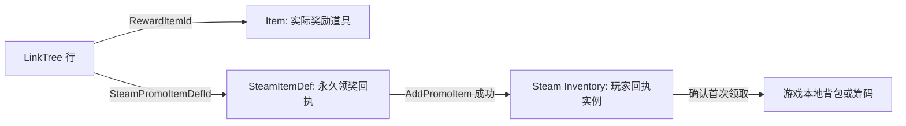

# SteamItemDef 表说明

## 功能定位

`SteamItemDef` 表是 Lucky Dog Rise 的 Steam Inventory 定义源。它描述 Steam 服务器能够识别的物品类型，以及这些物品的促销、交易、背包显示和内容生成规则。

本表不是玩家实际库存，也不直接描述游戏本地背包。Steam 为每一位玩家实际生成的物品称为库存实例；本表中的每一行只是生成该类实例时使用的定义。

当前首批用途是 LinkTree 奖励的永久领奖回执。后续可扩展至补偿回执、盲盒、开箱券、礼包和随机生成器。

## 与本地 Item 表的关系

`Item` 表描述游戏里的实际内容道具，例如装扮、饮品和卡背。`SteamItemDef` 表描述 Steam Inventory 的物品规则，两张表不能互相替代。

当 LinkTree 奖励已有道具时，`LinkTree.RewardItemId` 直接填写原有 `Item.Id`，不复制一行新的本地道具数据。`LinkTree.SteamPromoItemDefId` 则填写本表中对应的永久领奖回执 ID。

## 当前 LinkTree 回执

当前已预留四条永久领奖回执：

1. `401001` / `LinkTreeTwitterFollowClaim`
   - 对应 `TwitterFollow`。

2. `401002` / `LinkTreeSteamCommunityClaim`
   - 对应 `SteamCommunity`。

3. `401003` / `LinkTreeSteamStoreClaim`
   - 对应 `SteamStore`。

4. `401004` / `LinkTreeXiaohongshuProfileClaim`
   - 对应 `XiaohongshuProfile`。

四条回执统一使用以下规则：

1. `Type=Item`。
2. `PromoRule=manual`。
3. `GrantedManually=TRUE`。
4. `Tradable=FALSE`、`Marketable=FALSE`。
5. `GameOnly=TRUE`、`StoreHidden=TRUE`。
6. `AutoStack=FALSE`。

客户端在玩家完成 LinkTree 的打开流程后调用 `AddPromoItem`。Steam 只会为符合规则且尚未领取的玩家创建一次回执实例；该实例不销毁，用于后续判断该奖励是否已经领取。

## 字段说明

### 基础识别

`Id`

Steam Inventory 的 ItemDef ID。每个 AppID 内唯一；发布并投入使用后不得改作其它用途。非创意工坊物品 ID 必须小于 `1000000`。

`Key`

稳定机器名，用于转换脚本、日志和策划识别。发布后不要改名。

`Type`

Steam 物品定义类型，使用 `ESteamItemDefType` 枚举。转换到 Steam schema 时会映射为 Steam 要求的小写字符串。

`Name`

Steam 后台的英文名称。`GameOnly=TRUE` 的内部回执不会向玩家显示，但仍应填写稳定、容易检索的英文名称。

`Description`

Steam 后台的英文说明。内部回执可使用简短技术说明。

`IsEnabled`

是否参与 Steam ItemDef 配置导出。已发布且不再使用的定义不应复用 ID；需要停止发放时应关闭促销资格或停用对应业务入口。

对于已经上传到 Steamworks 的定义，`IsEnabled=FALSE` 不应使转换器将该行从完整 Steam schema 中省略，否则仍持有该库存实例的玩家可能无法取得定义信息。该字段仅用于阻止从未发布的草稿参与首次发布；已发布定义需要停止使用时，应保留定义并关闭对应的业务入口或促销资格。

### 促销与发放

`PromoRule`

Steam 的 `promo` 属性原文。支持复杂规则，因此使用字符串而不是项目枚举。

常用填写：

1. `manual`
   - 仅在客户端显式调用 `AddPromoItem` 或 `AddPromoItems` 时检查和发放。
   - LinkTree 永久领奖回执使用此值。

2. `owns:2583700`
   - 正式 AppID 的拥有者满足促销资格。
   - 适合低价值的全员补偿；客户端调用 `GrantPromoItems` 后领取。

`GrantedManually`

是否只允许通过指定 ItemDef 的 `AddPromoItem` 或 `AddPromoItems` 发放。LinkTree 回执填写 `TRUE`，避免被通用 `GrantPromoItems` 意外领取。

### Steam 社区可见性

`Tradable`

是否允许在 Steam 玩家之间交易。永久回执、补偿回执、内部令牌通常填写 `FALSE`。

`Marketable`

是否允许在 Steam 社区市场出售。内部令牌通常填写 `FALSE`。

`GameOnly`

是否只在游戏内使用。填写 `TRUE` 时，物品不会显示在 Steam 背包和新物品通知中。永久领奖回执和内部资格令牌填写 `TRUE`。

`StoreHidden`

是否在 Steam Item Store 隐藏。非售卖物品填写 `TRUE`。

`AutoStack`

同一 ItemDef 的多次发放是否自动堆叠为一个库存实例。一次性永久回执不需要堆叠，填写 `FALSE`；可累积的消耗品可视业务需要填写 `TRUE`。

### 复杂物品

`Bundle`

仅 `Bundle`、`Generator` 和 `PlaytimeGenerator` 使用的内容配方。

1. `Bundle`
   - 填固定内容，例如 `100101;100102x5`。
   - Steam 发放礼包时自动展开为这些实际物品。

2. `Generator`
   - 填随机权重，例如 `100101x80;100102x20`。
   - Steam 发放生成器时按权重产生结果；生成器本身不会保留在玩家库存中。

3. `PlaytimeGenerator`
   - 配方格式与 `Generator` 相同。
   - 客户端在合适时机调用 `TriggerItemDrop`，Steam 再根据游玩时间、冷却和投放上限决定是否发放。

普通 `Item` 留空。

## ESteamItemDefType

`ESteamItemDefType` 是项目的 Luban 枚举，不是 Steam 指定的数字枚举。Steam schema 使用的类型字符串由导出转换逻辑负责映射。

1. `Item=1`
   - Steam schema：`item`。
   - 普通物品，可实际存在于玩家 Steam 库存中。

2. `Bundle=2`
   - Steam schema：`bundle`。
   - 固定内容礼包，发放后自动展开。

3. `Generator=3`
   - Steam schema：`generator`。
   - 随机内容生成器。

4. `PlaytimeGenerator=4`
   - Steam schema：`playtimegenerator`。
   - 游玩投放生成器。

5. `TagGenerator=5`
   - Steam schema：`tag_generator`。
   - 为物品实例生成随机标签或词条；当前项目暂不使用。

## 导出与发布流程

Luban 导出和 Steamworks 发布是两步独立流程。前者只生成项目可读取的数据与代码，后者才会改变 Steam 服务器的 ItemDef 配置。

1. 主人在 Excel 的 `SteamItemDef` Sheet 维护定义，并在总枚举表维护 `ESteamItemDefType`。
2. Luban 导出本地数据和 C# 类型。
3. 转换脚本读取导出的 `SteamItemDef` 数据，生成 Steam schema JSON。
4. 主人在 Steamworks 后台分别为 Playtest AppID `4972240` 和正式 AppID `2583700` 上传并发布 ItemDef。
5. 客户端调用 `LoadItemDefinitions` 与对应的 Inventory API，同步 Steam 服务器已发布的定义和玩家库存。

Playtest 与正式版是独立 AppID。两边可以使用相同的 ItemDef ID，但必须分别上传和发布，玩家领取记录也不会自动继承。

## 当前范围与后续工作

当前表已配置 LinkTree 的四条永久领奖回执。Luban 已生成 `SteamItemDef.cs`、`TbSteamItemDef.cs` 和 `tbsteamitemdef.json`，且 `Tables.cs` 已注册 `TbSteamItemDef`；运行时可通过 `LubanData.Tables.TbSteamItemDef` 读取定义数据。四条 `LinkTree.SteamPromoItemDefId` 引用均已对应到现有回执定义。

后续接入顺序：

1. 实现 Steam schema JSON 转换脚本。
2. 在 Playtest AppID 上传四条回执并测试 `AddPromoItem`。
3. 为客户端增加库存同步、领取结果回调、回执查询和崩溃补偿事务。
4. 再扩展后台补偿回执、盲盒和实际装扮库存。
