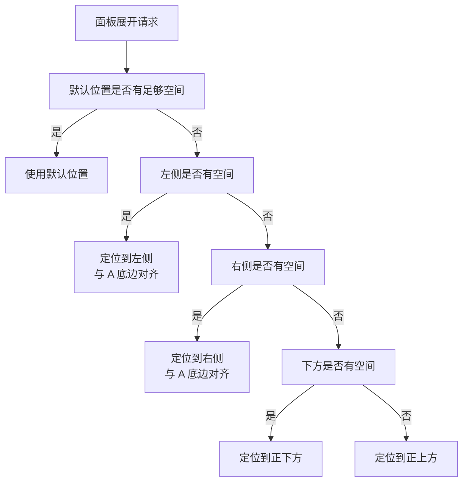

## 概述

为了解决展开面板时调整窗口大小导致闪烁的问题，将方案改为：每种模式在初始化时设定一个富余的宿主窗口尺寸（即容纳该模式所有面板展开后的最大尺寸），之后展开/收起面板不再调整窗口大小，只有切换模式时才重新设定窗口尺寸，此时允许视觉闪烁。（最好不要闪）

## 通用规则

- 每种模式的基础内容区域记作 **A**，其他面板依次记作 **B、C、……**
- 每种模式在初始化时一次性设定宿主窗口尺寸，之后面板展开/收起 **不改变** 窗口尺寸
- 面板在窗口内有各自固定的预留位置（即该模式默认布局中的位置），展开时直接在该位置显示
- 切换模式时重新设定宿主窗口尺寸，允许短暂闪烁

---

## 桌宠伪装模式

### 面板清单

| 代号 | 面板 | 尺寸参考 |
|------|------|---------|
| A | 桌宠面板（狗+按钮） | 由场景实际节点决定 |
| B | 测试设置面板 | 300×420 |

### B 可能出现的位置

A 在窗口中央，B 可能出现在 A 周围的 9 宫格位置：

```
789
4A6
123
```

即 B 可能出现在 A 的左上、正上、右上、正左、正右、左下、正下、右下。

### 位置选择规则

1. **默认**：B 出现在 A 的左侧（4 号位），且 B 的底边与 A 的底边对齐
2. 当宿主窗口靠近屏幕左边缘，导致 B 超出屏幕时 → B 切换到 A 的右侧（6 号位），底边对齐规则不变
3. 当宿主窗口靠近屏幕上边缘，导致 B 超出屏幕时 → B 切换到 A 的正下方（2 号位）
4. 当窗口在屏幕角落时 → 按上述规则组合选择最合适的方位
5. 所有切换都在面板展开前计算完毕，展开过程中动画不会产生跳跃 @AI [可能有歧义]

### 窗口尺寸计算

为了容纳 B 在 A 周围任意方位的显示，宿主窗口的最小富余尺寸为：

- 宽度 = A.width + B.width
- 高度 = A.height + B.height

在此窗口内，A 和 B 的摆放如下：

- A 位于窗口右下区域（`x = B.width, y = B.height`）
- B 根据位置选择规则在 A 周围的预留空间中展开

### 窗口初始定位

宿主窗口首次定位时，以 A 的可见区域为锚点（而非窗口左上角）：

- 默认定位到任务栏上方，确保 A 的底部紧贴任务栏上边缘
- 由于窗口高度富余（包含 B 高度的空间），窗口顶部可能会延伸到任务栏以上区域，但这些区域是透明的，不影响视觉效果

---

## 桌宠游戏模式

### 面板清单

| 代号 | 面板 | 尺寸参考 |
|------|------|---------|
| A | 标准游戏面板 | 约 800×600 |
| B | 系统设置面板（含背包等扩展页签） | 待定 |
| C | 游戏信息面板（与 A 等高） | 约 200×600 |

### 默认布局

```
_B_
CA_
```

即 C 固定在 A 左侧，B 在 A 和 C 的上方、偏左位置。

### 位置选择规则

1. C 与 A 等高（约 600px），始终在 A 的左右两侧之一：
   - 默认：C 在 A 左侧
   - 当宿主窗口靠近屏幕左边缘时 → C 切换到 A 右侧
2. B 的定位规则：
   - B 可以在 A 和 C 的上方或下方，具体取决于屏幕空间
   - B 在水平方向上与 A 的某一侧对齐（非整个 9 宫格居中），以保持视觉整洁
3. C 可以通过游戏设置收起，收起后在 A 内部出现一个呼出按钮

### 窗口尺寸计算

为了同时容纳 A + B + C：

- 宽度 = A.width + B.width + C.width（三者水平排列的需求）
- 高度 = A.height + B.height（B 在 A 上方或下方的需求）

### 窗口初始定位

- 宿主窗口居中放置在屏幕上（因为游戏模式需要完整的视觉呈现）
- @AI [具体居中对齐规则待补充：是否考虑多显示器？]

---

## 沉浸模式

### 面板清单

| 代号 | 面板 | 尺寸参考 |
|------|------|---------|
| A | 大尺寸游戏面板 | 接近全屏 |
| B | 系统设置面板 | 待定 |
| C | 游戏信息面板 | 约 200×600 |

### 布局规则

```
CA
```

- C 固定在 A 左侧
- 由于沉浸模式是窗口化全屏，其他面板（如 B）出现时以覆盖层形式浮在 A 和 C 上方
- @主人 [沉浸模式是否需要单独的富余窗口计算方法，还是直接使用屏幕可用区域？] @AI [直接按照全屏计算即可，如果玩家选择窗口游戏模式，则按照全屏等比缩放即可实际不影响宿主窗口内的位置]

---

## 面板定位算法

当面板展开时，按照以下流程确定面板在窗口内的最终位置：



说明：
- 以上流程以桌宠伪装模式为例，其他模式根据各自的面板布局规则调整优先级
- "空间是否足够"的计算基于：面板在窗口内的预设位置是否超出当前屏幕可用区域
- 超出屏幕的判断应考虑宿主窗口的当前位置和屏幕各方向剩余空间
