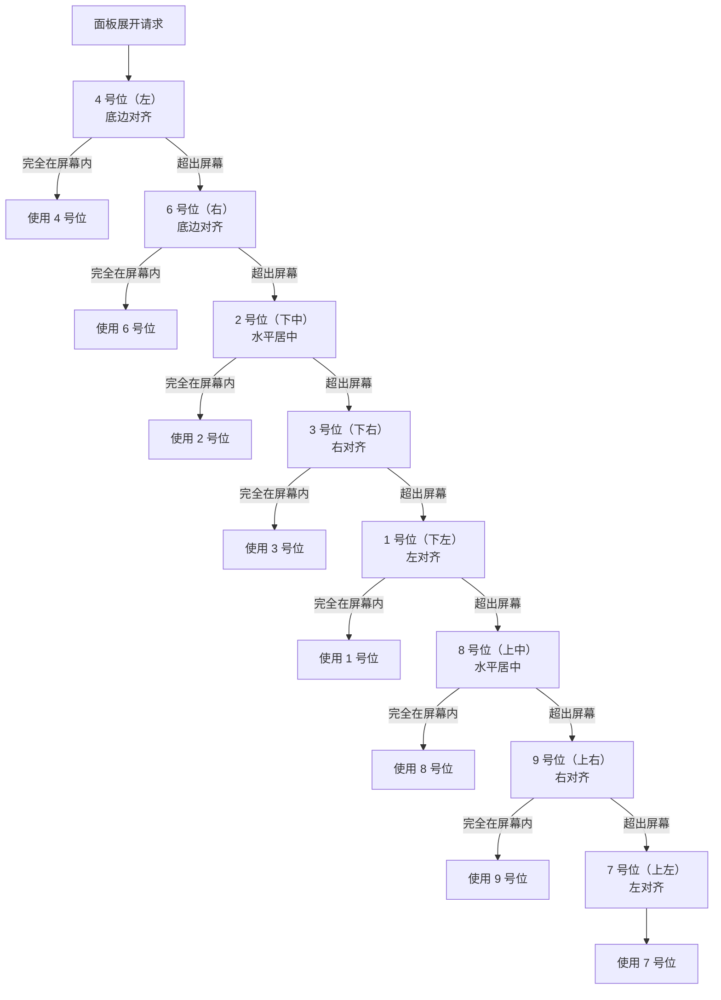

## 概述

为了解决展开面板时调整窗口大小导致闪烁的问题，将方案改为：每种模式在初始化时设定一个富余的宿主窗口尺寸（即容纳该模式所有面板展开后的最大尺寸），之后展开/收起面板不再调整窗口大小。只有切换模式时才重新设定窗口尺寸，切换时也应采用"先布置内容再调窗口"的顺序来尽可能避免闪烁。

## 通用规则

- 每种模式的基础内容区域记作 **A**，其他面板依次记作 **B、C、……**
- 每种模式在初始化时一次性设定宿主窗口尺寸，之后面板展开/收起 **不改变** 窗口尺寸
- 面板在窗口内有各自固定的预留位置（即该模式默认布局中的位置），展开时直接在该位置显示
- 切换模式时重新设定宿主窗口尺寸，允许短暂闪烁

---

## 桌宠伪装模式

### 面板清单

| 代号 | 面板 | 尺寸参考 |
|------|------|---------|
| A | 桌宠面板（狗+按钮） | 由场景实际节点决定 |
| B | 测试设置面板 | 300×420 |

### B 可能出现的位置

A 周围以 9 宫格划分，B 可能出现在除 A 所在中心之外的任意位置：

```
789
4A6
123
```

### 窗口尺寸计算

B 可能出现在 A 周围的任意方位，因此窗口需要在 A 的四周都预留 B 的完整尺寸空间：

- **宽度 = A.width + 2 × B.width**
- **高度 = A.height + 2 × B.height**

在此窗口内，A 和 B 的摆放如下：

- A 固定在窗口中央偏左上区域（`x = B.width, y = B.height`），内容不再随面板切换移动
- B 在 A 周围的预留空间中展开，展开过程中 A 的内容位置不变

> **实现细节**：A 的所有子节点放在一个 `ContentA` 包裹节点中，包裹节点定位在 `(B.width, B.height)`。CanvasLayer 通过 `offset = (B.width, B.height)` 独立偏移。这样 A 的内容在胖窗口中始终位于右下区域（从 `(B.width, B.height)` 到 `(A.width+B.width, A.height+B.height)`），无需动态补偿。

### 位置选择规则

1. **默认**：B 出现在 A 的左侧（4 号位），B 的底边与 A 的底边对齐
2. 当默认位置导致 B 超出屏幕时 → 按完整优先级链依次检查每个槽位（见下方算法）
3. 所有切换都在面板展开前计算完毕，展开过程中动画不会产生跳跃

### 完整优先级链

```
4(左) → 6(右) → 2(下中) → 3(下右) → 1(下左) → 8(上中) → 9(上右) → 7(上左)
```

每个槽位的布局定义：

| 槽位 | 窗口内 x | 窗口内 y | 对齐说明 |
|------|----------|----------|---------|
| 4（左） | 0 | `Bh + Ah - PanelH` | 左侧，底边与 A 底边对齐 |
| 6（右） | `Bw + Aw` | `Bh + Ah - PanelH` | 右侧，底边与 A 底边对齐 |
| 2（下中） | `Bw + Aw/2 - PanelW/2` | `Bh + Ah` | 正下方，水平居中 |
| 3（下右） | `Bw + Aw` | `Bh + Ah` | 下方，右对齐 |
| 1（下左） | 0 | `Bh + Ah` | 下方，左对齐 |
| 8（上中） | `Bw + Aw/2 - PanelW/2` | 0 | 正上方，水平居中 |
| 9（上右） | `Bw + Aw` | 0 | 上方，右对齐 |
| 7（上左） | 0 | 0 | 上方，左对齐 |

其中 `PanelW/Bw = B.width`，`PanelH/Bh = B.height`，`Aw = A.width`，`Ah = A.height`。

### 判断方法

每个槽位的判断方式是：**计算 B 在屏幕上的实际矩形范围（窗口内坐标 + 窗口屏幕位置），检查是否完全在屏幕可用区域内（允许 >5px 的超出）**。

同时检查水平和垂直方向，任一方向超出屏幕 >5px 则该槽位不可用。

### 窗口初始定位

宿主窗口首次定位时，以 A 的可见区域为锚点（而非窗口左上角）：

- 默认定位到任务栏上方，确保 A 的底部紧贴任务栏上边缘
- 由于窗口高度富余（包含 B 高度的空间），窗口顶部可能会延伸到任务栏以上区域，但这些区域是透明的，不影响视觉效果
- **实现要点**：使用场景中的 `TaskBar` 标记节点（位于 A 底部中心附近）作为定位参考，计算其屏幕坐标与任务栏上边缘对齐

---

## 桌宠游戏模式

### 面板清单

| 代号 | 面板 | 尺寸参考 |
|------|------|---------|
| A | 标准游戏面板 | 约 800×600 |
| B | 系统设置面板（含背包等扩展页签） | 待定 |
| C | 游戏信息面板（与 A 等高） | 约 200×600 |

### 默认布局

```
_B_
CA_
```

即 C 固定在 A 左侧，B 在 A 和 C 的上方、偏左位置。

### 位置选择规则

1. C 与 A 等高（约 600px），始终在 A 的左右两侧之一：
   - 默认：C 在 A 左侧
   - 当宿主窗口靠近屏幕左边缘时 → C 切换到 A 右侧
2. B 的定位规则：
   - B 可以在 A 和 C 的上方或下方，具体取决于屏幕空间
   - B 在水平方向上与 A 的某一侧对齐（非整个 9 宫格居中），以保持视觉整洁
3. C 可以通过游戏设置收起，收起后在 A 内部出现一个呼出按钮

### 窗口尺寸计算

为了同时容纳 A + B + C：

- 宽度 = A.width + B.width + C.width（三者水平排列的需求）
- 高度 = A.height + B.height（B 在 A 上方或下方的需求）

### 窗口初始定位

- 宿主窗口居中放置在屏幕上（因为游戏模式需要完整的视觉呈现）
- @AI [具体居中对齐规则待补充：是否考虑多显示器？]

---

## 沉浸模式

### 面板清单

| 代号 | 面板 | 尺寸参考 |
|------|------|---------|
| A | 大尺寸游戏面板 | 接近全屏 |
| B | 系统设置面板 | 待定 |
| C | 游戏信息面板 | 约 200×600 |

### 布局规则

```
CA
```

- C 固定在 A 左侧
- 由于沉浸模式是窗口化全屏，其他面板（如 B）出现时以覆盖层形式浮在 A 和 C 上方
- 窗口尺寸直接使用屏幕可用区域（`ScreenGetUsableRect()`），窗口化时等比缩放


---

## 面板定位算法

当面板展开时，按照以下流程确定面板在窗口内的最终位置：



### 说明

- 以上流程以桌宠伪装模式为例，其他模式根据各自的面板布局规则调整优先级
- "完全在屏幕内"的判断：B 在候选槽位的完整矩形范围（窗口内坐标 + 窗口屏幕位置）的四个边界均未超出屏幕可用区域 >5px
- 四个方向（上下左右）各需要预留一个 B 的完整尺寸空间，即窗口尺寸为 `(Aw + 2Bw) × (Ah + 2Bh)`，A 固定在 `(Bw, Bh)`，内容不随面板切换移动
- 切换模式下才重新设定窗口尺寸，允许短暂闪烁
