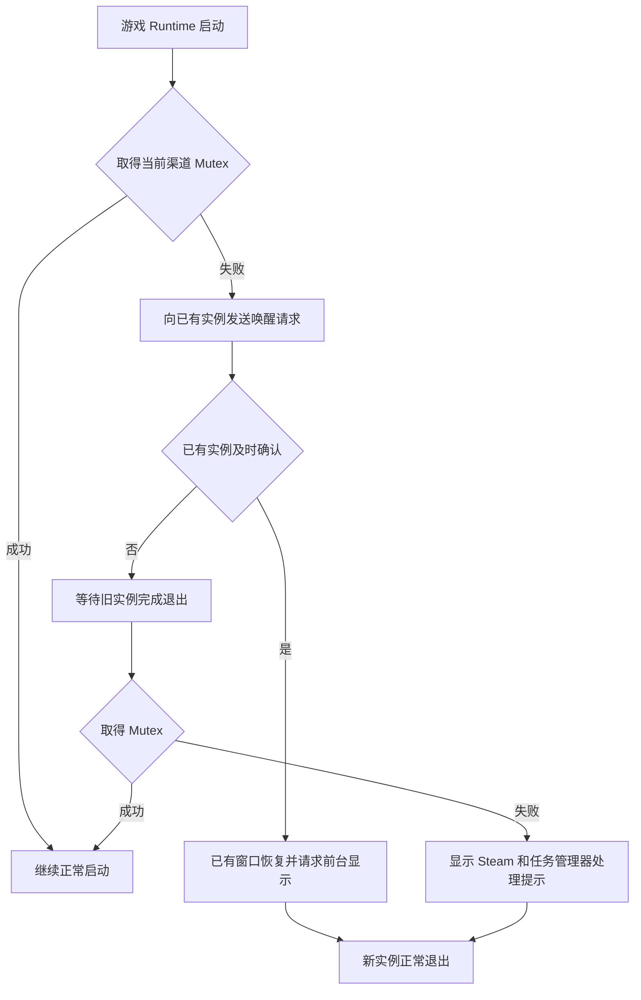

# 单实例运行保护说明

## 文档目的

本文档记录 Lucky Dog Rise 的单实例运行保护、重复启动时的玩家体验、开发环境注意事项，以及后续出现问题时的排查方式。

该功能主要防止多个游戏 Runtime 同时读写同一份本地存档、提交 Steam Inventory 请求或推进盲盒状态。Godot 编辑器和 `Wick.Server` 本身不属于游戏 Runtime，不应因为进程名称相似而被结束。

## 问题背景

开发期间曾出现盲盒气球提前变为可开启状态。后续确认同一台电脑上存在多个游戏 Runtime，它们同时读取和写入盲盒存档，导致前台状态与预期时间线不一致。

该问题在玩家看来通常只表现为提前获得一次本地消耗品盲盒，不一定会被识别为错误，但多个 Runtime 还可能造成以下风险：

- 同时写入同一份本地存档，后写入的旧状态覆盖新状态。
- 重复提交 Steam Inventory 同步、投放或兑换请求。
- 一个不可见 Runtime 继续累计游玩时间和推进本地调度。
- 开发测试结果受到旧 Runtime 干扰，导致错误定位业务逻辑。

## 当前实现

`SingleInstanceGuard` 作为最早加载的 Autoload，通过 Windows 命名 Mutex 判断同一构建渠道是否已经存在游戏 Runtime。

Mutex 按构建渠道隔离：

- `Dev`
- `Playtest`
- `Release`

因此同一渠道不能同时运行两个游戏实例，不同渠道不会互相阻止。



命名 Mutex 由 Windows 维护。持有它的进程崩溃或退出后，系统会自动释放所有权，不会留下只能通过重启电脑清除的永久锁。

## 重复启动表现

玩家再次启动同一渠道游戏时，第二个实例不会直接静默消失，而是先通知已有实例：

- 解除已有窗口的 DWM Cloak。
- 恢复最小化窗口。
- 重新显示因全屏检测而隐藏的游戏内容。
- 请求把已有窗口切到前台并重新置顶。
- 请求 Steam 平台服务进行一次高优先级恢复检查。
- 完成唤醒确认后，第二个实例退出。

如果已有实例持续存活但在约三秒内没有响应，新实例会提示玩家先在 Steam 中停止游戏。Steam 无法停止时，可在 Windows 任务管理器中结束 LuckyDogRise，无需重启电脑。

## 游戏内重启

设置页的“重启游戏”原本会先创建新进程，再退出旧进程。加入单实例保护后，旧进程必须先释放 Mutex，再创建新进程，否则新进程会被旧进程误判为重复启动。

当前流程为：

1. 立即保存本地状态。
2. 释放单实例 Mutex。
3. 创建新游戏进程。
4. 创建成功后退出旧进程。
5. 创建失败时尝试重新取得 Mutex，并保持旧游戏继续运行。

## Wick 与 Godot 编辑器

`Wick.Server` 是 AI 与 Godot 编辑器之间的桥接进程，不是游戏 Runtime。存在多个空闲 `Wick.Server` 不等于游戏被多开。

Wick 的 `editor_run_scene` 会通过 Godot 编辑器调用 `play_main_scene()` 或 `play_custom_scene()` 启动 Runtime；`editor_stop` 调用 `stop_playing_scene()`。它与手动 F5、命令行启动或另一个 Godot 编辑器实例仍可能形成并行 Runtime。

AI 助手进行 Wick 运行测试时应遵守：

1. 启动前确认编辑器当前是否已经运行场景。
2. 测试完成后调用 `editor_stop`。
3. 时间线、存档或 Steam 状态异常时，先检查游戏 Runtime 数量。
4. 不通过结束所有 Godot 进程的方式清理，因为其中可能包含主人正在使用的编辑器。

可使用以下 PowerShell 命令查看 Godot 进程：

```powershell
Get-Process | Where-Object { $_.ProcessName -like '*Godot*' } |
    Select-Object ProcessName, Id, StartTime, MainWindowTitle, Path
```

正常情况下，编辑器空闲时只应看到一个 Godot 编辑器进程。运行游戏时通常会额外出现一个 Runtime。

## 控制台日志

单实例功能可能打印以下诊断信息：

- `Existing game instance was activated; closing duplicate launch.`：第二个实例已通知旧实例并退出。
- `Existing game window was revealed after another launch request.`：旧实例已执行窗口唤醒。
- `Previous instance exited during handoff; continuing startup.`：旧实例正在退出，新实例等待后成功接管。

盲盒时间问题排查期间加入的 `[BlindBoxTiming]` 临时日志已经删除。Steam事务、fallback、库存上限和配置错误日志继续保留。

## 当前验证状态

已经完成：

- Debug C# 编译通过，零警告、零错误。
- 已有测试 Runtime 存活时启动第二个同渠道 Runtime，第二个实例在约一秒内正常退出。
- 原测试 Runtime 在重复启动后继续存活。
- Wick 测试结束后调用 `editor_stop`，确认没有残留测试 Runtime。
- 新增 Godot Node 已加入混淆保留列表，配置生成检查通过。
- 主人结束导出包的任务进程后立即重新启动，游戏正常进入，未残留永久 Mutex，且已经落盘的筹码数量保持一致。

尚未完整人工确认：

- 主场景处于不同显示模式或全屏隐藏状态时，重复启动后的窗口唤醒表现。
- 设置页“重启游戏”按钮从旧实例到新实例的完整可视交接。
- Playtest 和 Release 导出包中的重复启动表现。

这些项目不是当前功能收束的阻塞条件。主人后续自然遇到重复启动、游戏内重启或打包测试场景时再观察即可；出现异常时根据本文档中的日志和进程检查方式继续定位。

启动隐藏、Steam 等待超时、后台恢复和诊断导出的整体状态见 [启动可靠性与诊断说明](启动可靠性与诊断说明.md)。

## 相关文件

- `lucky-dog-rise/Scripts/Desktop/SingleInstanceGuard.cs`
- `lucky-dog-rise/Scripts/ModeManager.cs`
- `lucky-dog-rise/Scripts/Desktop/SystemPanelController.cs`
- `lucky-dog-rise/Scripts/Desktop/WindowNative.cs`
- `lucky-dog-rise/project.godot`
- `lucky-dog-rise/Build/godot-obfuscation-preserve.txt`
