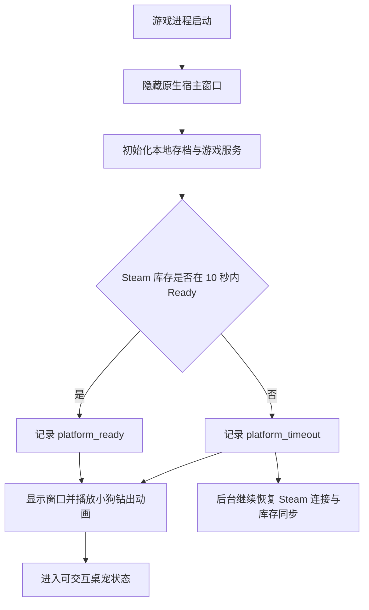

# 启动可靠性与诊断说明

## 文档目的

本文档记录 v0.3.4 启动可靠性工作的设计边界、当前实现、诊断方式、主人已完成的人工验证，以及公开 Playtest 前仍需收尾的内容。

“启动技术链路已经稳定”不等于“v0.3.4 已经可以公开发布”。版本号、玩家提示、公开界面清理、最终打包和外部回归需要分别验收。

## 启动流程

游戏启动后先隐藏宿主窗口，在本地数据和 Steam 平台状态达到可继续条件后，再播放小狗钻出动画。这样可以避免玩家先看到场景默认占位状态、未完成的桌宠层或初始化中的界面。



当前规则：

- 启动阶段只保留一份头和爪子，通过遮罩表现从任务栏后方钻出，避免透明或美化任务栏暴露隐藏部分。
- 爪子翻到手背后不再受任务栏遮罩影响；舌头收起后再伸出时位于任务栏前方。
- 钻出动画结束后切换到真实 `DogArea`，继续使用玩家当前装备的小狗、帽子和眼镜。
- 主窗口显隐通过 Windows 原生窗口接口处理，避免在 Godot 主窗口尚无父窗口时修改 `Window.Visible` 的报错。
- Steam 在十秒内没有完成库存同步时不阻塞游戏；小狗照常钻出，平台服务在后台继续恢复。

## Dev 开发启动器

Dev 调试页提供一次性的“下次启动显示开发启动器”开关；启动参数 `--dev-launcher` 也可强制显示。启动器在创建平台服务、加载 `GameData` 和提交任何库存请求之前完成环境选择，显示一次后自动清除设置开关。Playtest 与 Release 不包含该场景、控制器、环境类型或入口。

当前已实现两种运行环境：

- `综合调试环境`：保持现有 Dev 行为，创建真实 Steam 恢复服务、读取真实本地存档并开放完整 Debug 工具。Steam Mock 面板可在真实事务空闲时临时进入模拟沙箱，也可恢复真实 Steam。
- `Steam 模拟环境`：进程启动时只创建离线内层服务和 Debug Mock 装饰器，不创建真实 Steam 会话。`GameData` 在记录业务统计和绑定库存服务前进入独立内存沙箱；Mock 期间不写真实存档、Steam 库存或成就。该环境锁定为 Mock，当前进程不能切回真实 Steam。

Steam 网络场景与平台来源相互独立。Mock 下拉菜单固定提供七个纯模拟场景：正常响应、请求前不可用、三秒慢响应、超时复查成功、超时复查无奖励、提交后断联、断联恢复成功。“真实 Steam”不再作为网络场景；在综合调试环境中通过独立按钮启用 Mock 或恢复真实 Steam。

后续可在同一开发启动器架构中增加“真实 Steam 回归环境”和“离线开发档案”，本阶段尚未实现这两种入口。

## 单实例与异常退出

`SingleInstanceGuard` 在游戏业务初始化前取得当前构建渠道的命名 Mutex，避免两个同渠道 Runtime 同时读写存档或推进 Steam 事务。

进程正常退出、崩溃或被任务管理器结束后，Windows 会释放 Mutex。玩家应能立即重新启动游戏，不需要重启电脑。存档关键节点仍由 `SaveManager` 立即写入或防抖写入；强制结束进程只能保证已经落盘的状态，不保证尚在内存中的最后瞬时变化。

单实例的详细唤醒与游戏内重启流程见 [单实例运行保护说明](单实例运行保护说明.md)。

## 诊断日志

游戏在 `user://diagnostics/` 中维护结构化事件日志，并保留 Godot 运行日志。结构化日志按会话写入 `events-*.jsonl`，限制单文件大小并只保留最近会话，避免长期无限增长。

与本轮问题相关的关键事件包括：

- `session_started`：本次游戏会话开始。
- `platform_service_created`：平台服务创建结果。
- `save_loaded`、`save_committed`：存档读取与关键写入。
- `startup_reveal_ready`：启动展示放行，`reason` 为 `platform_ready` 或 `platform_timeout`。
- `platform_inventory_snapshot`：Steam 库存同步快照。
- `platform_inventory_trust_changed`：共享库存可信状态在 `Unknown`、`Trusted`、`RevalidationRequired` 之间变化。
- `linktree_reward_completed`：LinkTree 奖励事务完成。
- `blindbox_presentation_locked`：本次盲盒展示来源和盲盒类型已经锁定。
- `blindbox_opened`：开盒完成。
- `blindbox_preparation_submitted`、`blindbox_preparation_confirmed`：后台提交直接奖励 Generator，以及唯一合法实例被确认为待揭晓奖励。
- `blindbox_preparation_callback_unresolved`、`blindbox_preparation_revalidation_empty`：回调或可信库存复查尚未归因到唯一奖励，后台等待节流后重试。
- `blindbox_prepared_reward_missing`：尚未锁定展示的待揭晓实例在可信库存中消失，准备槽位被安全撤销。
- `blindbox_loading_started`、`blindbox_loading_completed`：玩家点击后至少 500 毫秒的本地前台反馈与表演展开耗时；点击路径不再等待 Steam。
- `steam_mock_phase`、`steam_mock_inventory_snapshot`：仅 Dev 的固定 Mock 场景阶段与模拟库存复查结果。
- `diagnostics_export_requested`：主人或玩家请求导出诊断包。

设置页的“导出诊断包”会生成：

```text
LuckyDogRise-Diagnostics-yyyyMMdd-HHmmss.zip
```

导出位置优先使用 Windows 登记的“下载”文件夹，因此主人或玩家把下载目录迁移到 D 盘等位置后仍会跟随系统设置。成功后资源管理器会打开并选中该 ZIP；如果系统下载目录不可用，则回退到 `user://diagnostic-exports/`。

诊断包包含近期结构化事件、Godot 日志和 `diagnostic-summary.json`。导出过程会清理已知的本机用户名、计算机名和 SteamID；公开 Playtest 不自动上传日志，只在玩家主动点击并自行发送 ZIP 时导出。

## 2026-08-10 人工验证

主人已确认：

- 导出包启动后约七至八秒播放小狗钻出动画，未再停留在场景默认占位界面。
- 钻出动画可以正常衔接真实狗头，帽子和眼镜在重启后显示正常。
- 结束任务进程后立即重新启动，游戏可以再次进入，筹码与结束任务前已经保存的数量一致。
- 诊断包可以导出到主人重定向后的下载目录，并自动打开所在位置。
- 盲盒展示来源锁定后，虚拟券从无到有或从有到无都不会令当前气球在 `STEAM` 与 `FALLBACK` 之间闪烁。
- 消耗一瓶酒后再次获得同种酒，新获得的背包图标不会错误显示 `E`。

## 当前结论与公开 Playtest 收尾

启动隐藏、十秒放行、后台恢复、单实例保护、诊断导出和已发现的存档恢复路径已经形成可用的技术闭环。

v0.3.4 仍不能标记为公开 Playtest 完成，以下内容尚待实现或验收：

1. Steam 启动等待超时后，如果小狗钻出动画结束时平台仍未恢复，需要只显示一次非阻塞、可本地化的玩家提示。建议语义为：“Steam 奖励仍在后台连接，游戏可以正常游玩；连接恢复后会自动同步。”如果平台在动画结束前已经恢复，不显示过时提示。
2. 将项目与导出版本统一升级为 v0.3.4。
3. 使用正式 Playtest 打包脚本生成候选包，回归启动正常路径、启动超时路径、重复启动、强制结束后重启、盲盒、LinkTree、存档和诊断导出。

盲盒来源标签现已改为 Dev 调试页中的会话级开关，默认关闭。`CHIPS`、`LOCAL`、`STEAM`、`FALLBACK` 的文字绘制代码只参与 Debug 编译；Playtest 和 Release 不包含该显示功能。删除本地存档入口也已迁入 Debug 页，其按钮、确认和执行逻辑不参与 Playtest/Release 的可用功能。

LinkTree 与盲盒现已共用 Steam Inventory 连接状态和库存可信状态。盲盒或 LinkTree 令库存进入 `RevalidationRequired` 后，已经打开的 LinkTree 页面会立即切换到 Loading，不需要玩家重新进入页签；只有连接恢复到 `Ready` 且完整库存同步把可信状态恢复为 `Trusted` 后，Banner 才重新出现。短暂正常写事务不会触发页面级故障提示，而是保留 Banner、统一压暗并禁用点击。

LinkTree 是当前玩家显式查看 Steam Inventory 状态的页面。页面刚进入恢复状态时只显示简短检查提示；仅在连接持续 `Unavailable` 十秒后追加网络、加速器或 VPN 节点建议。该状态通过事件实时刷新，不为每次进入 LinkTree 强制制造一次新的库存请求。

Dev 调试页中的“显示 Steam Mock 面板”只控制普通扑克模式上方的会话级面板，不保存设置。Mock 通过真实平台接口事件同时驱动盲盒与 LinkTree 的正式事务状态机，但不会向 Steam 写库存、真实存档或成就；非真实场景会在 Banner 右上角显示调试 ID，原“模拟 LinkTree 领奖流程”独立开关已移除。`Scenes/Debug/*` 与所有 `DEBUG` 条件类型不会进入 Playtest/Release。

当前客户端已改为在后台通过 PlaytimeGenerator 准备具体装扮，并以 `SteamPlaytimeEligibilityLeadSeconds` 和转换器使用同一套分钟级资格公式；旧请求提前量和点击后 Exchange 已移除。展示点没有可信待揭晓装扮时会立即锁定本地 Refreshment Fallback，迟到装扮只在后续展示点揭晓。玩家点击后不再出现“Steam 开盒结果待确认”的半截前台状态，也不会在点击路径发起 Steam 网络写操作。

本地存档版本已提升至 V15。V14 及更早存档会先归档为 `legacy` 文件，再创建新档；正式 Steam 装扮在可信同步后静默恢复。此断代策略仅适用于当前小范围亲友 Playtest，不承诺保留旧版筹码、消耗品、统计、盲盒进度或未完成 Exchange 事务。

## 相关文件

- `lucky-dog-rise/Scripts/ModeManager.cs`
- `lucky-dog-rise/Scripts/Desktop/WindowNative.cs`
- `lucky-dog-rise/Scripts/Desktop/SingleInstanceGuard.cs`
- `lucky-dog-rise/Scripts/Desktop/DiagnosticLog.cs`
- `lucky-dog-rise/Scripts/Desktop/GameData.cs`
- `lucky-dog-rise/Scripts/Desktop/SystemPanelController.cs`
- `lucky-dog-rise/Scripts/Desktop/BalloonHintController.cs`
- `lucky-dog-rise/Scripts/Desktop/SaveManager.cs`
- `lucky-dog-rise/Scripts/Platform/IRecoverablePlatformService.cs`
- `lucky-dog-rise/Scripts/Platform/RecoveringSteamPlatformService.cs`
- `lucky-dog-rise/Scripts/Platform/DebugSteamMockPlatformService.cs`
