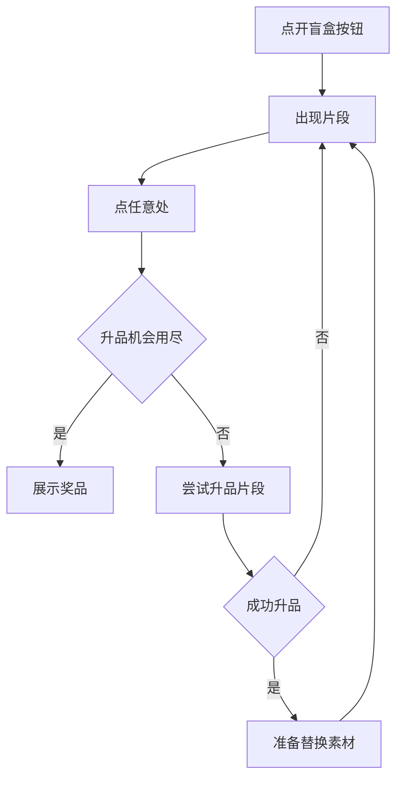

本说明给中只包含前台演示过程，后台数据通信等不在此描述，请根据实际情况处理。

## 流程示意

## 概述

点击开盲盒的入口按钮，扣除筹码
当前模在标准游戏模式中，全屏显示开盲盒表演动画；
当前模式在桌宠模式中，后面再开发

## 出现片段

- 首次，背景淡入，从全透明变为不透明

- 首次，盲盒从高度Y1处出现

- 盲盒从0.6放大过冲到1.1, 如果升品成功则在这个过程中背景色过度到新背景色，到1.1（最大值）时盲盒换成新图片

- 然后盲盒 回弹一次至1.0

- 盲盒从Y1落下到Y2处，欠冲0.9,之后归位到1.0

- 同时Y2处的阴影也会做相应的缩放动画，以体现盲盒的高度。

- 玩家点击任意处可进行盲盒升品操作
（为了避免玩家在这个过程中通过游戏系统设置面板搞事情）

## 尝试升品片段

- 盲盒快速收缩（表现蓄力）

- 盲盒跳起到Y1处，与此同时盲盒放大，到Y1时正好过冲到1.1

- 盲盒缩小到0.6

- 如果此时盲盒升品了,则准备改变背景颜色和盲盒图片。不立即改变的原因是，背景色需要淡入

