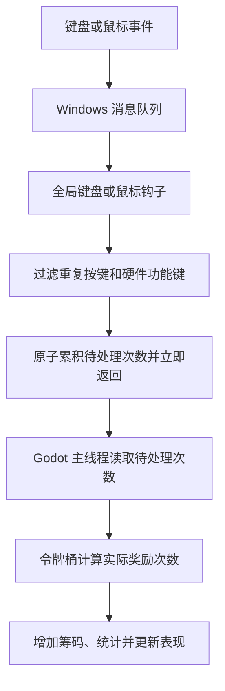
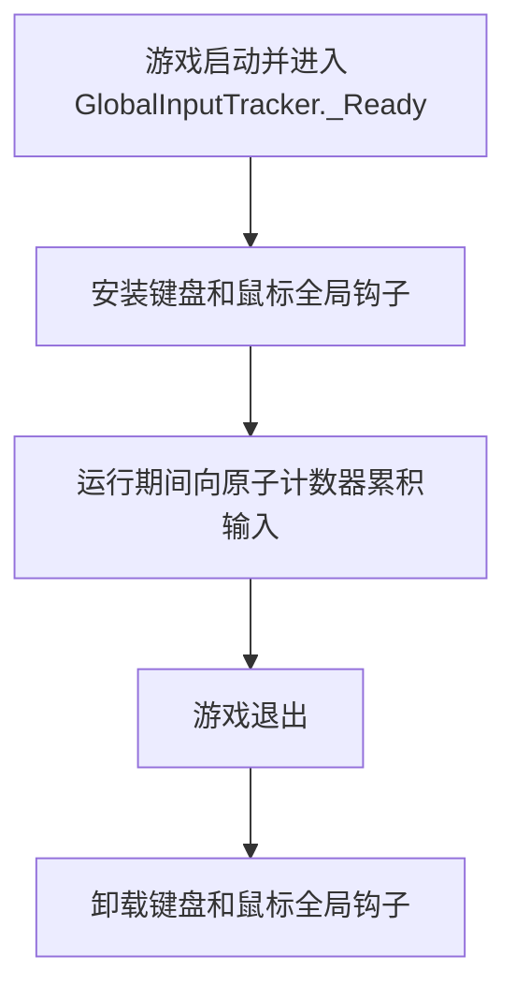

# 打字统计功能

## 概述

玩家启动游戏后，不论焦点窗口是否在游戏上，只要按键盘或点鼠标，就会触发该功能——每触发一次筹码 +1。

## 防刷策略

- 按住按键不放只视为 1 次，系统产生的重复按键消息不重复奖励。
- 音量、媒体播放、浏览器和应用启动等硬件功能键不属于有效输入，不产生筹码。
- 自动脚本不主动拦截，但所有有效键盘和鼠标输入共享同一个奖励令牌桶。
- 令牌桶以每秒 20 个令牌的速度补充，稳定收益上限为每分钟 1200 筹码。
- 令牌桶容量为 40，启动时为满桶，允许玩家短时间爆发输入；停止输入约 2 秒后恢复满桶。
- 每次有效输入消耗 1 个令牌并奖励 1 筹码。令牌不足时，超出部分静默丢弃，不延迟补发，也不给玩家负面反馈。
- 筹码收益、输入成长统计和对应表现只使用实际获得奖励的次数，避免超额宏输入绕过经济限制。

## 生效模式

三种游戏模式均生效：
- **伪装模式**：窗口小且无焦点，是筹码增长的主要场景
- **游玩模式**：有焦点时由 Godot 输入系统处理，无焦点时由钩子处理
- **沉浸模式**：同上

## UI 反馈

- 模式不受影响，仅筹码数跳动
- 伪装模式面板的筹码计数实时更新

## 技术实现

### 原理

采用 Windows 低层键盘/鼠标钩子（`WH_KEYBOARD_LL` / `WH_MOUSE_LL`），与 Steam 游戏 Bongo Cat 相同的技术路径。



### 为什么用 Windows 钩子而不是 Godot 输入监听

| 方案 | 窗口有焦点 | 窗口无焦点 |
|------|-----------|-----------|
| Godot `_Input` | ✅ 正常 | ❌ 收不到事件 |
| `WH_KEYBOARD_LL` 全局钩子 | ✅ 正常（可配合 Godot 输入） | ✅ 仍能收到事件 |

### 钩子生命周期



### C# 实现示意

```csharp
public partial class GlobalInputTracker : Node
{
    private const double TokensPerSecond = 20.0;
    private const double BucketCapacity = 40.0;

    private int _pendingPresses;
    private double _tokens = BucketCapacity;

    // Windows 钩子线程只过滤事件并累积原子计数。
    private IntPtr HookCallback(int nCode, IntPtr wParam, IntPtr lParam)
    {
        if (nCode >= 0 && IsRewardableInput(wParam, lParam))
            Interlocked.Increment(ref _pendingPresses);

        return CallNextHookEx(IntPtr.Zero, nCode, wParam, lParam);
    }

    public override void _Process(double delta)
    {
        _tokens = Math.Min(BucketCapacity, _tokens + delta * TokensPerSecond);

        var count = Interlocked.Exchange(ref _pendingPresses, 0);
        int rewardedCount = Math.Min(count, (int)_tokens);
        if (rewardedCount <= 0)
            return;

        _tokens -= rewardedCount;
        GameData.ModifyChips(rewardedCount);
    }
}
```

### 注意事项

- 钩子回调运行在**系统线程**，操作 Godot 对象会直接崩溃
- 必须通过 `Interlocked` / `Volatile` 与主线程通信
- `SetWindowsHookEx` 需要 `threadId=0`（全局）才能捕获无焦点时的输入
- 程序退出前必须 `UnhookWindowsHookEx`，否则系统会残留钩子

## 文件清单

- `Scripts/Desktop/GlobalInputTracker.cs`：全局输入钩子、硬件功能键过滤和奖励令牌桶。
- `Scripts/ModeManager.cs`：初始化 `GlobalInputTracker` 并连接桌宠输入表现。

## 验证

1. 启动游戏 → 切换到伪装模式 → 窗口失去焦点 → 按键盘 → 筹码增加
2. 按住一个键不放 → 筹码只计 1 次
3. 静置 2 秒后快速输入超过 40 次 → 开始时最多消耗桶内 40 个令牌，随后按每秒 20 个令牌继续奖励
4. 持续运行高频输入宏 → 初始爆发结束后，长期收益稳定为每分钟约 1200 筹码
5. 使用音量滚轮和媒体功能键 → 系统功能正常，但筹码不增加
6. 切换到游玩模式 → 窗口获取焦点 → Godot 输入正常，筹码仍通过钩子累积
