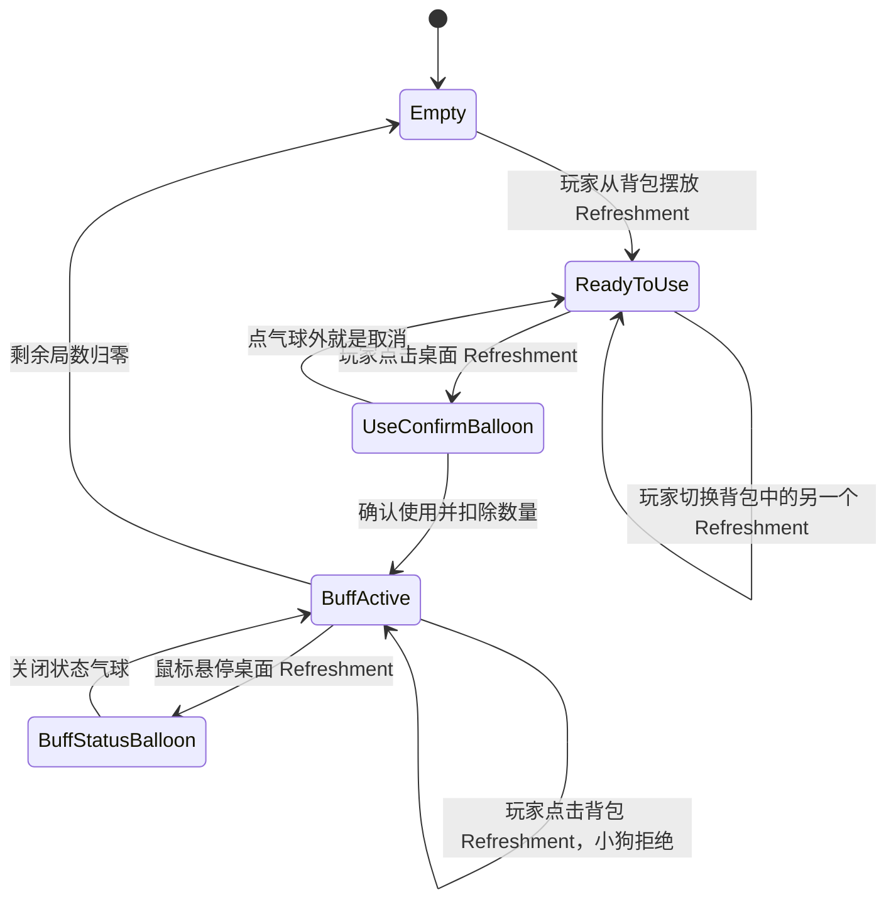

# 消耗品与幸运发牌系统说明

## 概述

Refreshment 是玩家在牌桌上摆放并主动使用的本地消耗品。当前美术资源以酒水为主，但系统命名和数据设计不应绑定酒类；后续 Refreshment 可以扩展为茶水、饼干、寿司、香烟、槟榔等“提神 / 心情愉悦 / 改变牌局运势”的物品。

Refreshment 的核心流程分为两层：

- 摆放：玩家从背包中选择一个 Refreshment，将它显示到牌桌上的 Refreshment 位置。
- 使用：玩家点击牌桌上的 Refreshment，经由气球确认后消耗 1 个背包数量，并获得 Buff。

Refreshment 属于纯本地功能。使用、扣除、Buff 持续状态和桌面显示状态都只需要写入本地存档，不作为 Steam 库存物品处理。

## 术语

- Refreshment：Excel 表和 C# 枚举中的当前物品分类名。
- Treat：旧命名，仅用于历史脚本、旧节点或资源目录中的遗留名字。新增设计、表格字段和玩家可见文案应使用 Refreshment。
- 桌面 Refreshment：摆在牌桌上的当前 Refreshment 图标或美术资源。
- Lucky Deal Buff：当前已实现的幸运发牌 Buff。它按成功开始的牌局数消耗，而不是按真实时间消耗。

## 玩家流程

玩家在背包中点击 Refreshment 时，系统只负责摆放，不立即消耗物品。

如果当前没有 Buff 持续中：

1. 玩家点击背包中的 Refreshment。
2. 系统将该 Refreshment 摆放到牌桌的 Refreshment 位置。
3. 如果玩家继续点击背包中的另一个 Refreshment，系统切换桌面 Refreshment。
4. 切换摆放不会扣除背包数量，也不会发放 Buff。

如果当前有 Buff 持续中：

1. 玩家点击背包中的任意 Refreshment。
2. 系统不替换桌面 Refreshment。
3. 背包数量不变化。
4. 小狗播放拒绝表情。
5. 拒绝表情短暂展示后，小狗恢复到进入拒绝前的表情。

玩家与牌桌上的 Refreshment 交互时，系统根据状态展示不同气球：

- `ReadyToUse`：点击后打开使用确认气球。
- `BuffActive`：鼠标悬停后打开持续状态气球，显示当前剩余局数。
- 没有桌面 Refreshment：不响应，或作为透明区域处理。

## 摆放规则

背包中 Refreshment 的点击行为应区别于装备类物品：

- Refreshment 不进入 EquipmentSlotConfig，不作为装备槽处理。
- Refreshment 的摆放状态应独立保存，不写入 `EquippedItemIdsByType`。
- 玩家可以拥有同一个 Refreshment 的多个数量。
- 只有点击确认使用后，才扣除 1 个数量。
- 玩家在 `ReadyToUse` 状态切换桌面 Refreshment 时，不扣除旧物品，也不扣除新物品。
- 如果某个已摆放 Refreshment 的背包数量变为 0，且该 Refreshment 尚未进入 BuffActive，系统应清空桌面 Refreshment。
- 实际使用前，系统应二次确认当前 Refreshment 仍有剩余数量；如果数量不足，不扣除数量，不发放 Buff，并清空桌面 Refreshment。

背包图标的 `E` 只表示“这一份同种 Refreshment 当前以 `ReadyToUse` 状态摆在桌上”，不表示该物品曾经被使用，也不表示当前 Buff 的来源类型：

- 玩家确认使用后，桌面状态进入 `BuffActive`，原物品数量被消耗；此时背包中不再有一份可装备的同种酒，因此不得保留 `E`。
- `BuffActive` 可以继续记住来源 ItemId，用于桌面图标、剩余局数和 Buff 规则，但该来源记录不能作为背包 `E` 的判断条件。
- Buff 持续期间再次获得同种 Refreshment 时，新获得的库存属于未摆放物品，不得继承已经消耗物品的 `E`。

主人已于 2026-08-10 在编辑器中验证：使用一瓶酒后，通过 Debug 再次获得同种酒，新进入背包的图标不显示 `E`。

## 使用确认气球

玩家点击 `ReadyToUse` 状态的桌面 Refreshment 后，系统弹出气球提示。

气球设计原则：

- 气球内不放说明文字。
- 气球内容以图标和数字表达。
- 气球不是 Godot 原生弹窗，不应脱离牌桌面板。
- 气球可以阻止自身区域内点击穿透，但不应阻断整个牌桌。
- 点击气球之外算是取消（ Refreshment 本身不算）

气球结构：

- `Hint_RefreshmentEffect.svg` 图示，告知玩家使用 Refreshment 可以增加牌运。
- `Icon_CircleCheck.svg` 对号图标，提示玩家该气球可以点击确认。
- 点击整个气球都算作触发使用，Check 图标只是提示玩家可以点击。
- 气球弹出后再次点击 Refreshment，默认不收起气球、不确认使用，也不重置主动提示计时。
- 如果长时间未确认并触发主动提示，对号执行大幅摆动，Refreshment 同时播放提示动画；此后点击气球或 Refreshment 都可确认使用。

确认按钮候选方向：

- `circle-check` / `check`：语义最清晰，表示确认。
- `hand-pointer`：强调点击使用，但可能和普通点击提示混淆。
- `bolt` / `wand-magic-sparkles`：强调激活 Buff，但“使用消耗品”的语义弱一些。
- `utensils` / `mug-saucer`：强调吃喝，但对酒水、香烟、槟榔等未来品类不够通用。

## Buff 状态气球

玩家将鼠标悬停在 `BuffActive` 状态的桌面 Refreshment 上时，系统弹出状态气球。

状态气球用于解释桌面图标为什么还在，并告诉玩家 Buff 剩余局数：

- 显示当前 Refreshment 图标。
- 显示 Lucky Deal Buff 图标。
- 显示 `RemainingHands / TotalHands`，例如 `7/10`。
- 不提供确认使用按钮。
- 鼠标离开 Refreshment 与状态气球后，经过短暂防闪烁延迟自动收起。
- 点击 BuffActive 状态的 Refreshment 不算有效操作，按点击空白处理，可以触发当前牌局阶段的被动交互提示。

持续状态中再次点击背包 Refreshment 不打开状态气球；该操作属于“尝试切换 / 尝试摆放”，应由小狗拒绝反馈处理。

## Buff 持续表现

玩家确认使用后：

1. 系统扣除当前 Refreshment 数量 1。
2. 系统调用对应 Buff 发放接口。
3. 桌面 Refreshment 不立即消失。
4. 桌面 Refreshment 切换为 BuffActive 表现。
5. Buff 持续局数归零后，桌面 Refreshment 淡出或缩小消失。

BUFF持续中的气球：

- Buff持续中时，鼠标划过 Refreshment 也会展示气球，气球出现和消失都要有缓动效果
- `Icon_LuckyDealBuff_Color.svg` 图标。
- `{剩余局数}/{该消耗品提供的总局数}` 例如 `10/20`
- 点击气球无反馈

## 小狗拒绝反馈

当 BuffActive 期间玩家点击背包中的 Refreshment 时，系统不允许替换桌面 Refreshment。小狗应播放拒绝表情，然后恢复原有表情。

设计要求：

- 拒绝反馈不应改变当前牌局状态。
- 拒绝反馈不应清空狗原本的牌局提示情绪。
- 拒绝表情结束后，恢复进入拒绝前的表情。
- 如果拒绝表情播放期间再次触发拒绝，可以重播或延长，但不应堆叠多个 Tween。

使用 `EDogReactionTrigger.RefuseRefreshment`

## 新手提示

Refreshment 也需要进入主动交互提示系统，但只在合适状态下提示。

触发规则：

- `ReadyToUse` 且玩家长时间未操作时，提示桌面 Refreshment 可以点击使用。
- `BuffActive` 状态不主动提示点击，因为此时点击只查看剩余局数，不是推进流程的必要操作。
- 没有桌面 Refreshment 时不提示 Refreshment。
- 背包里有 Refreshment 但尚未摆放的情况，理论上只存在玩家故意将其拿下来的情况；当玩家下次获得 Refreshment 时，系统应自动将其摆到桌上。

提示动画：

- 采用类似扑克的效果就行
- 具体就是跳起来左右晃动
- 落下

提示音效方向：

- 使用轻短的玻璃 / 陶瓷 / 餐具轻响，不要像真实喝下。
- 搜索关键词：`soft clink`、`glass tap`、`ceramic tap`、`small table tap`、`item nudge`、`ui chime soft`。
- 音效长度建议小于 0.35 秒。
- 实际 Cue 由 `RefreshmentConfig.InteractionHintSfxCue` 按物品配置，不再由代码统一写死。

## 使用音效

使用成功的音效需要表达“消耗品被使用并激活 Buff”，但不要绑定具体品类。由于未来 Refreshment 可能是酒、茶、饼干、寿司、香烟或槟榔，不建议第一版使用明显吞咽声、倒酒声或咀嚼声作为通用音效。

每种 Refreshment 通过 `RefreshmentConfig.UseSfxCue` 配置使用成功音效。Cue 填写 `AudioManager` 的逻辑名称，不填写路径或扩展名；空字符串表示静音。

音效方向建议：

- 轻微杯盏声 + 轻微闪光尾音。
- 柔和 UI chime + 低音短提示。
- 不使用大胜利音效，避免和牌局赢钱反馈冲突。
- 不使用明显饮酒 / 进食拟音，避免未来 Refreshment 类型扩展时违和。

可搜索关键词：

- `soft chime`
- `positive ui`
- `magic sparkle`
- `lucky charm`
- `small buff`
- `glass clink soft`
- `ceramic clink`
- `pleasant notification`
- `power up soft`

## 数据驱动设计

Refreshment 的物品基础信息继续来自 `Item` 表：

- `ItemType = Refreshment`
- `AssetPathList`：桌面显示资源。
- `IconPath`：背包、气球和状态 UI 使用图标。
- `RefreshmentBoxWeight`：消耗品盲盒权重。

`RefreshmentConfig` 是 `Item` 的一对一扩展表，以 `ItemId` 为主键并通过 Luban 引用 `Item.Id`。`Item` 表不反向保存配置 ID；运行时通过当前桌面物品 ID 查询配置。

配置字段：

- `ItemId`：关联的 Refreshment 物品 ID。
- `DurationHands`：使用成功后的 Buff 持续牌局数，允许范围为 `1-99`。
- `LuckyDealMode`：幸运发牌模式。当前只实现 `GuidedDraw`；`GuaranteedWin` 与 `BaitUpgrade` 为预留值。
- `LuckyDealTriggerChance`：每局触发幸运发牌的概率，填写 `0-1` 小数。
- `InteractionHintSfxCue`：Refreshment 或确认对号播放交互提示动画时使用的逻辑 Cue；空字符串表示静音。
- `UseSfxCue`：确认使用并激活 Buff 时播放的逻辑 Cue；空字符串表示静音。
- `BalloonOffsetY`：在 PSD JSON 顶边差值定位之后，对 UseBalloon 和 StatusBalloon 同时追加的 Y 轴像素偏移；正数向下，负数向上。

运行时规则：

- `ItemType = Refreshment` 的可用物品必须有对应配置，否则不能摆放或使用，并输出配置错误。
- 使用前校验持续局数、触发概率和发牌模式；无效配置不得扣除物品。
- 所有 Refreshment 当前仍使用同一套气球效果图、确认图标和 Buff 状态图标。
- PSD JSON 负责不同素材的基础位置与气球基础高度差，`BalloonOffsetY` 只负责策划层的二次修正。

## 存档设计

Lucky Deal Buff 当前已有持久化状态。Refreshment UI 还需要额外保存桌面状态：

- 当前桌面 Refreshment ItemId。
- 当前桌面 Refreshment 状态：`ReadyToUse` 或 `BuffActive`。
- BuffActive 来源 ItemId。
- BuffActive 初始总局数，用于显示 `RemainingHands / TotalHands`。
- Buff 激活时的幸运发牌模式和触发概率快照。

`RefreshmentConfig` 只在确认使用时读取。正在持续的 Buff 使用存档中的模式、概率和总局数快照；重新导表不会中途改变已经激活的 Buff。

如果 Lucky Deal Buff 已经有剩余局数，但桌面状态缺失，系统需要有兼容策略：

- 如果存档有 Buff 剩余局数且有 BuffActive 来源 ItemId，则恢复桌面 Refreshment。
- 如果只有 Buff 剩余局数但没有来源 ItemId，可以不兼容。当前没有玩家使用过正式 Buff，旧 Debug Lucky Deal Buff 不需要恢复桌面来源图标。

## 幸运 Buff

Lucky Deal Buff 包含剩余局数、幸运发牌模式和本局触发概率。Buff 按牌局次数计算，而不是按真实时间计算，因此玩家切换到桌宠模式后不会浪费效果。

每次玩家成功下注并正式开始新局时，Buff 剩余局数减少 1。该局会以 Buff 的触发概率判定是否执行幸运发牌；即使本局未触发，局数仍会正常消耗。

当前开发版本通过 Debug 页的“补充幸运发牌 10 局”发放 `GrantLuckyDealBuff(10, 0.75f)`；未指定模式时默认使用 `GuidedDraw`。该入口与 Refreshment 共用正式接口，Buff 状态会写入本地存档。

Refreshment 使用成功后，应调用同一个 Buff 发放接口，不得在 UI 层直接修改发牌算法或存档字段。

## 幸运发牌

幸运发牌只在 Buff 的触发判定成功后创建 `LuckyDealPlan`。自然发牌不创建该计划，继续使用普通洗牌与随机补牌流程。

`LuckyDealPlan` 包含：

- `WinnerHand`：按赔率表 `LuckyWeight` 抽取赢家牌型后生成的完整五张赢家牌。
- `InitialVisibleHand`：首轮展示的五张牌。
- `ReplacementQueue`：首轮隐藏的赢家牌，供补牌时优先发放。
- `NormalDeck`：普通随机补牌使用的剩余牌堆。

幸运发牌按以下步骤生成：

1. 从赔率表中筛选 `LuckyWeight > 0` 的赢家牌型，并按权重抽取目标牌型。
2. 随机生成该牌型对应的完整赢家手牌。
3. 按 30 / 60 / 10 的权重随机隐藏 1 / 2 / 3 张赢家牌。
4. 用不会与赢家手牌重复的无关牌替换被隐藏牌。
5. 将五张首轮展示牌整体随机排列，避免关键牌或诱饵牌固定出现在特定位置。
6. 将隐藏赢家牌随机排列后写入 `ReplacementQueue`。

补牌不绑定诱饵牌位置。玩家弃牌后，系统按弃牌位置从左到右处理：只要 `ReplacementQueue` 仍有牌，就优先取出其中一张补入；队列耗尽后，剩余弃牌位从普通牌堆随机补牌。

因此，玩家即使没有弃掉全部诱饵牌，也可能看到“差一点就能获胜”的近失结果；但若玩家弃掉原本正确的牌，系统不会恢复那张牌，最终仍可能无法组成目标赢家手牌。

## 后续扩展

未来可增加强力 Refreshment，其 Buff 使用“直接赢家手牌”模式：

- 触发后按赔率表 `LuckyWeight` 抽取赢家牌型，并直接将完整五张 `WinnerHand` 发给玩家。
- 该模式不隐藏赢家牌、不创建 `ReplacementQueue`，也不要求玩家通过弃牌补出牌型。
- 首轮已是可结算的赢家手牌；玩家仍可自行弃牌，但弃掉正确牌后只走普通补牌，不会由系统恢复。

普通幸运发牌与直接赢家手牌应作为独立的 Buff 发牌模式，例如 `NearMiss` 与 `GuaranteedWin`。两种模式共享赢家牌型权重和完整赢家手牌生成逻辑，但不得复用彼此的首轮牌面或补牌规则。

更高等级的 Refreshment 可使用“赢牌诱饵升格”模式，例如 `BaitUpgrade`：

- 首轮先发一手低赔率、已可结算的赢家牌，作为诱饵；同时预置一手更高赔率的目标赢家牌。
- 系统记录达成目标所需的弃牌数量，并将缺少的目标牌写入升级补牌队列。
- 只有玩家弃掉恰好数量的牌时，升级补牌队列才会生效；玩家还必须保留组成目标牌型的正确牌，才能完成升格。
- 玩家弃牌数量不正确，或弃掉组成目标牌型的正确牌时，补牌改走普通牌堆，不提供兜底恢复。

例如，首轮可发 `CA HA CK CQ CJ`：该牌面已有一对 A 的低赔率胜利。若玩家识别出同花顺机会并仅弃掉 `HA`，升级队列补入 `C10`，最终组成 `CA C10 CJ CQ CK` 的皇家同花顺。
