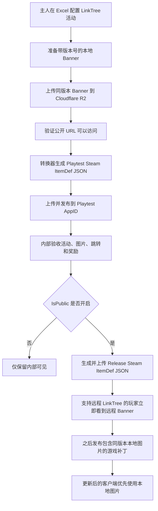

# LinkTree 在线活动发布工作流

## 文档用途

本文档供主人以后新增、测试、公开和补丁内置 LinkTree 在线活动时查阅，避免遗漏 Excel、Banner、Cloudflare、Steam Inventory 和客户端补丁之间的先后关系。

本文描述的是“LinkTree 远程配置与远程 Banner 功能开发完成后”的目标工作流。当前客户端仍然从本地 `tblinktree.json` 读取 LinkTree 数据，并从游戏包内加载 `BannerTexturePath`；当前 Steam ItemDef 转换器也只校验 LinkTree 奖励引用，尚未把完整的 LinkTree 展示数据写入 Steam ItemDef。功能开发完成前，单独上传 Steam JSON 和 Cloudflare 图片不会让旧客户端自动出现新 Banner。

## 最终目标

功能完成后，一次 LinkTree 活动发布分成两个阶段：

1. 远程先行阶段
   - 主人在 Excel 中配置活动。
   - Banner 上传到 Cloudflare R2。
   - LinkTree 配置通过转换器写入 Steam ItemDef JSON。
   - 主人将 JSON 上传并发布到 Steam 后台。
   - 已经安装“支持远程 LinkTree”的客户端可以立即读取新活动，并显示远程 Banner，不需要先下载游戏补丁。

2. 本地补齐阶段
   - 同版本 Banner 和本地 LinkTree 表随之后的游戏补丁一起发布。
   - 玩家更新后，客户端发现与远程配置版本完全对应的本地图片，改为优先读取游戏包内图片。
   - 尚未更新的玩家继续读取并缓存 Cloudflare 上的远程图片。



## 一次性开发前提

以下能力只需开发一次，完成后主人才能长期使用本文档中的日常发布流程：

1. 客户端能够刷新并读取 Steam ItemDef 中的 LinkTree 自定义属性。
2. 转换器能够把 LinkTree 的展示、跳转、奖励和图片字段写入对应 Steam ItemDef。
3. 客户端能够从 Cloudflare URL 下载 Banner，并在本地缓存。
4. 客户端能够根据活动与图片版本判断本地资源是否匹配。
5. 同版本本地图片存在时优先使用本地资源；不存在时使用远程缓存或重新下载。
6. 下载失败时显示占位图或暂时隐藏对应活动，不影响 LinkTree 页面其余入口。
7. Playtest 和 Release 转换结果能够按照 `IsPublic` 过滤活动。
8. 多语言 Banner 图集能够按当前语言裁切对应区域，并在缺少语言时回退到默认语言。

## 日常发布清单

以后发布一次普通 LinkTree 活动时，主人按以下顺序操作。

### 确定活动身份和版本

1. 为活动确定稳定的 `Id` 与 `Key`。
2. 确定 Banner 版本，例如 `v1`。
3. 同一次发布中的本地路径、Cloudflare 路径和 Steam 配置必须使用同一个版本。
4. 图片内容有任何变化时创建新版本，例如从 `v1` 升级到 `v2`，不要覆盖已经发布的旧地址。

推荐的活动 Key 使用短小、稳定、只包含 ASCII 字母、数字和连字符的名称，例如：

```text
summer-2026
steam-community
launch-week
```

### 在 Excel 中配置活动

1. 在 `LinkTree` 表中新建或更新活动行。
2. 填写活动展示顺序、置顶状态、跳转链接和奖励配置。
3. 新活动初次测试时设置：
   - `IsEnabled=true`
   - `IsPublic=false`
4. 填写带版本号的本地 Banner 路径。
5. 填写 Cloudflare 公开 URL 或供转换器生成 URL 所需的活动 Key、版本和文件名。
6. 如果活动以后需要公开，第一次分配时就使用正式 LinkTree 回执和 Bundle ID 段。

`IsEnabled` 与计划新增的 `IsPublic` 含义如下：

- `IsEnabled=false`
  - 活动整体停用。
  - Playtest 和 Release 均不展示。
- `IsEnabled=true` 且 `IsPublic=false`
  - 活动只进入 Playtest 配置，供主人和内部测试者验收。
  - Release 玩家不可见。
- `IsEnabled=true` 且 `IsPublic=true`
  - 活动进入 Playtest 和 Release 配置。
  - Release 玩家可以看到。

对于以后准备公开的活动，推荐从第一天就分配正式 ID，只用 `IsPublic=false` 控制测试阶段。这样测试完成后可以直接切换为公开。

Playtest 专用 ID 只用于一次性或废弃式测试。使用 Playtest 专用 ID 的活动不能只靠把 `IsPublic` 改为 `true` 进入 Release；需要重新建立使用正式回执与 Bundle ID 的活动配置。

### 准备本地 Banner

普通单语言 Banner 推荐放在：

```text
lucky-dog-rise/Assets/UI/LinkTree/<activity-key>/v<version>/banner-default.png
```

多语言图集推荐放在：

```text
lucky-dog-rise/Assets/UI/LinkTree/<activity-key>/v<version>/banner-atlas.png
```

准备图片时检查：

1. 文件名和目录中的活动 Key、版本与 Excel 完全一致。
2. PNG 能正常打开，没有错误的透明边缘或色彩模式。
3. Banner 的主要文字和按钮不会被 LinkTree 容器裁掉。
4. 多语言图集的语言顺序、格子尺寸和间隔与 Excel 配置一致。
5. 不删除或覆盖已经随旧版本发布的图片。

### 上传到 Cloudflare R2

当前 R2 bucket：

```text
lucky-dog-rise-public
```

当前测试阶段公开地址前缀：

```text
https://pub-3c9d532c84d74d47a0bb45b019def02d.r2.dev/
```

LinkTree Banner 推荐对象路径：

```text
linktree/banners/<activity-key>/v<version>/banner-default.png
linktree/banners/<activity-key>/v<version>/banner-atlas.png
```

当前已验证的测试对象是：

```text
linktree/banners/test/v1/Banner_CloudTest.png
```

上传后必须执行以下检查：

1. 在 R2 对象列表中确认完整路径和文件名。
2. 在浏览器中直接打开完整公开 URL。
3. 确认图片能够正常渲染，而不是只在 Cloudflare 后台对象列表中存在。
4. 核对文件名大小写。R2 对象路径区分大小写。
5. 核对公开 URL 与 Excel 中填写的 URL 完全一致。

日常上传图片不需要重新创建 bucket、Worker、KV、D1 或 Cloudflare API Token。只有以后需要自动批量上传时，才需要另外设计受限的 R2 API 凭据和上传工具。

当前 `r2.dev` 地址用于开发、Playtest 和早期小规模使用。正式大规模发布前应绑定 Cloudflare 自定义域名并更新统一的资源地址前缀。Cloudflare 官方说明见：<https://developers.cloudflare.com/r2/buckets/public-buckets/>。

### 生成 Steam ItemDef JSON

完成 Luban 数据导出后，使用项目现有 Steam ItemDef 转换器：

```text
lucky-steamworks/steam-item-def/Start-SteamItemDefTool.cmd
```

转换器默认生成：

```text
lucky-steamworks/steam-item-def/generated/steam-itemdefs.playtest.json
lucky-steamworks/steam-item-def/generated/steam-itemdefs.release.json
lucky-steamworks/steam-item-def/generated/validation-report.json
```

生成后检查：

1. `validation-report.json` 没有错误。
2. 预览中出现本次活动对应的回执和领取 Bundle。
3. LinkTree 自定义属性包含正确的活动 ID、版本、图片地址、跳转地址和可见性。
4. `icon_url_large` 指向默认语言的完整 Banner，而不是多语言拼图。
5. 多语言图集 URL 写入客户端专用自定义属性，例如 `ldr_banner_atlas_url`。
6. Playtest 预览包含内部活动。
7. Release 预览不包含 `IsPublic=false` 的活动。

转换器只生成和校验文件，不会自动上传或发布 Steam 配置。

### 上传到 Steam Playtest

Playtest 固定使用 AppID：

```text
4972240
```

1. 将 `steam-itemdefs.playtest.json` 上传到 Playtest 的 Steam Inventory Service 页面。
2. 在 Steam 后台检查差异。
3. 发布 Playtest ItemDef。
4. 等待 Steam 定义刷新后启动 Playtest 客户端。
5. 验收以下内容：
   - 内部活动能够出现。
   - 当前语言显示正确 Banner。
   - Cloudflare 图片下载失败时有合理回退。
   - 点击打开正确的外部链接。
   - 奖励能够领取且不能重复领取。
   - 重启客户端后领取状态正确恢复。
   - LinkTree 与盲盒不会并发提交 Steam Inventory 写事务。

如果活动只用于内部测试，保持 `IsPublic=false`，流程到此结束。

### 公开给 Release 玩家

Release 固定使用 AppID：

```text
2583700
```

内部验收通过后：

1. 将活动的 `IsPublic` 改为 `true`。
2. 重新导出 Luban 数据。
3. 重新生成 Steam ItemDef JSON。
4. 再次确认 Release 结果没有引用 Playtest 专用 ID。
5. 将 `steam-itemdefs.release.json` 上传到 Release 的 Steam Inventory Service 页面。
6. 在 Steam 后台检查差异并发布。
7. 使用普通玩家账号验证远程活动是否出现。

完成以上步骤后，已经安装支持远程 LinkTree 功能版本的玩家应当可以看到新活动和 Cloudflare Banner，不需要先更新游戏补丁。Steam ItemDef 刷新可能不是即时完成，验收时需要区分“Steam 尚未刷新”与“客户端解析失败”。

### 发布本地资源补丁

远程活动公开后，可以随后制作包含本地资源的游戏补丁：

1. 确认同版本 Banner 已位于游戏资产目录。
2. 确认本地 `tblinktree.json` 包含该活动的正式快照。
3. 生成候选游戏包。
4. 验证候选包内确实包含对应图片和 Godot 导入资源。
5. 验证更新后的客户端优先使用同版本本地图片。
6. 验证未更新客户端仍然可以使用远程图片。
7. 按项目现有 Playtest 或 Release 打包上传流程发布补丁。

补丁不是活动首次出现的必要条件。补丁的作用是把已经远程上线的 Banner 变成游戏包内的正式本地资源，降低后续网络依赖，并保留该版本客户端对应的资源快照。

## Banner 加载优先级

客户端推荐按照以下优先级选择图片：

1. 远程配置指定的同版本本地资源存在时，读取本地资源。
2. 本地资源不存在时，读取已经缓存的同版本远程图片。
3. 缓存不存在或校验失败时，从 Cloudflare 下载同版本远程图片。
4. 下载失败时，使用默认占位图或暂时隐藏该入口。
5. 网络恢复后允许重新尝试下载，但不能阻塞 LinkTree 页面其余入口。

本地资源匹配必须同时检查活动身份和 `BannerVersion`，不能只检查一个长期不变的文件名。否则客户端补丁中的旧图可能覆盖 Steam 已经发布的新图。

## 多语言 Banner 图集

多语言 Banner 可以放在同一张 2048×2048 的图集中，由客户端按当前语言裁切显示。该方案只用于 LinkTree 客户端图片，不用于 Steam 市场装扮图片；2048×2048 是 Steam 对 `icon_url_large` 的推荐尺寸，不应写成强制上限。

推荐约定：

1. `icon_url_large`
   - 指向默认语言的完整 Banner。
   - 保持 Steam 对“大图”的正常语义。
   - Steam 官方推荐大图尺寸为 2048×2048，说明见：<https://partner.steamgames.com/doc/features/inventory/schema?l=english>。

2. `ldr_banner_atlas_url`
   - 指向多语言 Banner 图集。
   - 只供游戏客户端读取和裁切。

3. `ldr_banner_atlas_local_path`
   - 指向补丁内同版本本地图集。

4. `ldr_banner_atlas_locales`
   - 按从左到右、从上到下的顺序记录语言代码。

5. `ldr_banner_atlas_columns`
   - 记录图集列数。

6. `ldr_banner_cell_width` 与 `ldr_banner_cell_height`
   - 记录每个语言格子的像素尺寸。

7. `ldr_banner_version`
   - 记录图集版本。

图集制作规则：

1. 所有格子使用相同尺寸。
2. 格子之间保留透明间隔，避免纹理线性过滤导致相邻语言串色。
3. 没有当前语言时回退到默认语言，推荐默认回退 English。
4. 修改任意一种语言后，整个图集升级版本并使用新 URL。
5. 本地与远程图集必须完全相同，不能只保持文件名相同。
6. 客户端应复用已解码图集；2048×2048 RGBA 图片完全解码约占 16 MB 内存，不能为同一活动重复加载多份。

Steam 不会理解图集中的语言布局，也不会自动裁切。图集语言选择、裁切和回退全部由游戏客户端负责。

以后用于 Steam 市场的装扮图片不得使用这种多语言拼图。可交易或可市场出售物品的 `icon_url_large` 必须是一张正常、完整的物品大图。

## 下线、修正与回滚

### 尚未公开的内部活动

1. 将 `IsEnabled` 改为 `false`。
2. 重新生成并发布 Playtest JSON。
3. 已经分配的 ItemDef ID 保留，不重新分配给其它活动。
4. Cloudflare 上已经发布的版本图片可以保留，避免旧配置或缓存地址失效。

### 已经公开的活动

发现普通文案或图片问题时：

1. 创建新 Banner 版本，不覆盖旧对象。
2. 修改 Excel 中的版本、本地路径和远程 URL。
3. 先在 Playtest 验证。
4. 再发布新的 Release Steam ItemDef。
5. 之后的补丁加入新版本本地图片。

活动需要紧急隐藏时：

1. 将 `IsEnabled` 改为 `false`，或使用未来实现的远程停用字段。
2. 重新生成并发布 Release Steam ItemDef。
3. 不删除永久回执、Bundle 定义或已经发放给玩家的库存物品。
4. 不复用已发布的活动 ID 和 ItemDef ID。

如果远程图片地址失效但活动仍需保留，应先上传一个新版本图片并更新 Steam 配置，不应依赖直接覆盖旧 URL 后等待未知缓存刷新。

## 哪些操作必须由主人完成

以下操作涉及外部账号、发布责任或敏感凭据，必须由主人本人确认或操作：

1. Cloudflare 登录、密码、邮箱验证码和 OAuth 授权。
2. Cloudflare 付款方式、信用卡和账单确认。
3. 创建、查看或保存 R2 API Token、Access Key 和 Secret Key。
4. Steamworks 登录与二次验证。
5. 在 Steam 后台上传、检查并正式发布 ItemDef JSON。
6. 将候选构建设置为正式可见分支或 Live。

任何密码、验证码、Secret Key 或完整敏感凭据都不应写入本文档、Excel、Git 仓库或聊天记录。

## 每次发布前的最后检查

主人可以在发布前逐项确认：

- [ ] 活动 `Id` 和 `Key` 没有复用。
- [ ] 准备公开的活动从一开始使用正式 ItemDef ID 段。
- [ ] 初次测试时 `IsEnabled=true`、`IsPublic=false`。
- [ ] 本地与远程 Banner 使用相同活动 Key 和版本。
- [ ] Cloudflare URL 已在浏览器中直接打开验证。
- [ ] 没有覆盖旧版本对象。
- [ ] Luban 已重新导出。
- [ ] Steam 转换器校验通过。
- [ ] Playtest JSON 上传到了 AppID `4972240`。
- [ ] 活动、语言、跳转、奖励和重复领取均已在 Playtest 验证。
- [ ] 公开前已将 `IsPublic` 改为 `true`。
- [ ] Release JSON 不包含内部活动或 Playtest 专用 ID。
- [ ] Release JSON 上传到了 AppID `2583700`。
- [ ] 普通玩家账号能够读取远程活动和 Banner。
- [ ] 后续补丁包含同版本本地图片与表格快照。
- [ ] 更新后的客户端优先读取同版本本地图片。

## 当前尚待实现的内容

本文档记录的目标方案包含以下尚未完成的开发工作：

1. LinkTree 完整配置写入 Steam ItemDef 自定义属性。
2. 客户端枚举并解析远程 LinkTree 定义。
3. Cloudflare Banner 下载、磁盘缓存、失败重试和占位回退。
4. `BannerVersion` 与同版本本地资源优先逻辑。
5. `IsPublic` 字段及 Playtest/Release 转换器过滤。
6. 多语言图集字段、裁切、默认语言回退和内存复用。
7. 对应的转换器校验、Debug Steam Mock 和真实 Steam 验收流程。

在以上内容完成并通过 Playtest 验收前，本文档保持 `draft` 状态。
