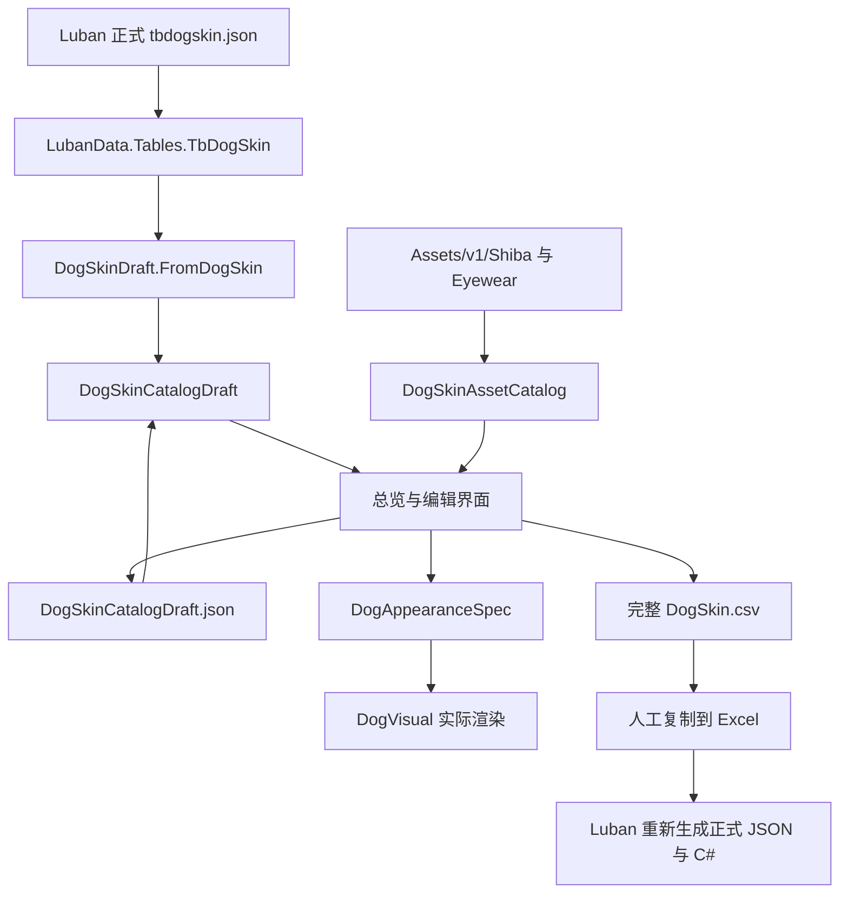
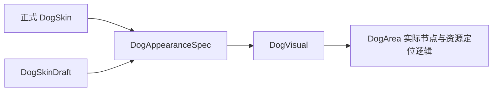
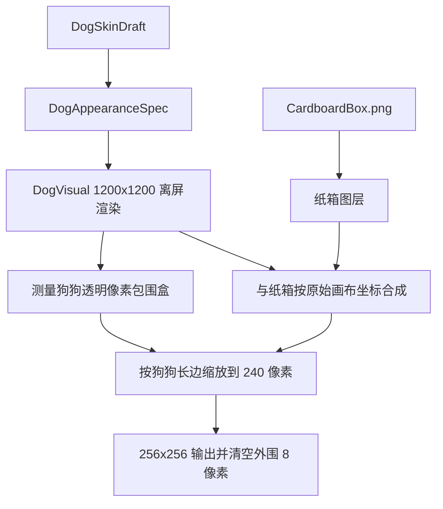

# DogSkin 可视化编辑器开发维护指南

## 文档定位

本文档面向后续接手 DogSkin 可视化编辑器的程序员，说明当前实现的架构、数据边界、扩展入口和验证要求。

本文档不是策划操作手册，不逐步说明按钮如何使用。界面行为只在其影响代码结构、数据安全或扩展方式时说明。

工具当前位于 `lucky-dog-rise/Tools/DogSkinEditor/`，使用 Godot 4.6 + C# 实现，是游戏项目内的独立开发工具场景，不是 `EditorPlugin`，也不随正式游戏包发布。

## 核心设计原则

后续扩展应继续遵守以下边界：

- 工具预览必须复用游戏实际的 `DogVisual` 渲染，不维护第二套狗狗拼装算法。
- 工具只维护可恢复的草稿 JSON，并导出完整 CSV；不直接修改 Excel，也不直接修改 Luban 生成的正式 JSON。
- Luban 生成的 `Scripts/DataTables/*.cs` 不得手工修改。表结构变化应先在配置源中完成并重新生成 JSON 与 C#。
- 策划辅助字段与视觉字段分开处理。仅影响识别或管理的字段不应进入渲染模型。
- `Tools/*` 继续从 Playtest 和 Release 导出中排除，工具代码不得成为游戏运行时依赖。
- 面向维护者显示的错误信息使用中文；原始系统异常写入 Godot 日志，不直接作为弹窗正文。

## 目录职责

当前目录结构如下：

```text
lucky-dog-rise/
├── Tools/DogSkinEditor/
│   ├── DogSkinEditor.tscn
│   ├── DogSkinEditorController.cs
│   ├── DogSkinDraft.cs
│   ├── DogSkinAssetCatalog.cs
│   ├── DogSkinIconComposerWindow.cs
│   ├── DogSkinIconExportService.cs
│   ├── DogSkinEditorTheme.tres
│   ├── Assets/IconComposer/CardboardBox.png
│   └── output/
│       ├── .gdignore
│       ├── DogSkinCatalogDraft.json
│       ├── DogSkin.csv
│       └── IconComposer/
│           ├── settings.json
│           ├── tbitem_dog_icon_patch.csv
│           └── ItemIcon/Dog_*.png
├── Scripts/DogAppearanceSpec.cs
├── Scripts/DogVisual.cs
└── Scenes/DogArea.tscn
```

各文件职责如下：

- `DogSkinEditor.tscn`：保持最小场景，只声明根 `Control` 并挂载控制器。
- `DogSkinEditorController.cs`：负责窗口、总览、编辑表单、实时选择器、脏状态、校验、草稿保存和 CSV 导出。
- `DogSkinDraft.cs`：定义可序列化草稿模型、正式表到草稿的映射、克隆和渲染模型转换。
- `DogSkinAssetCatalog.cs`：扫描狗狗素材目录与眼镜 PNG，提供候选列表和资源存在性检查。
- `DogSkinIconComposerWindow.cs`：管理图标预览、纸箱水平偏移、批量生成进度和完成提示。
- `DogSkinIconExportService.cs`：复用 `DogVisual` 离屏渲染狗狗，合成纸箱，生成 256×256 PNG 和 tbitem 补丁 CSV。
- `DogSkinEditorTheme.tres`：开发工具专用的 Godot 3 风格深色主题。
- `DogAppearanceSpec.cs`：游戏运行时与开发工具共享的可变视觉数据模型。
- `DogVisual.cs`：唯一的狗狗渲染实现，同时接受正式 `DogSkin` 和工具预览数据。

`output/.gdignore` 只阻止 Godot 导入该目录内容，不等同于 Git 忽略。草稿和 CSV 是否进入版本控制应由项目的 Git 策略决定。

## 数据流

工具的数据流如下：



启动时优先读取 `DogSkinCatalogDraft.json`。草稿不存在或无法读取时，使用 `LubanData.Tables.TbDogSkin` 创建内存草稿。

“重新载入正式 JSON”会用当前 Luban 数据替换整个内存草稿，但不会立即覆盖磁盘草稿；替换后进入脏状态，直到保存或放弃。

## 共享渲染链

工具不能自行拼接 Sprite、复制坐标公式或模拟 `DogReaction`。所有预览必须经过以下共享链路：



正式游戏通过 `DogAppearanceSpec.FromDogSkin()` 创建视觉数据。工具通过 `DogSkinDraft.ToAppearanceSpec()` 创建同一种视觉数据，并调用 `DogVisual.SetPreviewAppearance()`。

`DogVisual.CurrentDogSkin` 的优先级为：

1. 工具传入的 `_previewAppearance`。
2. 游戏当前装备的 `_dogSkin`。
3. 正式表中的 DogSkin `1001`。

`SetPreviewAppearance()` 只覆盖当前 `DogVisual` 实例的表现，不修改背包、装备、存档或 Luban 表。

`DogAppearanceSpec` 应只包含渲染需要的数据。以 `Alias` 为例，该字段用于策划识别，不影响画面，因此只存在于 `DogSkinDraft` 和正式 `DogSkin`，不进入 `DogAppearanceSpec`。

新增视觉字段时，必须同步检查：

1. `DogAppearanceSpec` 是否需要该字段。
2. `DogAppearanceSpec.FromDogSkin()` 是否完成映射。
3. `DogSkinDraft.ToAppearanceSpec()` 是否完成映射。
4. `DogVisual` 是否通过 `CurrentDogSkin` 消费该字段。

不得在工具控制器中另写一套只供预览使用的渲染分支。

## 预览视口

`CreateDogViewport()` 同时用于总览缩略图、狗头选择器、眼镜选择器和编辑页大预览。

每个预览会实例化真实的 `DogArea.tscn`，关闭狗狗点击按钮，并将草稿转换成 `DogAppearanceSpec`。预览使用独立 `SubViewport`，避免依赖完整游戏入口、Steam、存档或 `ModeManager`。

狗狗仍处于 1200×1200 PSD 坐标系。当前取景参数为：

- 取景框：`Rect2(180, 40, 840, 760)`。
- 游戏狗狗原点：`Vector2(610, 677)`。
- 缩放方式：按照容器宽高的较小比例等比缩放，并计算 letterbox 偏移。

这些数值定义的是工具镜头，不是狗狗素材坐标。修改它们只应改变预览取景，不应补偿具体 DogSkin 的资源问题。

容器尺寸变化时必须重新计算取景变换。不要让 `SubViewportContainer.Stretch` 改变坐标系后继续使用固定缩放值，否则总览会再次出现只显示耳朵或局部区域的问题。

## 草稿模型与版本迁移

`DogSkinCatalogDraft` 当前版本为 V2，包含：

- `Version`：草稿结构版本。
- `UpdatedAtUtc`：最近一次保存时间。
- `DogSkins`：完整 DogSkin 草稿集合。

草稿模型不是 Luban 生成类，允许增加编辑器专用状态，但导出字段必须继续与正式 DogSkin 表保持明确映射。

持久化字段发生不兼容变化时，应执行以下流程：

1. 提升 `DogSkinCatalogDraft.Version`。
2. 在 `MigrateCatalog()` 中按旧版本逐级迁移。
3. 优先使用 DogSkin `Id` 从正式表回填新字段。
4. 不覆盖旧草稿中已经存在的有效值。
5. 迁移完成后更新版本号，等待下一次正常保存写入磁盘。

V1 → V2 的现有迁移会按 `Id` 从正式表补齐 `Alias`。后续不得删除该迁移，除非项目明确不再支持任何 V1 草稿。

## 素材扫描边界

`DogSkinAssetCatalog` 当前只扫描：

- `res://Assets/v1/Shiba` 的一级子目录，形成 `FolderPath` 候选。
- 当前狗狗目录顶层的 `*.png`，按前缀筛选 Head、Ears、Eyes、Claw 和 Tongue。
- `res://Assets/v1/Eyewear` 顶层的 `*.png`，并额外加入空字符串表示无眼镜。

扫描不会递归进入更深层目录。若未来改变美术目录层级，应先明确新的唯一资源标识，再修改扫描逻辑、路径校验、CSV 表达和游戏运行时路径解析，不能只让选择器递归显示文件。

界面通过 `DisplayAssetName()` 隐藏 `.png`，但草稿、CSV 和资源加载始终保留完整文件名。新增控件时应继续遵守“显示值与存储值分离”，不要把隐藏扩展名后的文本直接写入草稿。

## 总览与重复检查

总览由 `RefreshOverviewGrid()` 根据搜索、头型、眼镜和“仅看重复”状态重建。

卡片缩略图使用真实 `DogVisual`。头型和眼镜后的计数用于观察素材复用频率，不代表完全重复。

完全重复由 `CombinationKey()` 判断。目前比较所有视觉组合字段，不比较：

- `Id`
- `Alias`
- `IconName`

重复组会在卡片上显示橙色标记并列出同组 ID。“仅看重复”只过滤显示，不修改数据。

新增任何影响最终狗狗画面的字段时，必须同步加入 `CombinationKey()`。否则两个实际不同的 DogSkin 可能被误报为重复。纯策划字段不得加入该 Key。

如果后续需要区分“完全重复”“默认造型重复”“单项复用过高”，应拆成不同检查器，不要继续扩大一个含义不清的 Key。

## 编辑状态与数据安全

当前编辑器直接修改内存中的 `DogSkinDraft`，没有为每个字段建立命令栈或撤销栈。

脏状态 `_hasUnsavedChanges` 覆盖整份 DogSkin 草稿集合，而不是当前单只狗狗。以下操作会进入脏状态：

- 修改任意字段。
- 选择狗头或眼镜。
- 新建或克隆 DogSkin。
- 重新载入正式 JSON。

上下两组保存按钮共享同一脏状态。成功保存后统一清除；保存失败时保持脏状态。

“放弃并返回”会重新读取磁盘上的整份草稿，并丢弃自上次保存以来的全部内存修改，包括其他 DogSkin、新建行和克隆行。后续若实现单只狗狗撤销，必须先拆分全局脏状态与编辑会话快照，不能改变现有按钮语义却仍调用 `LoadCatalog()`。

草稿保存使用同目录临时文件：

1. 序列化到 `DogSkinCatalogDraft.json.tmp`。
2. 使用 `File.Move(tempPath, path, true)` 替换目标文件。
3. 替换成功后清除脏状态。

草稿 JSON 使用 UTF-8 无 BOM，并允许直接保存可读中文。保存和 CSV 导出遇到文件占用、权限不足、路径错误等异常时，弹窗显示中文分类信息；完整异常写入 Godot 日志。

## 新建与克隆

“新建”不是创建 PNG。当前实现会：

1. 使用现有最大 `Id + 1` 作为新 ID。
2. 优先复制 DogSkin `1001`，不存在时复制列表第一项。
3. 复用模板的 `IconName` 和全部视觉素材。
4. 生成新的 `Alias`，随后由维护者调整视觉组合。

“克隆”会复制选中 DogSkin 的全部数据，分配新 ID，并复用来源 `IconName`。

因此，新建或克隆后出现完全重复标记是预期行为。图标合成不读取或修改 `IconName`，而是根据 DogSkin ID 固定生成 `Dog_{Id}.png`。新建 DogSkin 即使还没有对应 Item 行，也可以先生成审阅图标；tbitem 补丁 CSV 不会凭空创建 Item 行。

“视觉组合生成”和“图标产物生成”是两个独立步骤。图标生成失败不得破坏已经保存的 DogSkin 草稿。

## 可视化选择器

狗头和固定眼镜使用实时选择窗口，而不是普通文件名下拉框：

- 狗头候选来自当前 `FolderPath` 下的 `Head_*`。
- 眼镜候选来自全局 Eyewear 目录，并支持无眼镜。
- 每个候选通过 `CreateDogViewport()` 渲染当前狗狗的完整组合。
- 候选卡片显示素材在全库中的复用次数。
- 选择完成后修改草稿、标记脏状态并刷新主预览。

新增第三种需要视觉判断的选择器时，应优先抽取通用选择器框架，参数化候选来源、草稿字段写入和使用次数统计。不要再复制一整份窗口构建代码，否则搜索、布局和预览行为会逐渐分叉。

普通耳朵、眼睛、爪子和舌头目前仍使用 `OptionButton`。是否升级为实时选择器应根据“单看文件名是否足以判断”的成本决定。

## CSV 导出契约

`DogSkin.csv` 是整表导出，不是单行复制。输出按 DogSkin `Id` 排序，使用 UTF-8 BOM 和 CRLF，以保证 Windows Excel 直接打开或复制时正确识别中文。

`CsvHeaders` 与 `BuildCsv()` 中的值顺序必须严格一致，并与 DogSkin 表保持一致。当前前几列顺序为：

```text
Id, Alias, IconName, DefaultEars, DefaultEyes, ...
```

字段包含逗号、双引号或换行时，通过 `Csv()` 按标准 CSV 规则转义。

导出前 `ValidateCatalog()` 会检查：

- ID 是否重复。
- `Alias`、`IconName`、`FolderPath` 是否为空。
- 狗头、耳朵、眼睛、爪子和常规舌头素材是否存在。
- 固定眼镜素材是否存在。

完整 DogSkin CSV 导出时，`IconName` 只检查非空，不检查同名 PNG 是否存在。图标合成使用 DogSkin ID 生成独立文件名，不消费也不校验该字段；在 DogSkin 表正式移除 `IconName` 前，完整 DogSkin CSV 仍须保留它。

## DogSkin 道具图标合成

图标合成是独立工具模块，不属于 DogSkin 草稿保存或完整 DogSkin CSV 导出。入口位于主工具栏的“合成道具图标”。

合成流程如下：



纸箱素材保持 1200×1200 完整 PSD 画布，不应预先缩小为 256×256。所有狗狗部件、固定眼镜和纸箱先在源尺寸合成，只在最后执行一次 Lanczos 缩放，避免交界处因多次缩放出现透明虚边。

纸箱使用全局 `CardboardOffsetX` 微调水平位置，单位是 1200×1200 源画布像素，正值向右。该参数保存在 `output/IconComposer/settings.json`，不进入 DogSkin 表。垂直方向使用纸箱与 PSD 的原始画布坐标，不为单只 DogSkin 保存补偿参数。

输出固定写入工具目录：

```text
Tools/DogSkinEditor/output/IconComposer/
├── ItemIcon/
│   ├── Dog_1001.png
│   └── Dog_1002.png
└── tbitem_dog_icon_patch.csv
```

工具不直接写入 `Assets/v0`。主人审阅 PNG 后，手动将通过的文件复制到 `Assets/v0/ItemIcon`。`output/.gdignore` 会阻止 Godot 导入这些审阅产物；工具内预览使用运行时 `ImageTexture`，不能依赖 `GD.Load()` 读取 output 下的 PNG。

图标文件名不读取 `DogSkin.IconName`，固定使用 `Dog_{DogSkin.Id}.png`。`IconName` 仍属于当前 DogSkin 表与完整 DogSkin CSV，在正式表决定移除该字段前，不应由图标模块擅自删除或改写。

## tbitem 图标补丁 CSV

图标批量生成同时输出 `tbitem_dog_icon_patch.csv`，用于人工更新 Item 表的 `AssetPathList` 与 `IconPath`。这是一份差量辅助文件，不是完整 Luban Item 表。

列顺序固定为：

```text
Id,SkinId,AssetPathList,IconPath
```

关联必须使用 `Item.SkinId == DogSkin.Id`，不得假设 `Item.Id == DogSkin.Id`。活动物品等多条 Item 可以引用同一个 DogSkin；这些行会共享同一张生成图标。

每行的生成规则为：

- `Id`：现有 Item ID。
- `SkinId`：现有 Item 的 DogSkin 引用，用于人工核对。
- `AssetPathList`：对应 DogSkin 的 `FolderPath`，规范化为带尾部反斜杠的单目录值。
- `IconPath`：`v0\ItemIcon\Dog_{SkinId}.png`。

新 DogSkin 没有现有 Item 引用时仍生成 PNG，但不生成补丁行。现有 Item 引用了草稿中不存在的 DogSkin 时，批量生成必须失败并提示具体 Item 与 SkinId，不能输出一份不完整 CSV。

导出成功弹窗可调用 `OS.ShellShowInFileManager()` 打开文件所在目录。Windows 文件占用错误通过 HResult 低位 `32/33` 识别，并转换为中文提示。

## DogSkin 表新增字段时的同步清单

每次 DogSkin 表结构变化后，至少检查以下位置：

1. 确认 Luban 已重新生成 `tbdogskin.json` 和 `Scripts/DataTables/DogSkin.cs`。
2. 在 `DogSkinDraft` 增加属性。
3. 在 `DogSkinDraft.FromDogSkin()` 增加正式表映射。
4. 在 `DogSkinDraft.CloneWithId()` 增加克隆映射。
5. 如果是视觉字段，在 `DogAppearanceSpec`、`FromDogSkin()` 和 `ToAppearanceSpec()` 增加映射。
6. 在编辑表单中放入语义正确的分组，并接入脏状态。
7. 根据字段类型补充候选来源、资源校验和中文错误名称。
8. 将字段按正式表顺序同时加入 `CsvHeaders` 与 `BuildCsv()`。
9. 如果字段影响画面，将其加入 `CombinationKey()`。
10. 如果旧草稿缺少该字段会造成数据丢失，提升草稿版本并增加迁移。
11. 重新加载正式 JSON，验证旧数据映射。
12. 导出 CSV，复制到 Excel，再通过 Luban 生成并运行游戏验证。

仅在编辑表单中增加输入框是不完整实现。最容易遗漏的是克隆映射、CSV 列序、重复检查和旧草稿迁移。

## 界面扩展约定

当前 UI 主要在 `DogSkinEditorController` 中以代码构建。其优点是迭代快，缺点是控制器会随功能增长而膨胀。

小规模调整可以继续使用现有辅助方法：

- `CreateFormSection()`：创建编辑分组。
- `CreateSaveActions()`：创建共享保存操作区。
- `AddTextField()`、`AddPngNameField()`、`AddChoiceField()`：创建字段控件并接入脏状态。
- `CreateDogViewport()`：创建真实渲染预览。
- `ShowMessage()`：显示普通信息或错误。

出现以下任一情况时，应开始拆分类，而不是继续扩充控制器：

- 新增第三个复杂实时素材选择器。
- 增加批量编辑或多选操作。
- 增加图标合成任务队列。
- 增加独立的多类校验报告。
- 增加单只 DogSkin 撤销/重做。

建议优先拆分为 View、Catalog Service、Validation Service、CSV Exporter 和 Preview Factory，同时保持 `DogAppearanceSpec → DogVisual` 的共享渲染边界不变。

## 窗口与主题

游戏主窗口使用透明、无边框和置顶行为，但工具需要普通桌面窗口。`_EnterTree()` 会明确关闭透明、无边框、置顶和禁止缩放，并切换为 Windowed 模式。

`_Ready()` 设置工具标题、最小尺寸、初始尺寸和屏幕居中。后续不得直接复用 `ModeManager` 的窗口逻辑，否则可能重新引入透明窗口或鼠标穿透行为。

主题由 `DogSkinEditorTheme.tres` 独立维护。新增控件应优先继承该主题，保持 Godot 3 风格的蓝灰层级。警告与脏状态使用克制的橙色，不应使用大面积高亮色破坏预览判断。

## 构建与发布边界

正式导出配置当前通过 `Tools/*` 排除整个工具目录：

- `lucky-dog-rise/export_presets.cfg`
- `lucky-dog-rise/Build/New-ExportPresets.ps1`

工具依赖的 `DogAppearanceSpec` 和 `DogVisual` 属于游戏运行时共享代码，不能放入 `Tools/*`。

`Build/godot-obfuscation-preserve.txt` 当前包含 `DogSkinEditorController`。如果控制器改名、拆分或工具进入不同的 Dev 构建流程，应同步检查保留名单；不得因为正式包排除了 `Tools/*` 就假设所有开发构建都不会处理该程序集。

## 验证要求

修改工具后至少执行以下检查：

1. 使用项目既有 NuGet 缓存编译：

   ```powershell
   $env:NUGET_PACKAGES = "C:\Users\carlo\.nuget\packages"
   dotnet build .\lucky-dog-rise\LuckyDogRise.csproj --no-restore
   ```

2. 启动独立场景：

   ```text
   res://Tools/DogSkinEditor/DogSkinEditor.tscn
   ```

3. 检查 Godot 运行时异常。
4. 人工检查总览响应式列数、缩略图取景、编辑分组和选择弹窗。
5. 修改字段后确认上下脏状态同步。
6. 分别验证保存、保存并返回、放弃并返回和文件被占用错误。
7. 验证完全重复标记与“仅看重复”。
8. 导出 CSV，确认中文、列序、引号转义和 Excel 粘贴结果。
9. 将 CSV 数据进入 Excel 后重新运行 Luban，并在游戏中验证实际 DogSkin。

“编译通过”只证明 C# 语法和类型正确；“场景无异常”只证明启动阶段没有捕获到运行时错误。预览构图、窗口布局和 Excel 数据闭环仍需人工验收。

## 当前限制与后续扩展方向

当前版本有以下明确限制：

- 不直接写 Excel。
- 不直接修改 Luban 正式 JSON。
- 不自动把生成的 DogSkin 背包图标复制到正式 `Assets/v0`。
- 不编辑 PSD 或批量导出 PSD 素材。
- 不处理帽子与眼镜的前后层级配置。
- 不提供单只 DogSkin 的撤销/重做。
- 不自动遍历全部帽子检查兼容性。
- 不生成盲盒或 Steam ItemDef 数据。

后续模块应按独立职责接入。图标合成、PSD 导出、帽子兼容检查和表格写入不应一起塞进一次保存操作。每个模块都应有独立输入、输出、失败提示和可恢复边界。
