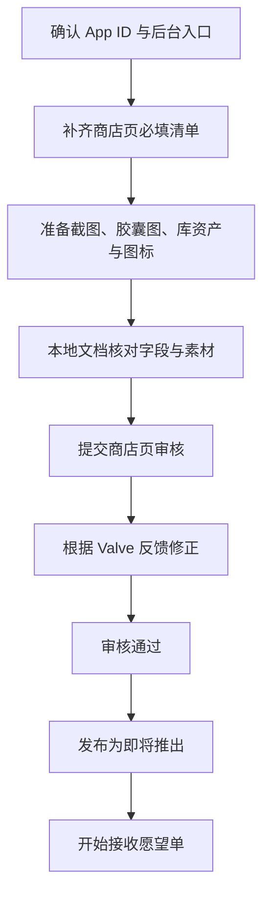

# Steam 商店页填写与审核清单

## 文档目的

本文档记录 `Lucky Dog Rise` 进入 Steam 商店页“即将推出”状态前的填写决策、素材清单、审核注意事项与后台操作记录。

关联材料准备文档：

- `docs/steamworks/store-page-materials.md`
- `docs/steamworks/store-page-submission-summary.md`

本轮工作的目标包含三件事：

1. 帮主人完成 Steamworks 后台商店页填写。
2. 让主人理解每一项字段的用途、审核重点与填写取舍。
3. 在项目内留下可复用的上架记录，避免后续维护时丢失上下文。

## 应用信息

- Steam App ID：`2583700`
- Steamworks 应用页：`https://partner.steamgames.com/apps/landing/2583700`
- 当前后台标题：`Lucky Dog Rise (2583700)`
- 当前商店状态：已提交 Steam 商店页审核，等待 Valve 审批
- 目标公开状态：`Coming Soon / 即将推出`
- 愿望单入口：商店页公开为“即将推出”后，玩家即可加入愿望单。

## 当前提交状态

2026-07-06，主人已在 Steamworks 后台提交 `Lucky Dog Rise` 的商店页审核。

本文件保留早期填写清单与字段解释。提交时的最终决策、素材策略、语言策略与后续待办，记录在 `docs/steamworks/store-page-submission-summary.md`。

2026-07-07 补充：

- “关于此游戏”四语长描述已经单独整理为 `docs/steamworks/关于此游戏-*` 文件，本清单中的早期描述草案不再作为最终文本来源。
- 当前不优先制作 About This Game 用 WebM/GIF，避免页面过早折叠；结尾静态小狗图更适合当前阶段。
- 公开 Coming Soon 前，应重点核对四语短描述截断情况和 Steam 语言支持表。

## 操作边界

- AI 助手可以读取 Steamworks 后台页面、解释字段、整理推荐填写内容、协助填写普通文本字段。
- 涉及保存、提交审核、发布“即将推出”、上传素材、修改账户/财务/权限、输入敏感信息等操作时，必须由主人确认后再执行。
- 登录、Steam Guard、验证码、敏感身份验证由主人手动完成。
- 后台页面内容以 Steamworks 实际显示为准；本文档用于记录项目决策，不替代 Steam 官方后台检查。

## 总体流程



## 商店页必填清单

以下清单来自 2026-07-03 Steamworks 应用页的只读观察。

### 基本信息

- 后台入口：`Store Presence / Basic Info`
- 当前状态：未完成
- 2026-07-03 页面观察：
  - 应用类型已选：游戏
  - 游戏名称已填：`Lucky Dog Rise`
  - 开发者为空
  - 发行商为空
  - 系列为空
  - 外部链接为空
  - 当前支持平台仅 Windows 已选
  - 系统需求为空
  - 发行日期未设置
  - 支持语言尚未确认
  - 玩家数尚未勾选
  - 支持功能尚未勾选
  - 主要类型未选
  - 标签数量为 0
  - 控制器支持向导未启动
  - 辅助功能向导未启动
  - 第三方 DRM、第三方账户、反作弊为空
  - 客服联系信息为空
- 2026-07-03 已在后台表单中设置但尚未点击保存：
  - 支持平台：`Windows`
  - 玩家数：`单人`
  - 类型：`休闲`
  - 主要类型：`Casual`
- 教学重点：
  - 这里决定商店页最基础的产品身份、分类、功能勾选、开发者/发行商显示。
  - 功能勾选必须与当前游戏实际支持一致；未实现的 Steam Cloud、成就、控制器支持等不应提前勾选。
- 待填写/确认：
  - 正式游戏名
  - 开发者名称
  - 发行商名称
  - 类型与标签
  - 支持平台
  - 支持功能

#### 基本信息建议草案

- 应用类型：保持 `游戏`
- 游戏名称：暂保持 `Lucky Dog Rise`
- 开发者：`Seanan Studio`
- 发行商：`Seanan Studio`
- 支持平台：首轮仅勾选 `Windows`
- 玩家数：勾选 `单人`
- 支持功能：首轮不勾选 Steam 成就、Steam 云、统计数据、排行榜、应用内购买、创意工坊、远程同乐、HDR、时间轴等尚未验证的功能
- 第三方 DRM：留空
- 第三方账户：留空
- 反作弊：留空
- 主要类型：建议优先选择 `休闲`
- 次要类型候选：`独立`、`模拟`、`策略` 中按商店定位选择，不建议过多
- 标签候选：`Casual`、`Cute`、`Card Game`、`Poker`、`Idler`、`Dog`、`Singleplayer`
- 控制器支持：如果当前游戏主要依赖鼠标/键盘与桌面交互，建议完成向导时明确为不主打控制器支持
- 辅助功能：先按当前实际支持填写，不夸大
- 系统要求：先填保守 Windows 配置，后续在发布包验证后修正
- 外部链接：无长期维护页面时可暂不填；隐私政策如果未来涉及联网、分析、账户或 Steam 库存服务，需要准备
- 客服联系信息：至少准备一个长期可用的客服邮箱

### 描述

- 后台入口：`Store Presence / Description`
- 当前状态：已在后台页面填入英文草案，尚未由主人确认保存
- 教学重点：
  - 短描述影响列表页和商店首屏理解成本。
  - 长描述需要清楚说明玩家能实际获得什么体验。
  - 不应把尚未确定首发可用的功能写成已上线功能。
- 2026-07-03 已填入后台页面的英文短描述草案：

```text
Lucky Dog Rise is a cozy desktop dog companion with idle progression and casual video poker. Let a lucky pup stay on your screen, earn chips as you type and click, open blind boxes, collect outfits, and take quick card-game breaks whenever you want.
```

- 2026-07-03 已填入后台页面的英文长描述草案：

```text
Lucky Dog Rise is a cozy desktop companion game about a lucky little dog who hangs out on your screen while you work, type, click, and take small breaks.

Your dog reacts to your desktop activity, gives playful feedback, and helps turn idle moments into a light collection loop. Keep the companion on your desk, earn chips through typing and clicking, open blind boxes, and dress your dog with new looks and accessories.

When you want a more focused break, switch into a casual video poker mode inspired by Jacks or Better. Bet chips, hold cards, draw new ones, and chase better hands at your own pace.

Features

A cute desktop dog companion that can stay with you while you work or relax

Typing and clicking activity that feeds into lightweight progression

Casual video poker gameplay with chips, hands, and rewards

Blind boxes, collectible items, dog skins, and outfit customization

A cozy 2D style designed for short sessions and background play

Lucky Dog Rise is made for players who enjoy desktop companions, idle collection, cute animals, and card-based mini games.
```

- 待填写/确认：
  - 主人确认是否保存当前英文草案
  - 是否继续补充简体中文商店页描述
  - 后续根据实际截图与宣传素材微调文案节奏
  - 关于首发功能范围的最终承诺边界

### 内容调查

- 后台入口：`Content Survey`
- 当前状态：未完成
- 教学重点：
  - 内容调查影响年龄提示、地区显示与审核判断。
  - 应按游戏实际内容填写，不为了“看起来安全”而隐瞒，也不把不存在的内容勾上。
- 待填写/确认：
  - 扑克/博彩表达的边界说明
  - 是否涉及真实货币博彩
  - 是否存在成人、暴力、药物、恐怖等内容

### 预定发行日期

- 当前状态：未完成
- 教学重点：
  - 可设置精确日期或较模糊的顾客可见日期。
  - “即将推出”页面需公开至少两周后才可正式发行。
- 待填写/确认：
  - 后台指定日期
  - 玩家可见日期文案
  - 是否先使用模糊窗口

### 系统要求

- 后台入口：`Basic Info / System Requirements`
- 当前状态：未完成
- 教学重点：
  - 系统要求应与 Godot Windows 构建实际运行需求相符。
  - 不确定项可以先保守填写，后续通过测试机或发布包验证。
- 待填写/确认：
  - 最低配置
  - 推荐配置
  - 存储空间
  - 是否仅支持 Windows

### 控制器支持描述

- 后台入口：`Basic Info / Controller`
- 当前状态：未完成
- 教学重点：
  - 如果游戏主要依赖鼠标、键盘和桌面交互，不应夸大控制器支持。
  - 控制器支持会影响商店功能标签与玩家预期。
- 待填写/确认：
  - 是否支持控制器
  - 如果不支持，后台应如何标记

### 截图

- 后台入口：`Graphical Assets / Screenshots`
- 当前状态：未完成
- 要求：5 张或更多截图
- 教学重点：
  - 截图应为真实 gameplay，不应使用概念图、纯宣传图或带大段营销文字的图。
  - 截图需要覆盖玩家最关心的体验：桌宠、扑克、装扮、盲盒、系统面板等。
- 待准备素材：
  - 桌宠模式截图
  - 扑克模式截图
  - 装扮/背包截图
  - 盲盒开盒表演截图
  - 调试功能不建议作为正式商店截图

### 宣传图

- 后台入口：`Graphical Assets / Store`
- 当前状态：未完成
- 教学重点：
  - 胶囊图必须包含清晰可读的产品标题或 logo。
  - 图像风格应与当前美化后的游戏视觉一致。
- 待准备素材：
  - Header capsule
  - Small capsule
  - Main capsule
  - Vertical capsule
  - Page background 或其他后台要求项

### 库资产

- 后台入口：`Graphical Assets / Library`
- 当前状态：未完成
- 教学重点：
  - 库资产影响玩家购买后在 Steam 客户端库中的展示。
  - 应与商店胶囊图保持同一套视觉识别。
- 待准备素材：
  - Library capsule
  - Library hero
  - Library logo

### 支持信息

- 后台入口：`Basic Info / Support Info`
- 当前状态：未完成
- 教学重点：
  - 用于玩家遇到问题时联系开发者。
  - 应填写主人愿意公开并长期维护的邮箱或支持入口。
- 待填写/确认：
  - 支持邮箱
  - 官方网站或支持页面
- 当前决策：
  - 客服电子邮件：`seanan.lucky@gmail.com`

### 开发者与发行商名称

- 后台入口：`Basic Info`
- 当前状态：未完成
- 教学重点：
  - 这是商店页公开展示的主体名称。
  - 需要与 Steamworks 账户、品牌规划和后续游戏保持一致。
- 待填写/确认：
  - 开发者显示名
  - 发行商显示名

### 商店页描述性标签

- 后台入口：`Basic Info / Genre And Tags`
- 当前状态：未完成
- 2026-07-03 标签向导已选择但尚未确认最终保存状态：
  - 主类型：`休闲`
  - 类型：`卡牌游戏`
  - 视觉效果与视角：`2D`、`可爱`、`卡通风格`
  - 主题与气氛：`狗`、`放松`、`温馨惬意`
  - 特色：`角色自定义`、`库存管理`
  - 玩家人数：`单人`
  - 未选择：`赌博`、`免费游玩`、`多人`、`Steam 云`、`Steam 成就`、`牌组构建`
- 教学重点：
  - 标签影响 Steam 推荐与玩家搜索。
  - 标签应兼顾真实玩法和目标受众，不应只堆热门词。
- 候选方向：
  - Casual
  - Cute
  - Solitaire / Card Game
  - Poker
  - Idler
  - Dog
  - Desktop Pet
- 待确认：
  - Steam 后台可选标签中的最终组合

## 社区与客户端图标清单

### 应用图标

- 后台入口：`Apps / Client Images`
- 当前状态：未完成
- 教学重点：
  - 应用图标用于 Steam 客户端、快捷方式等位置。
  - 建议使用简洁、可小尺寸识别的小狗或品牌符号。

### 快捷方式图标

- 后台入口：`Apps / Client Images`
- 当前状态：未完成
- 教学重点：
  - Windows 快捷方式图标需要在小尺寸下仍然清楚。
  - 不建议使用复杂截图裁切。

## 推荐但非必填项目

Steamworks 当前页面提示以下项目为推荐项，非发布商店页的必填项。若启用对应功能，需要在商店页支持功能中同步勾选。

- 云存档
- Steam 成就
- 辅助功能

当前建议：

- Steam Cloud：首轮商店页可暂不承诺，待本地存档路径和 Steam Cloud 集成验证后再决定。
- Steam 成就：首轮商店页可暂不承诺，待成就系统设计与 Steam API 接入后再决定。
- 辅助功能：可先记录当前实际支持情况，不夸大。

## 待公开前确认

- 商店页最终展示名称：`Lucky Dog Rise`
- 公开开发者/发行商名称：`Seanan Studio`
- 当前目标公开状态：审核通过后手动发布为 `Coming Soon / 即将推出`
- 公开前核对：短描述、关于此游戏、截图、胶囊图、年龄评级、语言支持表和客服信息。
