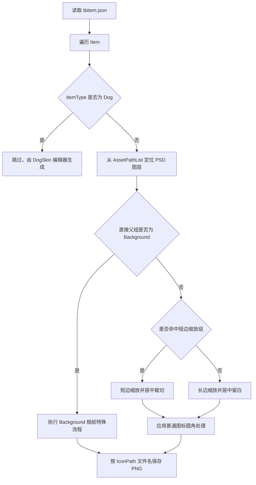
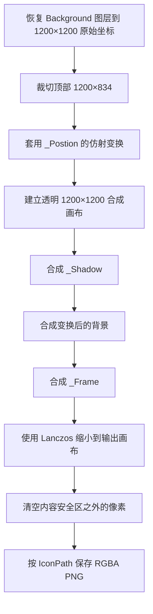

# PSD 道具图标导出工作流

## 工具链

- **psd_tools 1.17.1** — 读取 PSD 结构、重命名图层、获取像素
- **Pillow** — 图像处理（裁剪、缩放、圆角）
- **numpy** — alpha 通道运算
- **aggdraw** — 矢量形状图层渲染（可选，部分 ShapeLayer 需要）

## 一键导出

```bash
# 修改 configs/export_config.json 里的路径后直接运行：
python scripts/export_icons.py

# 或指定其他配置：
python scripts/export_icons.py --config my_config.json
```

### 配置项

```json
{
    "psd路径": "../assets/psd/LuckyDogPub-Test03.psd",
    "背景图标模板PSD": "../assets/psd/BackgroundItemDemo.psd",
    "道具表路径": "tbitem.json",
    "输出目录": "output",
    "画布尺寸": 256,
    "内容尺寸": 240,
    "边框留白": 16,
    "短边缩放组": ["Background", "Table"]
}
```

- `短边缩放组`：以短边为准缩放后居中裁剪。当前用于 `Table` 等需要填满画面的普通物品；`Background` 即使出现在名单中，也由相纸特殊流程优先处理。
- 其他物品以长边为准缩放，短边居中留白
- `背景图标模板PSD`：`Background` 组相纸图标使用的独立模板 PSD。模板不与游戏总 PSD 混放。

## 核心流程



## Background 相纸图标特殊流程

### 触发条件

特殊流程只根据源图层的直接父组判断。父组名称精确等于 `Background` 时启用相纸合成，不根据 Item 名称、文件名前缀或 `短边缩放组` 猜测。

`Table` 及其他组继续使用普通图标流程。桌布不得复用相纸模板，否则会破坏玩家区分背景和桌布的视觉语义。

### 输入文件职责

- 游戏总 PSD：提供 `Background` 组及组内的正式背景图层。当前流程要求总画布为 `1200×1200`。
- `tbitem.json`：提供 `AssetPathList` 和 `IconPath`。图层定位仍以 `AssetPathList` 为准，输出文件名取 `IconPath` 的文件名部分。
- `BackgroundItemDemo.psd`：只提供相纸模板，不提供正式背景内容。当前文件位于 `assets/psd/BackgroundItemDemo.psd`。

源 PSD 中的背景图层可以是普通像素层或智能对象。导出时先按图层在总 PSD 中的原始坐标恢复到完整的 `1200×1200` 透明画布，再取顶部区域 `(0, 0, 1200, 834)`。该裁切结果保持原始像素比例，不执行拉伸或二次适配。

### 模板 PSD 契约

模板画布必须为 `1200×1200`，以下图层必须位于 PSD 顶层：

- `_Shadow`：参与最终输出的投影素材。工具会保留智能对象变换、图层效果和图层不透明度。
- `_Frame`：参与最终输出的镂空相纸素材，始终覆盖在背景图层上方。
- `_Postion`：只提供背景素材的旋转、缩放和位置，不直接参与最终输出。工具同时兼容正确拼写 `_Position`。

`_Postion` 必须是带有效 Photoshop 放置变换数据的智能对象，并且只能使用位移、旋转和缩放。透视变换与非仿射 Warp 不受支持，检测到后导出立即失败，避免批量产生位置错误的图标。

当前模板中的旋转角度为 `-11.4°`，但代码不硬编码该角度。模板内移动、旋转或等比缩放 `_Postion` 后，下一次导出会自动读取新的仿射变换。

预览辅助图层建议统一使用 `_` 开头，例如：

```text
_预览用道具托盘
_预览用道具边框
_圆角预览
_原始素材
```

特殊流程只读取 `_Shadow`、`_Frame` 和 `_Postion` / `_Position`，其他预览图层不会进入输出。

### 合成和缩小



默认输出画布为 `256×256`，内容尺寸为 `240×240`。缩小完成后，工具强制清空四周各 8 像素，而不是只依赖相纸素材本身留白。最终文件仍保持完整的 `256×256 RGBA` 尺寸。

当前命名约定示例：

```text
PSD 父组：Background
PSD 图层：BlueA
Item.IconPath：v1\ItemIcon\Background_BlueA.png
输出文件：Background_BlueA.png
```

### 修改模板时的边界

调整相纸造型时，应只修改 `BackgroundItemDemo.psd`，无需把模板图层复制到游戏总 PSD。

允许的调整包括：

- 修改 `_Frame` 的颜色、边宽和造型。
- 修改 `_Shadow` 的形状、颜色、位置和不透明度。
- 移动、旋转或缩放 `_Postion`，同时保持其变换为仿射变换。

修改后必须确认 `_Shadow`、背景区域和 `_Frame` 仍在同一 `1200×1200` 坐标系中对齐。不得改变模板画布尺寸，也不得把三个约定图层移入子组。

### 验证清单

每次修改模板或特殊流程后至少检查：

1. `Background` 组内所有正式图层都成功生成，没有 `[MISS]` 或渲染失败。
2. `Table` 图标仍保持平整桌布造型，没有进入相纸流程。
3. 生成文件为 `256×256 RGBA`，四周 8 像素的 alpha 均为 0。
4. 相纸窗口内没有透明带，背景也没有从相纸外沿漏出。
5. 纯色背景、带文字背景和复杂场景背景均能保持可辨识内容。
6. 在游戏背包的品质 Plate 与 Frame 中检查最终缩略尺寸，确认背景相纸与桌布矩形能够被玩家直接区分。

当前基准验证使用 `assets/psd/LuckyDogPub-Test03.psd`，其中 19 个正式 `Background` 图层均可成功生成；该数量只是测试基线，不作为未来素材数量限制。

### 常见失败

- 报告模板画布尺寸错误：确认 `BackgroundItemDemo.psd` 仍为 `1200×1200`。
- 报告缺少模板图层：确认 `_Shadow`、`_Frame`、`_Postion` / `_Position` 位于 PSD 顶层且名称完全一致。
- 报告 `_Postion` 变换不受支持：移除透视或 Warp，只保留旋转、缩放和位移。
- 背景图标仍是普通矩形：确认源图层的直接父组名称为 `Background`，并确认工具选择了正确的背景模板 PSD。
- 图标外围存在不透明像素：确认配置仍为 `画布尺寸=256`、`内容尺寸=240`，并检查输出是否来自当前版本脚本。

## 关键注意事项

### 普通道具使用 `topil()`

```python
# ✅ 普通道具：直接获取图层原始像素，颜色准确
img = layer.topil()
```

普通道具是单个图层，`topil()` 可直接读取嵌入像素数据并保持颜色准确。狗皮肤图标不再由此工具生成。

### 圆角用 alpha 相乘，不是替换

```python
# ✅ 正确：遮罩与现有 alpha 取最小值（只切四角）
mask = Image.new("L", (CANVAS, CANVAS), 255)
ImageDraw.Draw(mask).rounded_rectangle(
    [0, 0, CANVAS-1, CANVAS-1], radius=RADIUS, fill=0)
arr = np.array(canvas)
arr[:, :, 3] = np.minimum(arr[:, :, 3], 255 - np.array(mask))
canvas = Image.fromarray(arr, "RGBA")

# ❌ 错误：putalpha 替换整个 alpha，会把透明背景变成黑色不透明
canvas.putalpha(mask)
```

`putalpha(mask)` 将画布上**所有**位于圆角矩形内的像素设为不透明。画布上物品周围的区域是 `(0,0,0,0)`，变成不透明后就是 `(0,0,0,255)`——纯黑。alpha 相乘则只切掉四个角，其他区域保持原透明度。

### 缩放策略

```python
if use_short_side:
    # 短边 = CONTENT → 适合桌布等需要填满画面的普通物品
    scale = CONTENT / min(w, h)
    img = img.resize((int(w*scale), int(h*scale)), Image.LANCZOS)
    # 居中裁剪到正方形
    left, top = (nw-CONTENT)//2, (nh-CONTENT)//2
    img = img.crop((left, top, left+CONTENT, top+CONTENT))
else:
    # 长边 = CONTENT → 适合头饰/眼镜等有固定形状的
    scale = CONTENT / max(w, h)
    img = img.resize((int(w*scale), int(h*scale)), Image.LANCZOS)
```

### 依赖

```bash
pip install psd-tools Pillow numpy
pip install aggdraw          # ShapeLayer 矢量渲染（可选）
```

## 文件结构

```
photoshop-tools/
├── export_icons_workflow.md      # 本文档
├── tbitem.json                   # 道具表（含 AssetPathList）
├── configs/
│   └── export_config.json        # 导出配置（路径、尺寸）
├── scripts/
│   └── export_icons.py           # 一键导出脚本
└── output/                       # 导出的 PNG 图标

assets/psd/
├── BackgroundItemDemo.psd        # Background 相纸模板
└── LuckyDogPub-Test03.psd        # 当前特殊流程验证用源 PSD
```
